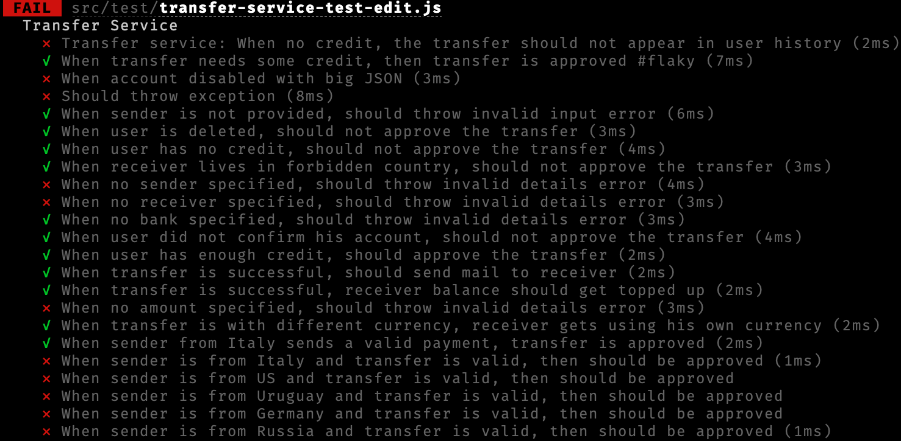
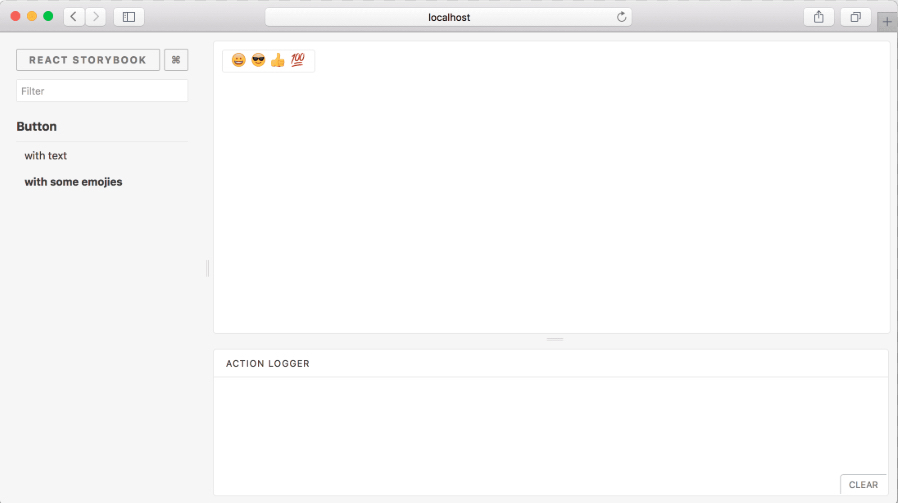
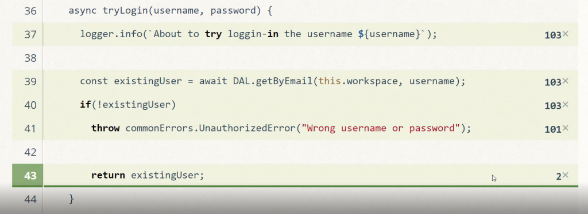

<br/>

# 👇 Powody dla których ten przewodnik może przenieść twoje umiejętności testowania na wyższy poziom

<br/>

## 📗 46+ najlepszych praktyk: super kompleksowe i wyczerpujące

Jest to przewodnik po niezawodności JavaScript i Node.js od A-Z. Podsumowuje i przygotowuje dla Ciebie dziesiątki najlepszych postów na blogu, książek i narzędzi dostępnych na rynku

## 🚢 Zaawansowane: przekracza 10 000 mil poza zwykłe podstawy

Wskocz w podróż, która wykracza poza podstawy, podróż do zaawansowanych tematów, takich jak testowanie na produkcji, testowanie mutacji, testowanie na podstawie właściwości i wiele innych strategicznych i profesjonalnych narzędzi. Jeśli przeczytasz każde słowo w tym przewodniku, Twoje umiejętności testowania prawdopodobnie przekroczą średnią

## 🌐 Full-stack: front, backend, CI, wszystko

Zacznij od zrozumienia wszechobecnych praktyk testowania, które są podstawą każdej warstwy aplikacji. Następnie zagłęb się w wybrany obszar: frontend/UI, backend, CI, a może wszystkie?

<br/>

### Napisane przez Yoni Goldberg

- Konsultant JavaScript & Node.js
- 📗 [Testowanie Node.js i JavaScript od A do Z](https://www.testjavascript.com) - Mój kompleksowy kurs online z ponad [10 godzinami wideo](https://www.testjavascript.com), 14 typów testów i ponad 40 najlepszych praktyk
- [Obserwuj mnie na Twitter](https://twitter.com/goldbergyoni/)

<br/>

### Tłumaczenia - czytaj w swoim własnym języku

- 🇨🇳[Chinese](readme-zh-CN.md) - dzięki uprzejmości [Yves yao](https://github.com/yvesyao)
- 🇰🇷[Korean](readme.kr.md) - dzięki uprzejmości [Rain Byun](https://github.com/ragubyun)
- 🇵🇱[Polish](readme.pl.md) - dzięki uprzejmości [Michal Biesiada](https://github.com/mbiesiad)
- Chcesz przetłumaczyć na swój język? Proszę skorzystaj z issue 💜

<br/><br/>

## `Spis treści`

#### [`Sekcja 0: Złota zasada`](#sekcja-0️⃣-złota-zasada)

Jedna rada, która inspiruje wszystkich innych (1 specjalny punkt)

#### [`Sekcja 1: Anatomia testu`](#sekcja-1-anatomia-testu-1)

Podstawa - konstruowanie czystych testów (12 wypunktowań)

#### [`Sekcja 2: Backend`](#sekcja-2️⃣-backend-testing)

Pisanie backendu i wydajne testy Mikroserwisów (8 wypunktowań)

#### [`Sekcja 3: Frontend`](#sekcja-3️⃣-frontend-testing)

Pisanie testów dla webowego interfejsu użytkownika, w tym testy komponentów i testy E2E (11 wypunktowań)

#### [`Sekcja 4: Pomiary skuteczności testów`](#sekcja-4%EF%B8%8F%E2%83%A3-pomiar-skuteczno%C5%9Bci-testu)

Watching the watchman - pomiar jakości testu (4 wypunktowania)

#### [`Sekcja 5: Continuous Integration`](#sekcja-5️⃣-ci-oraz-inne-miary-jakości)

Wytyczne dla CI w świecie JS (9 wypunktowań)

<br/><br/>

# Sekcja 0️⃣: Złota zasada

<br/>

## ⚪️ 0 Złota zasada: Projektowanie dla lean testing

:white_check_mark: **Opis:**
Testowany kod nie przypomina kodu produkcyjnego - zaprojektuj go tak, by był prosty, krótki, pozbawiony abstrakcji, płaski, przyjemny w pracy, lean. Trzeba spojrzeć na test i natychmiast uzyskać cel.

Nasz umysł jest przepełniony głównym kodem produkcyjnym, nie mamy 'przestrzeni roboczej' na dodatkową złożoność. Jeśli spróbujemy wcisnąć kolejny trudny kod do naszego słabego mózgu, spowolni to pracę zespołu, co działa wbrew temu, co testujemy. W praktyce wiele zespołów po prostu rezygnuje z testów.

Testy są okazją do czegoś innego - przyjaznego i uśmiechniętego asystenta, z którym przyjemnie się pracuje i zapewnia wielką wartość za tak małą inwestycję. Nauka mówi nam, że mamy dwa systemy mózgowe: system 1 służy do łatwych czynności, takich jak prowadzenie samochodu po pustej drodze, i system 2, który jest przeznaczony do złożonych i świadomych operacji, takich jak rozwiązywanie równania matematycznego. Zaprojektuj swój test dla systemu 1, gdy patrzysz na kod testowy, powinien on czuć się tak łatwo, jak modyfikacja dokumentu HTML, a nie jak rozwiązywanie 2X(17 × 24).

Można to osiągnąć poprzez selektywne wybieranie technik, narzędzi i celów testowych, które są opłacalne i zapewniają duży zwrot z inwestycji. Testuj tylko tyle, ile potrzeba, staraj się, aby był zwinny, czasem warto porzucić niektóre testy i wymienić niezawodność na zwinność i prostotę.


Większość poniższych porad to pochodne tej zasady.

### Gotów by rozpocząć?

<br/><br/>

# Sekcja 1: Anatomia testu

<br/>

## ⚪ ️ 1.1 Dołącz 3 części do każdej nazwy testu

:white_check_mark: **Opis:** Raport z testu powinien informować, czy bieżąca wersja aplikacji spełnia wymagania osób, które niekoniecznie znają kod: testera, wdrażającego inżyniera DevOps i przyszłego ciebie za dwa lata. Można to najlepiej osiągnąć, jeśli testy są na poziomie wymagań i obejmują 3 części:

(1) Co jest testowane? Na przykład, metoda ProductsService.addNewProduct

(2) W jakich okolicznościach i scenariuszu? Na przykład żadna cena nie jest przekazywana do metody

(3) Jaki jest oczekiwany wynik? Na przykład nowy produkt nie został zatwierdzony

<br/>

❌ **W przeciwnym razie:** Wdrożenie właśnie nie powiodło się, test o nazwie "Dodaj produkt" nie powiódł się. Czy to mówi ci, co dokładnie działa nieprawidłowo?

<br/>

**👇 Uwaga:** Każdy pocisk ma przykłady kodu, a czasem także ilustrację. Kliknij aby rozszerzyć

<details><summary>✏ <b>Przykłady kodu</b></summary>
  
<br/>
  
### :clap: Przykład robienia tego dobrze: nazwa testu, która składa się z 3 części


```javascript
//1. unit under test
describe('Products Service', function() {
  describe('Add new product', function() {
    //2. scenario and 3. expectation
    it('When no price is specified, then the product status is pending approval', ()=> {
      const newProduct = new ProductService().add(...);
      expect(newProduct.status).to.equal('pendingApproval');
    });
  });
});

```

<br/>

### :clap: Przykład robienia tego dobrze: nazwa testu, która składa się z 3 części


</details>

<br/><br/>

## ⚪ ️ 1.2 Struktura testów według wzorca AAA

:white_check_mark: **Opis:** Ustrukturyzuj swoje testy za pomocą 3 dobrze oddzielonych sekcji: Arrange, Act & Assert (AAA). Przestrzeganie tej struktury gwarantuje, że czytelnik nie poświęci procesora mózgu na zrozumienie planu testu:

1st A - Arrange: Cały kod instalacyjny, aby wprowadzić system do scenariusza, którego test ma na celu symulację. Może to obejmować tworzenie instancji testowanego konstruktora, dodawanie rekordów DB, mockowanie/usuwanie obiektów i każdy inny kod przygotowawczy

2nd A - Act: Wykonaj unit pod test. Zwykle 1 linia kodu

3rd A - Assert: Upewnij się, że otrzymana wartość spełnia oczekiwania. Zwykle 1 linia kodu

<br/>

❌ **W przeciwnym razie:** Nie tylko spędzasz godziny na zrozumieniu głównego kodu, ale to, co powinno być najprostszą częścią dnia (testowanie) obciąża Twój mózg

<br/>

<details><summary>✏ <b>Przykłady kodu</b></summary>

<br/>

### :clap: Przykład robienia tego dobrze: test oparty na wzorcu AAA

 

```javascript
describe("Customer classifier", () => {
  test("When customer spent more than 500$, should be classified as premium", () => {
    //Arrange
    const customerToClassify = { spent: 505, joined: new Date(), id: 1 };
    const DBStub = sinon.stub(dataAccess, "getCustomer").reply({ id: 1, classification: "regular" });

    //Act
    const receivedClassification = customerClassifier.classifyCustomer(customerToClassify);

    //Assert
    expect(receivedClassification).toMatch("premium");
  });
});
```

<br/>

### :thumbsdown: Przykład antywzorca: brak separacji, jedna masa, trudniejsza do interpretacji

```javascript
test("Should be classified as premium", () => {
  const customerToClassify = { spent: 505, joined: new Date(), id: 1 };
  const DBStub = sinon.stub(dataAccess, "getCustomer").reply({ id: 1, classification: "regular" });
  const receivedClassification = customerClassifier.classifyCustomer(customerToClassify);
  expect(receivedClassification).toMatch("premium");
});
```

</details>

<br/><br/>

## ⚪ ️1.3 Opisz oczekiwania w języku produktu: stosuj asercje w stylu BDD

:white_check_mark: **Opis:** Kodowanie testów w stylu deklaratywnym pozwala czytelnikowi na natychmiastowe złapanie go bez wydawania nawet jednego cyklu mózg-procesor. Kiedy piszesz kod imperatywny wypełniony logiką warunkową, czytelnik jest zmuszony wywierać więcej cykli mózg-procesor. W takim przypadku zakoduj oczekiwanie w języku przypominającym język człowieka, deklaratywnym stylu BDD, używając `expect` lub `should` i nie używając niestandardowego kodu. Jeśli Chai & Jest nie zawiera żądanej asercji i jest wysoce powtarzalne, rozważ [rozszerzenie Jest matcher (Jest)](https://jestjs.io/docs/en/expect#expectextendmatchers) lub napisanie [wtyczki niestandardowej Chai](https://www.chaijs.com/guide/plugins/)
<br/>

❌ **W przeciwnym razie:** Zespół napisze mniej testów i ozdobi części irytujące z .skip()

<br/>

<details><summary>✏ <b>Przykłady kodu</b></summary><br/>

 

### :thumbsdown: Przykład antywzorca: Czytelnik musi przejrzeć niezbyt krótki i imperatywny kod, aby uzyskać historię testową

```javascript
test("When asking for an admin, ensure only ordered admins in results", () => {
  //assuming we've added here two admins "admin1", "admin2" and "user1"
  const allAdmins = getUsers({ adminOnly: true });

  let admin1Found,
    adming2Found = false;

  allAdmins.forEach(aSingleUser => {
    if (aSingleUser === "user1") {
      assert.notEqual(aSingleUser, "user1", "A user was found and not admin");
    }
    if (aSingleUser === "admin1") {
      admin1Found = true;
    }
    if (aSingleUser === "admin2") {
      admin2Found = true;
    }
  });

  if (!admin1Found || !admin2Found) {
    throw new Error("Not all admins were returned");
  }
});
```

<br/>

### :clap: Przykład robienia tego dobrze: Przejrzenie poniższego testu deklaratywnego to pestka

```javascript
it("When asking for an admin, ensure only ordered admins in results", () => {
  //assuming we've added here two admins
  const allAdmins = getUsers({ adminOnly: true });

  expect(allAdmins)
    .to.include.ordered.members(["admin1", "admin2"])
    .but.not.include.ordered.members(["user1"]);
});
```

</details>

<br/><br/>

## ⚪ ️ 1.4 Trzymaj się testów czarnej skrzynki: testuj tylko metody publiczne

:white_check_mark: **Opis:** Testowanie elementów wewnętrznych przynosi ogromne koszty prawie za nic. Jeśli Twój kod / interfejs API zapewnia prawidłowe wyniki, czy naprawdę warto zainwestować następne 3 godziny w testowanie JAK działało ono wewnętrznie, a następnie utrzymać te delikatne testy? Za każdym razem, gdy sprawdzane jest zachowanie publiczne, implementacja prywatna jest również domyślnie testowana, a testy zostaną przerwane tylko w przypadku wystąpienia określonego problemu (np. nieprawidłowego wyniku). Takie podejście jest również określane jako `behavioral testing`. Z drugiej strony, jeśli przetestujesz wewnętrzne elementy (podejście z białą ramką) - skupiasz się na planowaniu wyniku komponentu na drobiazgowe szczegóły, a twój test może się zepsuć z powodu drobnych refaktorów kodu, chociaż wyniki są w porządku - to dramatycznie zwiększa konserwację, obciąża
<br/>

❌ **W przeciwnym razie:** Twoje testy zachowują się jak [chłopiec, który wołał wilka](https://en.wikipedia.org/wiki/The_Boy_Who_Cried_Wolf): krzycząc false-positive (np. test kończy się niepowodzeniem, ponieważ zmieniono nazwę zmiennej prywatnej). Nic dziwnego, że ludzie wkrótce zaczną ignorować powiadomienia CI, aż pewnego dnia prawdziwy błąd zostanie zignorowany…

<br/>
<details><summary>✏ <b>Przykłady kodu</b></summary>

<br/>

### :thumbsdown: Przykład antywzorca: Przypadek testowy testuje elementy wewnętrzne bez uzasadnionego powodu


```javascript
class ProductService {
  //this method is only used internally
  //Change this name will make the tests fail
  calculateVATAdd(priceWithoutVAT) {
    return { finalPrice: priceWithoutVAT * 1.2 };
    //Change the result format or key name above will make the tests fail
  }
  //public method
  getPrice(productId) {
    const desiredProduct = DB.getProduct(productId);
    finalPrice = this.calculateVATAdd(desiredProduct.price).finalPrice;
    return finalPrice;
  }
}

it("White-box test: When the internal methods get 0 vat, it return 0 response", async () => {
  //There's no requirement to allow users to calculate the VAT, only show the final price. Nevertheless we falsely insist here to test the class internals
  expect(new ProductService().calculateVATAdd(0).finalPrice).to.equal(0);
});
```

</details>

<br/><br/>

## ⚪ ️ ️1.5 Wybierz odpowiedni test doubles: Unikaj mockowania na rzecz stubs i spies

:white_check_mark: **Opis:** Test doubles są złem koniecznym, ponieważ są sprzężone z wewnętrznymi elementami aplikacji, ale niektóre zapewniają ogromną wartość (<a href="https://martinfowler.com/articles/mocksArentStubs.html" data-href="https://martinfowler.com/articles/mocksArentStubs.html" class="markup--anchor markup--p-anchor" rel="noopener nofollow" target="_blank">[Przeczytaj tutaj przypomnienie o test doubles: mocks vs stubs vs spies](https://martinfowler.com/articles/mocksArentStubs.html)</a>).

Przed użyciem test doubles zadaj bardzo proste pytanie: czy używam go do testowania funkcjonalności, która pojawia się lub może pojawić się w dokumencie wymagań? Jeśli nie, jest to white-box testing smell.

  Na przykład jeśli chcesz przetestować, czy aplikacja zachowuje się rozsądnie, gdy usługa płatnicza jest wyłączona, możesz zlikwidować usługę płatniczą i uruchomić niektóre zwracając ‘Brak odpowiedzi’, aby upewnić się, że testowana jednostka zwraca prawidłową wartość. To sprawdza zachowanie / odpowiedź / wynik naszej aplikacji w określonych scenariuszach. Możesz także użyć spies, aby potwierdzić, że wiadomość e-mail została wysłana, gdy ta usługa nie działa - jest to ponownie kontrola behawioralna, która prawdopodobnie pojawi się w dokumencie wymagań („Wyślij wiadomość e-mail, jeśli nie można zapisać płatności”). Z drugiej strony, jeśli mockujesz usługę płatności i upewniasz się, że została ona wywołana za pomocą odpowiednich typów JavaScript - wtedy twój test koncentruje się na wewnętrznych rzeczach, które nie mają nic z funkcjonalnością aplikacji i prawdopodobnie często się zmieniają
<br/>

❌ **W przeciwnym razie:** Wszelka refaktoryzacja kodu nakazuje wyszukiwanie wszystkich próbnych elementów w kodzie i odpowiednią aktualizację. Testy stają się ciężarem, a nie pomocnym przyjacielem

<br/>

<details><summary>✏ <b>Przykłady kodu</b></summary>

<br/>

### :thumbsdown: Przykład antywzorca: Mocks skupiające się na elementach wewnętrznych


```javascript
it("When a valid product is about to be deleted, ensure data access DAL was called once, with the right product and right config", async () => {
  //Assume we already added a product
  const dataAccessMock = sinon.mock(DAL);
  //hmmm BAD: testing the internals is actually our main goal here, not just a side-effect
  dataAccessMock
    .expects("deleteProduct")
    .once()
    .withArgs(DBConfig, theProductWeJustAdded, true, false);
  new ProductService().deletePrice(theProductWeJustAdded);
  dataAccessMock.verify();
});
```

<br/>

### :clap:Przykład robienia tego dobrze: spies koncentrują się na testowaniu wymagań, ale jako efekt uboczny nieuchronnie dotykają elementów wewnętrznych

```javascript
it("When a valid product is about to be deleted, ensure an email is sent", async () => {
  //Assume we already added here a product
  const spy = sinon.spy(Emailer.prototype, "sendEmail");
  new ProductService().deletePrice(theProductWeJustAdded);
  //hmmm OK: we deal with internals? Yes, but as a side effect of testing the requirements (sending an email)
  expect(spy.calledOnce).to.be.true;
});
```

</details>

<br/><br/>

## 📗 Chcesz poznać wszystkie te praktyki z wideo na żywo?

### Odwiedź mój kurs online [Testowanie Node.js i JavaScript od A do Z](https://www.testjavascript.com)

<br/><br/>

## ⚪ ️1.6 Nie "foo", używaj realistycznych danych wejściowych

:white_check_mark: **Opis:** Często błędy produkcyjne są ujawniane pod bardzo konkretnymi i zaskakującymi danymi wejściowymi - im bardziej realistyczny jest wkład testowy, tym większe są szanse na wczesne wykrycie błędów. Użyj dedykowanych bibliotek takich jak [Faker](https://www.npmjs.com/package/faker) do generowania pseudo-rzeczywistych danych, które przypominają różnorodność i formę danych produkcyjnych. Na przykład takie biblioteki mogą generować realistyczne numery telefonów, nazwy użytkowników, karty kredytowe, nazwy firm, a nawet tekst „lorem ipsum”. Możesz także utworzyć niektóre testy (oprócz testów jednostkowych, a nie zamienników), które losowo dodają fałszywych danych, aby rozciągnąć testowaną jednostkę lub nawet zaimportować prawdziwe dane ze środowiska produkcyjnego. Chcesz przenieść go na wyższy poziom? Zobacz następny punkt (testy oparte na właściwościach).
<br/>

❌ **W przeciwnym razie:** Wszystkie testy programistyczne będą fałszywie pokazywać kolor zielony, gdy użyjesz syntetycznych danych wejściowych, takich jak „Foo”, ale wtedy produkcja może zmienić kolor na czerwony, gdy haker przejdzie tak nieprzyjemny ciąg znaków, jak “@3e2ddsf . ##’ 1 fdsfds . fds432 AAAA”

<br/>

<details><summary>✏ <b>Przykłady kodu</b></summary>

<br/>

### :thumbsdown: Przykład antywzorca: Zestaw testowy, który przechodzi z powodu nierealistycznych danych


```javascript
const addProduct = (name, price) => {
  const productNameRegexNoSpace = /^\S*$/; //no white-space allowed

  if (!productNameRegexNoSpace.test(name)) return false; //this path never reached due to dull input

  //some logic here
  return true;
};

test("Wrong: When adding new product with valid properties, get successful confirmation", async () => {
  //The string "Foo" which is used in all tests never triggers a false result
  const addProductResult = addProduct("Foo", 5);
  expect(addProductResult).toBe(true);
  //Positive-false: the operation succeeded because we never tried with long
  //product name including spaces
});
```

<br/>

### :clap:Przykład robienia tego dobrze: Randomizing realistic input

```javascript
it("Better: When adding new valid product, get successful confirmation", async () => {
  const addProductResult = addProduct(faker.commerce.productName(), faker.random.number());
  //Generated random input: {'Sleek Cotton Computer',  85481}
  expect(addProductResult).to.be.true;
  //Test failed, the random input triggered some path we never planned for.
  //We discovered a bug early!
});
```

</details>

<br/><br/>

## ⚪ ️ 1.7 Testowanie wielu kombinacji danych wejściowych za pomocą testów opartych na właściwościach

  :white_check_mark: **Opis:** Zazwyczaj wybieramy kilka próbek wejściowych dla każdego testu. Nawet jeśli format wejściowy przypomina dane rzeczywiste (zobacz punkt ‘Nie foo’), obejmujemy tylko kilka kombinacji danych wejściowych (method(‘’, true, 1), method(“string” , false” , 0)). Jednak w produkcji interfejs API, który jest wywoływany z 5 parametrami, może być wywoływany z tysiącami różnych kombinacji, jeden z nich może spowolnić nasz proces ([zobacz Fuzz Testing](https://en.wikipedia.org/wiki/Fuzzing)). Co jeśli mógłbyś napisać pojedynczy test, który automatycznie wysyła 1000 permutacji różnych danych wejściowych i wyłapuje, dla których danych wejściowych nasz kod nie zwraca poprawnej odpowiedzi? Testowanie oparte na właściwościach jest techniką, która robi dokładnie to: wysyłając wszystkie możliwe kombinacje danych wejściowych do testowanego urządzenia, zwiększa to prawdopodobieństwo znalezienia błędu. Na przykład, biorąc pod uwagę metodę - addNewProduct (identyfikator, nazwa, isDiscount) - biblioteki obsługujące będą wywoływać tę metodę z wieloma kombinacjami (liczba, łańcuch, wartość logiczna), takich jak (1, „iPhone”, false), (2, „Galaxy ", prawdziwe). Możesz uruchomić testy oparte na właściwościach, używając swojego ulubionego test runnera (Mocha, Jest, etc) za pomocą bibliotek takich jak [js-verify](https://github.com/jsverify/jsverify) lub [testcheck](https://github.com/leebyron/testcheck-js) (znacznie lepsza dokumentacja). Aktualizacja: Nicolas Dubien sugeruje w komentarzach poniżej [sprawdzenie fast-check](https://github.com/dubzzz/fast-check#readme) który wydaje się oferować dodatkowe funkcje, a także jest aktywnie utrzymywany
<br/>

❌ **W przeciwnym razie:** Nieświadomie wybierasz wejścia testowe, które obejmują tylko dobrze działające ścieżki kodu. Niestety obniża to efektywność testowania jako pojazdu do wykrywania błędów

<br/>

<details><summary>✏ <b>Przykłady kodu</b></summary>

<br/>

### :clap: Przykład robienia tego dobrze: Testing many input permutations with “fast-check”


```javascript
import fc from "fast-check";

describe("Product service", () => {
  describe("Adding new", () => {
    //this will run 100 times with different random properties
    it("Add new product with random yet valid properties, always successful", () =>
      fc.assert(
        fc.property(fc.integer(), fc.string(), (id, name) => {
          expect(addNewProduct(id, name).status).toEqual("approved");
        })
      ));
  });
});
```

</details>

<br/><br/>

## ⚪ ️ 1.8 Jeśli potrzeba, użyj tylko short & inline snapshots

:white_check_mark: **Opis:** Gdzie jest potrzeba na [testy snapshot](https://jestjs.io/docs/en/snapshot-testing), używaj tylko krótkich i skoncentrowanych snapshotów (np. 3-7 linie), które są uwzględnione w ramach testu ([Inline Snapshot](https://jestjs.io/docs/en/snapshot-testing#inline-snapshots)) i nie w plikach zewnętrznych. Przestrzeganie tych wytycznych sprawi, że testy będą zrozumiałe i mniej kruche.

Z drugiej strony, poradniki ‘klasycznych snapshotów’ i narzędzia zachęcają do przechowywania dużych plików (np. znaczników renderowania komponentu, wyniku API JSON) na jakimś zewnętrznym nośniku i zapewniają za każdym razem, gdy uruchamiany jest test w celu porównania otrzymanego wyniku z zapisaną wersją. To, na przykład, może pośrednio powiązać nasz test z 1000 liniami z 3000 wartościami danych, o których twórca testów nigdy nie czytał i nie uzasadniał. Dlaczego to źle? W ten sposób istnieje 1000 powodów niepowodzenia testu - wystarczy zmienić jedną linię, aby migawka stała się nieważna, i prawdopodobnie zdarzy się to często. Jak często? Dla każdej przestrzeni, komentarza lub drobnej zmiany CSS / HTML. Nie tylko to, nazwa testu nie dałaby informacji o niepowodzeniu, ponieważ po prostu sprawdza, czy 1000 wierszy się nie zmieniło, zachęca także twórcy testu do zaakceptowania jako pożądanego prawdziwego długiego dokumentu, którego nie mógł sprawdzić i zweryfikować. Wszystko to są objawy niejasnego i niecierpliwego testu, który nie jest skoncentrowany i ma na celu osiągnięcie zbyt wiele

Warto zauważyć, że istnieje kilka przypadków, w których dopuszczalne są długie i zewnętrzne migawki - podczas potwierdzania schematu, a nie danych (wyodrębnianie wartości i skupianie się na polach) lub gdy otrzymany dokument rzadko się zmienia
<br/>

❌ **W przeciwnym razie:** Test interfejsu użytkownika kończy się niepowodzeniem. Kod wydaje się prawidłowy, ekran wyświetla idealne piksele, co się stało? Twoje testowanie migawek właśnie znalazło różnicę między dokumentem źródłowym, a aktualnie otrzymanym - do znacznika została dodana pojedyncza spacja...

<br/>

<details><summary>✏ <b>Przykłady kodu</b></summary>

<br/>

### :thumbsdown: Przykład antywzorca: Łączymy nasz test z niewidzialnymi 2000 liniami kodu


```javascript
it("TestJavaScript.com is renderd correctly", () => {
  //Arrange

  //Act
  const receivedPage = renderer
    .create(<DisplayPage page="http://www.testjavascript.com"> Test JavaScript </DisplayPage>)
    .toJSON();

  //Assert
  expect(receivedPage).toMatchSnapshot();
  //We now implicitly maintain a 2000 lines long document
  //every additional line break or comment - will break this test
});
```

<br/>

### :clap: Przykład robienia tego dobrze: Oczekiwania są widoczne i skoncentrowane

```javascript
it("When visiting TestJavaScript.com home page, a menu is displayed", () => {
  //Arrange

  //Act
  const receivedPage = renderer
    .create(<DisplayPage page="http://www.testjavascript.com"> Test JavaScript </DisplayPage>)
    .toJSON();

  //Assert

  const menu = receivedPage.content.menu;
  expect(menu).toMatchInlineSnapshot(`
<ul>
<li>Home</li>
<li> About </li>
<li> Contact </li>
</ul>
`);
});
```

</details>

<br/><br/>

## ⚪ ️1.9 Unikaj globalnych test fixture i seeds, dodawaj dane na test

:white_check_mark: **Opis:** Kierując się złotą zasadą (punkt 0), każdy test powinien dodawać i działać na swoim własnym zestawie wierszy BD, aby zapobiec sprzężeniu i łatwo uzasadnić przebieg testu. W rzeczywistości jest to często naruszane przez testerów, którzy zapełniają bazę danych danymi przed uruchomieniem testów ([znany również jako ‘test fixture’](https://en.wikipedia.org/wiki/Test_fixture)) w celu poprawy wydajności. Chociaż wydajność jest istotnym problemem - można ją złagodzić (patrz punkt „Testowanie komponentów”), jednak złożoność testów jest bardzo bolesnym smutkiem, który powinien rządzić innymi względami przez większość czasu. Praktycznie spraw, aby każdy przypadek testowy wyraźnie dodał potrzebne rekordy BD i działał tylko na tych rekordach. Jeśli wydajność stanie się kluczowym problemem - zrównoważony kompromis może przyjść w postaci inicjowania jedynego zestawu testów, które nie powodują mutacji danych (np. zapytania)
<br/>

❌ **W przeciwnym razie:** Niewiele testów kończy się niepowodzeniem, wdrożenie zostało przerwane, nasz zespół spędza teraz cenny czas, czy mamy błąd? Zbadajmy, och nie - wydaje się, że dwa testy mutowały te same dane seed

<br/>

<details><summary>✏ <b>Przykłady kodu</b></summary>

<br/>

### :thumbsdown: Przykład antywzorca: testy nie są niezależne i polegają na pewnym globalnym hook do zasilania globalnych danych BD


```javascript
before(() => {
  //adding sites and admins data to our DB. Where is the data? outside. At some external json or migration framework
  await DB.AddSeedDataFromJson('seed.json');
});
it("When updating site name, get successful confirmation", async () => {
  //I know that site name "portal" exists - I saw it in the seed files
  const siteToUpdate = await SiteService.getSiteByName("Portal");
  const updateNameResult = await SiteService.changeName(siteToUpdate, "newName");
  expect(updateNameResult).to.be(true);
});
it("When querying by site name, get the right site", async () => {
  //I know that site name "portal" exists - I saw it in the seed files
  const siteToCheck = await SiteService.getSiteByName("Portal");
  expect(siteToCheck.name).to.be.equal("Portal"); //Failure! The previous test change the name :[
});

```

<br/>

### :clap: Przykład robienia tego dobrze: Możemy pozostać w teście, każdy test działa na własny zestaw danych

```javascript
it("When updating site name, get successful confirmation", async () => {
  //test is adding a fresh new records and acting on the records only
  const siteUnderTest = await SiteService.addSite({
    name: "siteForUpdateTest"
  });

  const updateNameResult = await SiteService.changeName(siteUnderTest, "newName");

  expect(updateNameResult).to.be(true);
});
```

</details>

<br/>

## ⚪ ️ 1.10 Nie wychwytuj błędów, oczekuj ich

:white_check_mark: **Opis:** Podczas próby stwierdzenia, że niektóre dane wejściowe powodują błąd, może być właściwe użycie try-catch-finally i zapewnienie, że wprowadzono klauzulę catch. Wynikiem jest niezręczny i pełny przypadek testowy (przykład poniżej), który ukrywa prosty cel testu i oczekiwania na wynik

Bardziej elegancką alternatywą jest użycie dedykowanego asercji Chai w jednym wierszu: expect (method).to.throw (lub w Jest: expect(method).toThrow()). Absolutnie obowiązkowe jest również upewnienie się, że wyjątek zawiera właściwość określającą typ błędu, w przeciwnym razie biorąc pod uwagę tylko ogólny błąd, aplikacja nie będzie w stanie zrobić wiele, zamiast wyświetlać rozczarowujący komunikat użytkownikowi
<br/>

❌ **W przeciwnym razie:** Trudno będzie wnioskować z raportów testów (np. raportów CI), co poszło nie tak

<br/>

<details><summary>✏ <b>Przykłady kodu</b></summary>

<br/>

### :thumbsdown: Przykład antywzorca: Długi przypadek testowy, który próbuje potwierdzić istnienie błędu z try-catch


```javascript
it("When no product name, it throws error 400", async () => {
  let errorWeExceptFor = null;
  try {
    const result = await addNewProduct({});
  } catch (error) {
    expect(error.code).to.equal("InvalidInput");
    errorWeExceptFor = error;
  }
  expect(errorWeExceptFor).not.to.be.null;
  //if this assertion fails, the tests results/reports will only show
  //that some value is null, there won't be a word about a missing Exception
});
```

<br/>

### :clap: Przykład robienia tego dobrze: Oczekiwanie czytelne dla człowieka, które może być łatwo zrozumiane, może nawet przez QA lub technicznego PM

```javascript
it("When no product name, it throws error 400", async () => {
  await expect(addNewProduct({}))
    .to.eventually.throw(AppError)
    .with.property("code", "InvalidInput");
});
```

</details>

<br/><br/>

## ⚪ ️ 1.11 Taguj twoje testy

:white_check_mark: **Opis:** Różne testy muszą być uruchamiane w różnych scenariuszach: quick smoke, IO-less, testy powinny być uruchamiane, gdy programista zapisuje lub commituje plik, pełne kompleksowe testy zwykle uruchamiane są po przesłaniu nowego pull requesta itp. Można to osiągnąć poprzez oznaczenie testów słowami kluczowymi takimi jak #cold #api #sanity, aby można było grepować za pomocą uprzęży testującej i wywołać pożądany podzbiór. Na przykład w ten sposób można wywołać tylko grupę sanity test z Mocha: mocha — grep ‘sanity’
<br/>

❌ **W przeciwnym razie:** Uruchamianie wszystkich testów, w tym testów, które wykonują dziesiątki zapytań BD, za każdym razem, gdy programista wprowadzi małą zmianę, może być bardzo powolny i powstrzymuje programistów przed uruchomieniem testów

<br/>

<details><summary>✏ <b>Przykłady kodu</b></summary>

<br/>

### :clap: Przykład robienia tego dobrze: Tagowanie testów jako ‘#cold-test’ umożliwia test runnerowi wykonywanie tylko szybkich testów (testy cold===quick które nie wykonują operacji wejścia/wyjścia i mogą być wykonywane często, nawet gdy programista pisze)


```javascript
//this test is fast (no DB) and we're tagging it correspondigly
//now the user/CI can run it frequently
describe("Order service", function() {
  describe("Add new order #cold-test #sanity", function() {
    test("Scenario - no currency was supplied. Expectation - Use the default currency #sanity", function() {
      //code logic here
    });
  });
});
```

</details>

<br/><br/>

## ⚪ ️ 1.12 Kategoryzuj testy na co najmniej 2 poziomach

:white_check_mark: **Opis:** Zastosuj pewną strukturę do swojego zestawu testów, aby od czasu do czasu odwiedzający mógł łatwo zrozumieć wymagania (testy to najlepsza dokumentacja) i różne testowane scenariusze. Powszechną metodą jest umieszczanie co najmniej 2 bloków 'opisz' nad testami: pierwszy to nazwa testowanej jednostki, a drugi to dodatkowy poziom kategoryzacji, taki jak scenariusz lub kategorie niestandardowe (patrz przykłady kodu i prtscn poniżej). Takie postępowanie znacznie poprawi również raporty z testów: Czytelnik łatwo wywnioskuje kategorie testów, zagłębi się w żądaną sekcję i skoreluje testy zakończone niepowodzeniem. Ponadto programistom łatwiej będzie poruszać się po kodzie pakietu z wieloma testami. Istnieje wiele alternatywnych struktur dla zestawu testów, które możesz rozważyć, jak [given-when-then](https://github.com/searls/jasmine-given) oraz [RITE](https://github.com/ericelliott/riteway)

<br/>

❌ **W przeciwnym razie:** Patrząc na raport z płaską i długą listą testów, czytelnik musi przejrzeć długie teksty, aby zakończyć główne scenariusze i skorelować powszechność nieudanych testów. Rozważ następujący przypadek: gdy testy 7/100 zakończą się niepowodzeniem, przeglądanie płaskiej listy będzie wymagało przeczytania tekstu testów zakończonych niepowodzeniem, aby zobaczyć, jak się ze sobą wiążą. Jednak w hierarchicznym raporcie wszystkie z nich mogą podlegać temu samemu przepływowi lub kategorii, a czytelnik szybko zorientuje się, co lub gdzie jest źródło przyczyny awarii

<br/>

<details><summary>✏ <b>Przykłady kodu</b></summary>

<br/>

### :clap: Przykład robienia tego dobrze: Strukturyzacja pakietu z nazwą jednostki pod test i scenariuszy doprowadzi do wygodnego raportu pokazanego poniżej


```javascript
// Unit under test
describe("Transfer service", () => {
  //Scenario
  describe("When no credit", () => {
    //Expectation
    test("Then the response status should decline", () => {});

    //Expectation
    test("Then it should send email to admin", () => {});
  });
});
```


<br/>

### :thumbsdown: Przykład antywzorca: Płaska lista testów utrudni czytelnikowi identyfikację historii użytkowników i skorelowanie testów zakończonych niepowodzeniem


```javascript
test("Then the response status should decline", () => {});

test("Then it should send email", () => {});

test("Then there should not be a new transfer record", () => {});
```



<br/>

</details>

<br/><br/>

## ⚪ ️1.13 Inne ogólne dobre zasady higieny testowania

:white_check_mark: **Opis:** Ten post skupia się na poradach dotyczących testowania, które są związane lub przynajmniej mogą być zilustrowane przykładem Node JS. Ten punkt zawiera jednak kilka dobrze znanych wskazówek niezwiązanych z Node


Uczyć się i ćwiczyć [zasady TDD](https://www.sm-cloud.com/book-review-test-driven-development-by-example-a-tldr/) — dla wielu są niezwykle cenne, ale nie przestrasz się, jeśli nie pasują do Twojego stylu, nie tylko tobie. Rozważ napisanie testów przed kodem w [style red-green-refactor](https://blog.cleancoder.com/uncle-bob/2014/12/17/TheCyclesOfTDD.html), upewnij się, że każdy test sprawdza dokładnie jedną rzecz, gdy znajdziesz błąd - przed naprawą napisz test, który wykryje ten błąd w przyszłości, pozwól każdemu testowi zawieść co najmniej raz, zanim zmieni kolor na zielony, uruchom moduł, pisząc szybki i uproszczony kod, który satysfakcjonuje test - następnie stopniowo refaktoryzuj i przenieś go do poziomu klasy produkcyjnej, unikaj jakiejkolwiek zależności od środowiska (ścieżki, systemu operacyjnego itp.)
<br/>

❌ **W przeciwnym razie:** Będziesz tęsknić za perłami mądrości zbieranymi przez dziesięciolecia

<br/><br/>

# Sekcja 2️⃣: Backend Testing

## ⚪ ️2.1 Wzbogać swoje portfolio testowe: wyjdź poza testy jednostkowe i piramidę

:white_check_mark: **Opis:** [Piramida testowania](https://martinfowler.com/bliki/TestPyramid.html), pomimo że 10> lat starsza, to świetny i odpowiedni model, który sugeruje trzy typy testowania i wpływa na strategię testowania większości programistów. Jednocześnie pojawiła się ponad garstka nowych, błyszczących technik testowania, które ukrywają się w cieniu piramidy testowania. Biorąc pod uwagę wszystkie dramatyczne zmiany, które widzieliśmy w ciągu ostatnich 10 lat (Microservices, cloud, serverless), czy jest możliwe, że jeden dość stary model będzie odpowiedni _wszystkim_ typom aplikacji? Czy świat testowania nie powinien rozważyć przyjęcia nowych technik testowania?

Nie zrozumcie mnie źle, w 2019 roku piramida testowania, TDD i testy jednostkowe są nadal potężną techniką i prawdopodobnie najlepiej pasują do wielu aplikacji. Tylko jak każdy inny model, pomimo swojej przydatności, [czasem musi się mylić](https://en.wikipedia.org/wiki/All_models_are_wrong). Rozważmy na przykład aplikację IOT, która pobiera wiele zdarzeń do magistrali komunikatów, takiej jak Kafka/RabbitMQ, która następnie przepływa do jakiejś hurtowni danych i jest w końcu odpytywana przez interfejs analityczny. Czy naprawdę powinniśmy wydać 50% naszego budżetu z testów na pisanie testów jednostkowych dla aplikacji, która jest zorientowana na integrację i prawie nie ma logiki? Wraz ze wzrostem różnorodności typów aplikacji (boty, krypto, Alexa-skills) rośnie szansa na znalezienie scenariuszy, w których piramida testowania nie jest najlepszym rozwiązaniem.

Nadszedł czas, aby wzbogacić swoje portfolio testowania i zapoznać się z większą liczbą typów testów (następne punkty sugerują kilka pomysłów), modelami umysłu, takimi jak piramida testowania, ale także dopasować typy testowania do rzeczywistych problemów, z którymi się borykasz (‘Hej, nasz interfejs API jest zepsuty, napiszmy testowanie umów konsumenckich!’), zdywersyfikuj swoje testy jak inwestor, który buduje portfel na podstawie analizy ryzyka - oceń, gdzie mogą pojawić się problemy i dopasuj niektóre środki zapobiegawcze, aby zmniejszyć potencjalne ryzyko

Słowo ostrzeżenia: argument TDD w świecie oprogramowania ma typową fałszywą dychotomię, niektórzy głoszą, że można go używać wszędzie, inni uważają, że to diabeł. Każdy, kto mówi w absolutach, jest w błędzie :]

<br/>

❌ **W przeciwnym razie:** Będziesz tęsknić za niektórymi narzędziami z niesamowitym ROI, takimi jak Fuzz, lint, i mutacją która może zapewnić wartość w 10 minut

<br/>

<details><summary>✏ <b>Przykłady kodu</b></summary>

<br/>

### :clap: Przykład robienia tego dobrze: Cindy Sridharan sugeruje wzbogacić portfolio testowania w swoim niesamowitym poście 'Testowanie mikrousług - w ten sam sposób'


<strong class="markup--strong markup--p-strong">☺️Przykład: </strong><a href="https://www.youtube.com/watch?v=-2zP494wdUY&amp;feature=youtube" data-href="https://www.youtube.com/watch?v=-2zP494wdUY&amp;feature=youtu.be" class="markup--anchor markup--p-anchor" rel="nofollow noopener" target="_blank">[YouTube: “Beyond Unit Tests: 5 Shiny Node.JS Test Types (2018)” (Yoni Goldberg)](https://www.youtube.com/watch?v=-2zP494wdUY&feature=youtu.be)</a>

<br/>


</details>

<br/><br/>

## ⚪ ️2.2 Testowanie komponentów może być Twoją najlepszą kwestią

:white_check_mark: **Opis:** Każdy test jednostkowy obejmuje niewielką część aplikacji i jest to kosztowne, aby pokryć całość, podczas gdy kompleksowe testy z łatwością obejmują dużo gruntu, ale są niestabilne i wolniejsze, dlaczego nie zastosować zrównoważonego podejścia i napisać testy, które są większe niż testy jednostkowe, ale mniejsze niż testy kompleksowe? Testowanie komponentów to nieoceniona piosenka świata testowego - zapewniają to, co najlepsze z obu światów: rozsądną wydajność i możliwość zastosowania wzorców TDD + realistyczne i doskonałe pokrycie.

Testy komponentów koncentrują się na mikroserwisowej ‘jednostce’, działają przeciwko interfejsowi API, nie mockują niczego, co należy do samego mikroserwisu (np. prawdziwa baza danych lub przynajmniej wersja tej bazy danych w pamięci), ale usuwają wszystko, co jest zewnętrzne, jak wywołania innych mikrousług. W ten sposób testujemy to, co wdrażamy, podchodzimy do aplikacji od zewnątrz do wewnątrz i zyskujemy dużą pewność w rozsądnym czasie.
<br/>

❌ **W przeciwnym razie:** Możesz spędzać długie dni na pisaniu testów jednostkowych, aby dowiedzieć się, że masz tylko 20% zasięgu systemu

<br/>

<details><summary>✏ <b>Przykłady kodu</b></summary>

<br/>

### :clap: Przykład robienia tego dobrze: Supertest pozwala zbliżyć się do Express API w trakcie procesu (szybki i obejmuje wiele warstw)


 allows approaching Express API in-process (fast and cover many layers)")

</details>

<br/><br/>

## ⚪ ️2.3 Upewnij się, że nowe wersje nie psują interfejsu API

:white_check_mark: **Opis:** Tak więc twój mikroserwis ma wielu klientów i uruchamiasz wiele wersji usługi ze względu na kompatybilność (aby wszyscy byli zadowoleni). Potem zmieniasz jakieś pole i 'buum!'. Jakiś ważny klient, który działa na tym, jest zły. Oto Catch-22 w świecie integracji: po stronie serwera bardzo trudne jest uwzględnienie wszystkich oczekiwań wielu klientów - z drugiej strony klienci nie mogą przeprowadzać żadnych testów, ponieważ serwer kontroluje daty wydania. [Umowy konsumenckie i framework PACT](https://docs.pact.io/) stworzone zostały, aby sformalizować ten proces z bardzo destrukcyjnym podejściem - nie serwer sam określa plan testów, a klient określa testy… serwera! PACT może rejestrować oczekiwania klienta i umieszczać je we wspólnej lokalizacji, „brokerze”, dzięki czemu serwer może wyciągać oczekiwania i uruchamiać każdą kompilację za pomocą biblioteki PACT, aby wykrywać zerwane umowy - oczekiwanie klienta, które nie jest spełnione. W ten sposób wszystkie niedopasowania API serwer-klient zostaną wykryte wcześnie podczas kompilacji / CI i mogą zaoszczędzić sporo frustracji.
<br/>

❌ **W przeciwnym razie:** Alternatywami są wyczerpujące testy ręczne lub strach przed wdrożeniem

<br/>

<details><summary>✏ <b>Przykłady kodu</b></summary>

<br/>

### :clap: Przykład robienia tego dobrze:


</details>

<br/><br/>

## ⚪ ️ 2.4 Przetestuj swoje middleware w izolacji

:white_check_mark: **Opis:** Wiele osób unika testowania oprogramowania pośredniego, ponieważ stanowią one niewielką część systemu i wymagają aktywnego serwera Express. Oba powody są błędne - oprogramowanie pośrednie jest małe, ale wpływa na wszystkie lub większość żądań i można je łatwo przetestować jako dostępne funkcje {req,res} obiekty JS. Aby przetestować funkcję oprogramowania pośredniego, należy ją po prostu wywołać i szpiegować ([używając na przykład Sinon](https://www.npmjs.com/package/sinon)) w połączeniu z obiektami {req,res} aby upewnić się, że funkcja wykonała właściwą akcję.
Biblioteka [node-mock-http](https://www.npmjs.com/package/node-mocks-http) posuwa się jeszcze dalej i uwzględnia obiekty {req, res} wraz ze szpiegowaniem ich zachowania. Na przykład można sprawdzić, czy status HTTP ustawiony w obiekcie res jest zgodny z oczekiwaniami (patrz przykład poniżej)
<br/>

❌ **W przeciwnym razie:** Błąd w middleware Express === błąd we wszystkich lub większości żądań

<br/>

<details><summary>✏ <b>Przykłady kodu</b></summary>

<br/>

### :clap:Przykład robienia tego dobrze: Tesowanie middleware w izolacji, bez wykonywania połączeń sieciowych i budzenia całej maszyny Express


```javascript
//the middleware we want to test
const unitUnderTest = require("./middleware");
const httpMocks = require("node-mocks-http");
//Jest syntax, equivelant to describe() & it() in Mocha
test("A request without authentication header, should return http status 403", () => {
  const request = httpMocks.createRequest({
    method: "GET",
    url: "/user/42",
    headers: {
      authentication: ""
    }
  });
  const response = httpMocks.createResponse();
  unitUnderTest(request, response);
  expect(response.statusCode).toBe(403);
});
```

</details>

<br/><br/>

## ⚪ ️2.5 Pomiar i refaktoryzacja za pomocą narzędzi do analizy statycznej

:white_check_mark: **Opis:** Korzystanie z narzędzi do analizy statycznej pomaga, zapewniając obiektywne sposoby poprawy jakości kodu i utrzymania kodu w stanie możliwym do utrzymania. Możesz dodać narzędzia analizy statycznej do kompilacji CI, aby przerwać, gdy wykryje code smells. Jego głównymi zaletami w stosunku do zwykłego lintowania jest możliwość kontroli jakości w kontekście wielu plików (np. wykrywanie duplikacji), przeprowadzania zaawansowanej analizy (np. złożoności kodu) oraz śledzenia historii i postępu problemów z kodem. Są dwa przykłady narzędzi, których możesz użyć [Sonarqube](https://www.sonarqube.org/) (2,600+ [gwiazdek](https://github.com/SonarSource/sonarqube)) oraz [Code Climate](https://codeclimate.com/) (1,500+ [gwiazdek](https://github.com/codeclimate/codeclimate))

Źródło: <a href="https://github.com/TheHollidayInn" data-href="https://github.com/TheHollidayInn" class="markup--anchor markup--p-anchor" rel="noopener nofollow" target="_blank">[Keith Holliday](https://github.com/TheHollidayInn)</a>

<br/>

❌ **W przeciwnym razie:** Przy złej jakości kodu błędy i wydajność zawsze będą stanowić problem, którego nie będzie w stanie naprawić żadna nowa błyszcząca biblioteka ani najnowocześniejsze funkcje

<br/>

<details><summary>✏ <b>Przykłady kodu</b></summary>

<br/>

### :clap: Przykład robienia tego dobrze: CodeClimate, komercyjne narzędzie, które potrafi zidentyfikować złożone metody:


</details>

<br/><br/>

## ⚪ ️ 2.6 Sprawdź swoją gotowość na chaos związany z Node

:white_check_mark: **Opis:** Co dziwne, większość testów oprogramowania dotyczy wyłącznie logiki i danych, ale jednymi z najgorszych rzeczy, które się zdarzają (i naprawdę trudno je złagodzić) są problemy infrastrukturalne. Na przykład, czy kiedykolwiek testowałeś, co dzieje się, gdy pamięć procesowa jest przeciążona lub kiedy serwer/proces umiera, czy też twój system monitorowania zdaje sobie sprawę, kiedy API staje się o 50% wolniejsze? Aby przetestować i złagodzić tego rodzaju złe rzeczy — [Chaos engineering](https://principlesofchaos.org/) został stworzony przez Netflix. Ma na celu zapewnienie świadomości, frameworków i narzędzi do testowania odporności naszej aplikacji na chaotyczne problemy. Na przykład jedno z jego słynnych narzędzi, [the chaos monkey](https://github.com/Netflix/chaosmonkey), losowo zabija serwery, aby mieć pewność, że nasza usługa może nadal obsługiwać użytkowników i nie polegać na jednym serwerze (istnieje również wersja Kubernetes, [kube-monkey](https://github.com/asobti/kube-monkey), która zabija pods). Wszystkie te narzędzia działają na poziomie hosta / platformy, ale co zrobić, jeśli chcesz przetestować i wygenerować czysty chaos w Node, na przykład sprawdzić, jak proces Node'a radzi sobie z nieprzechwyconymi błędami, nieobsługiwanym odrzuceniem obietnicy (promise), pamięci v8 przeciążonej maksymalną dozwoloną wartością 1,7 GB lub czy Twój UX pozostaje zadowalający, gdy pętla zdarzeń jest często blokowana? Aby rozwiązać ten problem, napisałem, [node-chaos](https://github.com/i0natan/node-chaos-monkey) (alpha) który zapewnia wszelkiego rodzaju chaotyczne akty związane z Node'm.
<br/>

❌ **W przeciwnym razie:** Nie ma ucieczki, prawo Murphy'ego uderzy w twoją produkcję bez litości

<br/>

<details><summary>✏ <b>Przykłady kodu</b></summary>

<br/>

### :clap: Przykład robienia tego dobrze: : Node-chaos może generować różnego rodzaju pranki z Node.js, dzięki czemu możesz przetestować odporność aplikacji na chaos


</details>

<br/>

## ⚪ ️2.7 Unikaj global test fixtures oraz seeds, dodawaj dane na test

:white_check_mark: **Opis:** Przestrzeganie złotej zasady (punkt 0), każdy test powinien dodawać i działać na swoim własnym zestawie wierszy BD, aby zapobiec sprzężeniu i łatwo uzasadnić przebieg testu. W rzeczywistości jest to często naruszane przez testerów, którzy zapełniają bazę danych danymi przed uruchomieniem testów (znany również jako ‘test fixture’) w celu poprawy wydajności. Chociaż wydajność jest istotnym problemem - można ją złagodzić (patrz punkt “Component testing”), jednak złożoność testu jest bardzo bolesnym smutkiem, który przez większość czasu powinien rządzić innymi rozważaniami. Spraw praktycznie, aby każdy przypadek testowy wyraźnie dodał potrzebne rekordy BD i działał tylko na tych rekordach. Jeśli wydajność stanie się kluczowym problemem - zrównoważony kompromis może przyjść w postaci inicjowania jedynego zestawu testów, które nie powodują mutacji danych (np. zapytania)
<br/>

❌ **W przeciwnym razie:** Niewiele testów kończy się niepowodzeniem, wdrożenie zostało przerwane, nasz zespół spędza teraz cenny czas, czy mamy błąd? Zbadajmy, och nie - wydaje się, że dwa testy mutowały te same dane seed

<br/>

<details><summary>✏ <b>Przykłady kodu</b></summary>

<br/>

### :thumbsdown: Przykład antywzorca: testy nie są niezależne i polegają na pewnym globalnym hook do zasilania globalnych danych BD


```javascript
before(() => {
  //adding sites and admins data to our DB. Where is the data? outside. At some external json or migration framework
  await DB.AddSeedDataFromJson('seed.json');
});
it("When updating site name, get successful confirmation", async () => {
  //I know that site name "portal" exists - I saw it in the seed files
  const siteToUpdate = await SiteService.getSiteByName("Portal");
  const updateNameResult = await SiteService.changeName(siteToUpdate, "newName");
  expect(updateNameResult).to.be(true);
});
it("When querying by site name, get the right site", async () => {
  //I know that site name "portal" exists - I saw it in the seed files
  const siteToCheck = await SiteService.getSiteByName("Portal");
  expect(siteToCheck.name).to.be.equal("Portal"); //Failure! The previous test change the name :[
});

```

<br/>

### :clap: Przykład robienia tego dobrze: Możemy pozostać w teście, każdy test działa na własny zestaw danych

```javascript
it("When updating site name, get successful confirmation", async () => {
  //test is adding a fresh new records and acting on the records only
  const siteUnderTest = await SiteService.addSite({
    name: "siteForUpdateTest"
  });
  const updateNameResult = await SiteService.changeName(siteUnderTest, "newName");
  expect(updateNameResult).to.be(true);
});
```

</details>

<br/><br/>

# Sekcja 3️⃣: Frontend Testing

## ⚪ ️ 3.1 Oddziel interfejs użytkownika od funkcjonalności

:white_check_mark: **Opis:** Podczas koncentrowania się na testowaniu logiki komponentu szczegóły interfejsu użytkownika stają się szumem, który należy wyodrębnić, aby testy mogły koncentrować się na czystych danych. Praktycznie wyodrębnij pożądane dane ze znaczników w abstrakcyjny sposób, który nie jest zbyt sprzężony z implementacją graficzną, potwierdzaj tylko na czystych danych (vs szczegóły graficzne HTML / CSS) i wyłącz spowalniające animacje. Możesz ulec pokusie unikania renderowania i testowania tylko tylnej części interfejsu użytkownika (np. usług, akcji, store), ale spowoduje to testy fikcyjne, które nie przypominają rzeczywistości i nie ujawnią przypadków, w których właściwe dane nie są nawet przybyć do interfejsu użytkownika

<br/>

❌ **W przeciwnym razie:** Czysto obliczone dane z testu mogą być gotowe za 10 ms, ale wtedy cały test potrwa 500 ms (100 testów = 1 minuta) z powodu jakiejś wymyślnej i nieistotnej animacji

<br/>

<details><summary>✏ <b>Przykłady kodu</b></summary>

<br/>

### :clap: Przykład robienia tego dobrze: Oddzielanie szczegółów interfejsu użytkownika

 

```javascript
test("When users-list is flagged to show only VIP, should display only VIP members", () => {
  // Arrange
  const allUsers = [{ id: 1, name: "Yoni Goldberg", vip: false }, { id: 2, name: "John Doe", vip: true }];

  // Act
  const { getAllByTestId } = render(<UsersList users={allUsers} showOnlyVIP={true} />);

  // Assert - Extract the data from the UI first
  const allRenderedUsers = getAllByTestId("user").map(uiElement => uiElement.textContent);
  const allRealVIPUsers = allUsers.filter(user => user.vip).map(user => user.name);
  expect(allRenderedUsers).toEqual(allRealVIPUsers); //compare data with data, no UI here
});
```

<br/>

### :thumbsdown: Przykład antywzorca: asercja miesza szczegóły interfejsu użytkownika i dane

```javascript
test("When flagging to show only VIP, should display only VIP members", () => {
  // Arrange
  const allUsers = [{ id: 1, name: "Yoni Goldberg", vip: false }, { id: 2, name: "John Doe", vip: true }];

  // Act
  const { getAllByTestId } = render(<UsersList users={allUsers} showOnlyVIP={true} />);

  // Assert - Mix UI & data in assertion
  expect(getAllByTestId("user")).toEqual('[<li data-testid="user">John Doe</li>]');
});
```

</details>

<br/><br/>

## ⚪ ️ 3.2 Zapytaj elementy HTML na podstawie atrybutów, których zmiana jest mało prawdopodobna

:white_check_mark: **Opis:** Zapytaj elementy HTML na podstawie atrybutów, które prawdopodobnie przetrwają zmiany graficzne, w przeciwieństwie do selektorów CSS i podobnych etykiet formularzy. Jeśli wyznaczony element nie ma takich atrybutów, utwórz dedykowany atrybut testowy, taki jak 'test-id-submit-button'. Podążanie tą drogą nie tylko gwarantuje, że testy funkcjonalne / logiczne nigdy nie psują się z powodu zmian wyglądu i odczuć, ale także staje się jasne dla całego zespołu, że ten element i atrybut są wykorzystywane przez testy i nie należy ich usuwać

<br/>

❌ **W przeciwnym razie:** Chcesz przetestować funkcjonalność logowania obejmującą wiele komponentów, logikę i usługi, wszystko jest skonfigurowane idealnie - stubs, spies, połączenia Ajax są izolowane. Wszystko wydaje się idealne. Następnie test kończy się niepowodzeniem, ponieważ projektant zmienił klasę CSS div 'thick-border' do 'thin-border'

<br/>

<details><summary>✏ <b>Przykłady kodu</b></summary>

<br/>

### :clap: Przykład robienia tego dobrze: Zapytanie o element przy użyciu dedykowanego atrybutu do testowania


```html
// the markup code (part of React component)
<h3>
  <Badge pill className="fixed_badge" variant="dark">
    <span data-testid="errorsLabel">{value}</span>
    <!-- note the attribute data-testid -->
  </Badge>
</h3>
```

```javascript
// this example is using react-testing-library
test("Whenever no data is passed to metric, show 0 as default", () => {
  // Arrange
  const metricValue = undefined;

  // Act
  const { getByTestId } = render(<dashboardMetric value={undefined} />);

  expect(getByTestId("errorsLabel").text()).toBe("0");
});
```

<br/>

### :thumbsdown: Przykład antywzorca: Poleganie na atrybutach CSS

```html
<!-- the markup code (part of React component) -->
<span id="metric" className="d-flex-column">{value}</span>
<!-- what if the designer changes the classs? -->
```

```javascript
// this exammple is using enzyme
test("Whenever no data is passed, error metric shows zero", () => {
  // ...

  expect(wrapper.find("[className='d-flex-column']").text()).toBe("0");
});
```

</details>

<br/>

## ⚪ ️ 3.3 O ile to możliwe, testuj z realistycznym i w pełni renderowanym komponentem

:white_check_mark: **Opis:** Kiedy tylko rozsądny rozmiar, przetestuj komponent z zewnątrz, tak jak robią to użytkownicy, w pełni renderuj interfejs użytkownika, działaj na nim i upewnij się, że renderowany interfejs zachowuje się zgodnie z oczekiwaniami. Unikaj wszelkiego rodzaju mockowania, częściowego i płytkiego renderowania - takie podejście może skutkować niezakłóconymi błędami z powodu braku szczegółów i utrudniać konserwację, gdy testy brudzą się z elementów wewnętrznych (patrz punkt 'Preferuj testowanie czarnej skrzynki'). Jeśli jeden z elementów potomnych znacznie spowalnia (np. animacja) lub komplikuje konfigurację - zastanów się nad wyraźnym zastąpieniem go fake'm

Biorąc to wszystko pod uwagę, należy zachować ostrożność: ta technika działa w przypadku małych / średnich komponentów, które pakują rozsądne rozmiary komponentów potomnych. Pełne renderowanie komponentu ze zbyt dużą liczbą potomnych utrudni rozumowanie na temat błędów testów (analiza przyczyn) i może być zbyt wolne. W takich przypadkach napisz tylko kilka testów z tym głównym składnikiem macierzystym i więcej testów z jego potomnymi.

<br/>

❌ **W przeciwnym razie:** Podczas wbijania się w wewnętrzne komponenty przez wywoływanie ich prywatnych metod i sprawdzania stanu wewnętrznego - podczas refaktoryzacji implementacji komponentów musiałbyś przerefakturować wszystkie testy. Czy naprawdę masz możliwości takiego poziomu konserwacji?

<br/>

<details><summary>✏ <b>Przykłady kodu</b></summary>

<br/>

### :clap: Przykład robienia tego dobrze: Praca w trybie rzeczywistym z całkowicie renderowanym komponentem

 

```javascript
class Calendar extends React.Component {
  static defaultProps = { showFilters: false };

  render() {
    return (
      <div>
        A filters panel with a button to hide/show filters
        <FiltersPanel showFilter={showFilters} title="Choose Filters" />
      </div>
    );
  }
}

//Examples use React & Enzyme
test("Realistic approach: When clicked to show filters, filters are displayed", () => {
  // Arrange
  const wrapper = mount(<Calendar showFilters={false} />);

  // Act
  wrapper.find("button").simulate("click");

  // Assert
  expect(wrapper.text().includes("Choose Filter"));
  // This is how the user will approach this element: by text
});
```

### :thumbsdown: Przykład antywzorca: Mockowanie rzeczywistości z płytkim renderowaniem

```javascript
test("Shallow/mocked approach: When clicked to show filters, filters are displayed", () => {
  // Arrange
  const wrapper = shallow(<Calendar showFilters={false} title="Choose Filter" />);

  // Act
  wrapper
    .find("filtersPanel")
    .instance()
    .showFilters();
  // Tap into the internals, bypass the UI and invoke a method. White-box approach

  // Assert
  expect(wrapper.find("Filter").props()).toEqual({ title: "Choose Filter" });
  // what if we change the prop name or don't pass anything relevant?
});
```

</details>

<br/>

## ⚪ ️ 3.4 Nie śpij, użyj wbudowanej obsługi frameworków dla zdarzeń asynchronicznych. Spróbuj także przyspieszyć

:white_check_mark: **Opis:** W wielu przypadkach czas zakończenia testu jest po prostu nieznany (np. animacja wstrzymuje wygląd elementu) - w takim przypadku unikaj spania (np. SetTimeOut) i preferuj bardziej deterministyczne metody, które zapewnia większość platform. Niektóre biblioteki pozwalają na oczekiwanie na operacje (np. [Cypress cy.request('url')](https://docs.cypress.io/guides/references/best-practices.html#Unnecessary-Waiting)), inne zapewniają API do czekania jak [@testing-library/dom method wait(expect(element))](https://testing-library.com/docs/guide-disappearance). Czasami bardziej eleganckim sposobem jest zlikwidowanie wolnego zasobu, na przykład API, a następnie, gdy moment odpowiedzi staje się deterministyczny, komponent można jawnie ponownie renderować. Gdy zależy od jakiegoś zewnętrznego komponentu, który śpi, może się przydać [hurry-up the clock](https://jestjs.io/docs/en/timer-mocks). Spanie to schemat, którego należy unikać, ponieważ wymusza powolny lub ryzykowny test (podczas oczekiwania na zbyt krótki okres). Ilekroć spanie i odpytywanie jest nieuniknione i nie ma wsparcia ze strony środowiska testowego, niektóre biblioteki npm jak [wait-for-expect](https://www.npmjs.com/package/wait-for-expect) mogą pomóc w rozwiązaniu pół-deterministycznym
<br/>

❌ **W przeciwnym razie:** Podczas snu przez długi czas testy będą o rząd wielkości wolniejsze. Podczas próby spania dla małych liczb test nie powiedzie się, gdy testowana jednostka nie zareagowała w odpowiednim czasie. Sprowadza się to zatem do kompromisu między flakiness, a złą wydajnością

<br/>

<details><summary>✏ <b>Przykłady kodu</b></summary>

<br/>

### :clap: Przykład robienia tego dobrze: E2E API rozwiązuje to dopiero po zakończeniu operacji asynchronicznych (Cypress)


```javascript
// using Cypress
cy.get("#show-products").click(); // navigate
cy.wait("@products"); // wait for route to appear
// this line will get executed only when the route is ready
```

### :clap: Przykład robienia tego dobrze: Biblioteka testująca, która czeka na elementy DOM


```javascript
// @testing-library/dom
test("movie title appears", async () => {
  // element is initially not present...

  // wait for appearance
  await wait(() => {
    expect(getByText("the lion king")).toBeInTheDocument();
  });

  // wait for appearance and return the element
  const movie = await waitForElement(() => getByText("the lion king"));
});
```

### :thumbsdown: Przykład antywzorca: niestandardowy sleep code

```javascript
test("movie title appears", async () => {
  // element is initially not present...

  // custom wait logic (caution: simplistic, no timeout)
  const interval = setInterval(() => {
    const found = getByText("the lion king");
    if (found) {
      clearInterval(interval);
      expect(getByText("the lion king")).toBeInTheDocument();
    }
  }, 100);

  // wait for appearance and return the element
  const movie = await waitForElement(() => getByText("the lion king"));
});
```

</details>

<br/>

## ⚪ ️ 3.5 Zobacz, jak treść jest udostępniana przez sieć


✅ **Opis:** Zastosuj aktywny monitor, który zapewnia optymalizację ładowania strony w rzeczywistej sieci - obejmuje to wszelkie problemy związane z UX, takie jak powolne ładowanie strony lub niezminimalizowany pakiet. Rynek narzędzi inspekcyjnych nie jest krótki: podstawowe narzędzia, takie jak [pingdom](https://www.pingdom.com/), AWS CloudWatch, [gcp StackDriver](https://cloud.google.com/monitoring/uptime-checks/) można łatwo skonfigurować, aby sprawdzał, czy serwer żyje i reagował na podstawie rozsądnej SLA. To tylko rysuje powierzchnię tego, co może się nie udać, dlatego lepiej wybrać narzędzia specjalizujące się we frontendzie (np. [lighthouse](https://developers.google.com/web/tools/lighthouse/), [pagespeed](https://developers.google.com/speed/pagespeed/insights/)) i wykonać bogatszą analizę. Należy skoncentrować się na objawach, wskaźnikach, które bezpośrednio wpływają na UX, takich jak czas ładowania strony, [meaningful paint](https://scotch.io/courses/10-web-performance-audit-tips-for-your-next-billion-users-in-2018/fmp-first-meaningful-paint), [czas, aż strona stanie się interaktywna (TTI)](https://calibreapp.com/blog/time-to-interactive/). Ponadto można również zwrócić uwagę na przyczyny techniczne, takie jak zapewnienie kompresji zawartości, czas do pierwszego bajtu, optymalizacja obrazów, zapewnienie rozsądnego rozmiaru DOM, SSL i wiele innych. Wskazane jest, aby mieć te bogate monitory zarówno podczas projektowania, jako część CI, a co najważniejsze - 24x7 przez serwery produkcji / CDN

<br/>

❌ **W przeciwnym razie:** Musi być rozczarowujące, gdy zda się sobie sprawę, że po tak wielkiej dbałości o interfejs użytkownika, 100% testy funkcjonalne zdały i wyrafinowane pakowanie - UX jest straszny i powolny z powodu błędnej konfiguracji CDN

<br/>

<details><summary>✏ <b>Przykłady kodu</b></summary>

### :clap: Przykład robienia tego dobrze: Lighthouse page load inspection report


</details>

<br/>

## ⚪ ️ 3.6 Stub dla niestabilnych i wolnych zasobów, takich jak interfejsy zaplecza API

:white_check_mark: **Opis:** Kodując swoje główne testy (nie testy E2E), unikaj angażowania zasobów, które są poza twoją odpowiedzialnością i kontroluj, takie jak backend API i zamiast tego używaj stubs (np. test double). Praktycznie, zamiast prawdziwych wywołań sieciowych interfejsów API, użyj biblioteki test double (np [Sinon](https://sinonjs.org/), [Test doubles](https://www.npmjs.com/package/testdouble), etc) dla stubbingu odpowiedzi API. Główną zaletą jest zapobieganie niestabilności - testowanie lub przemieszczanie interfejsów API z definicji nie jest wysoce stabilne i od czasu do czasu zawiedzie testy, chociaż TWÓJ komponent zachowuje się dobrze (środowisko env nie było przeznaczone do testowania i zwykle ogranicza żądania). Pozwoli to na symulację różnych zachowań API, które powinny kierować zachowaniem twojego komponentu, tak jak w przypadku braku danych lub w przypadku, gdy API zgłasza błąd. Wreszcie połączenia sieciowe znacznie spowolnią testy

<br/>

❌ **W przeciwnym razie:** Średni test trwa nie dłużej niż kilka ms, typowe wywołanie API trwa 100 ms>, co powoduje, że każdy test ~20x wolniej


<br/>

<details><summary>✏ <b>Przykłady kodu</b></summary>

<br/>

### :clap: Przykład robienia tego dobrze: Stubbing lub przechwytywanie wywołań API

 

```javascript
// unit under test
export default function ProductsList() {
  const [products, setProducts] = useState(false);

  const fetchProducts = async () => {
    const products = await axios.get("api/products");
    setProducts(products);
  };

  useEffect(() => {
    fetchProducts();
  }, []);

  return products ? <div>{products}</div> : <div data-testid="no-products-message">No products</div>;
}

// test
test("When no products exist, show the appropriate message", () => {
  // Arrange
  nock("api")
    .get(`/products`)
    .reply(404);

  // Act
  const { getByTestId } = render(<ProductsList />);

  // Assert
  expect(getByTestId("no-products-message")).toBeTruthy();
});
```

</details>

<br/>

## ⚪ ️ 3.7 Mieć bardzo mało kompleksowych testów obejmujących cały system

:white_check_mark: **Opis:** Chociaż E2E (end-to-end) zwykle oznacza testowanie tylko interfejsu użytkownika z prawdziwą przeglądarką (patrz punkt 3.6), dla innych oznacza testy rozciągające cały system, w tym prawdziwy backend. Ten ostatni rodzaj testów jest bardzo cenny, ponieważ obejmuje błędy integracyjne między frontendem a backendem, które mogą się zdarzyć z powodu niewłaściwego zrozumienia schematu wymiany. Są również skuteczną metodą wykrywania problemów z integracją backend-to-backend (np. Microservice A wysyła niewłaściwy komunikat do Microservice B), a nawet wykrywania błędów wdrażania - nie ma struktur zaplecza dla testów E2E, które byłyby tak przyjazne i dojrzałe jak frameworki UI takie jak [Cypress](https://www.cypress.io/) oraz [Pupeteer](https://github.com/GoogleChrome/puppeteer). Minusem takich testów jest wysoki koszt konfiguracji środowiska z tyloma komponentami, a przede wszystkim ich kruchość - biorąc pod uwagę 50 mikrousług, nawet jeśli jeden się nie powiedzie, cały E2E po prostu zawiódł. Z tego powodu powinniśmy stosować tę technikę oszczędnie i prawdopodobnie mieć 1-10 z nich i nie więcej. To powiedziawszy, nawet niewielka liczba testów E2E może wychwycić rodzaj problemów, do których są skierowane - błędy wdrażania i integracji. Wskazane jest, aby uruchamiać je w środowisku produkcyjnym podobnym do produkcyjnego.

<br/>

❌ **W przeciwnym razie:** Interfejs użytkownika może dużo zainwestować w testowanie jego funkcjonalności, aby zdać sobie sprawę bardzo późno, że backend zwrócił payload (schemat danych, z którym musi pracować interfejs użytkownika) jest bardzo różny od oczekiwanego

<br/>

## ⚪ ️ 3.8 Przyspiesz testy E2E poprzez ponowne użycie danych logowania

:white_check_mark: **Opis:** W testach E2E, które obejmują prawdziwy backend i opierają się na prawidłowym tokenie użytkownika dla wywołań API, izolacja testu do poziomu, na którym użytkownik jest tworzony i logowany w każdym żądaniu, nie opłaca się. Zamiast tego zaloguj się tylko raz, zanim rozpocznie się wykonywanie testu (np. before-all hook), zapisz token w lokalnej pamięci i użyj go ponownie w żądaniach. Wydaje się to naruszać jedną z podstawowych zasad testowania - zachowaj autonomię testu bez łączenia zasobów. Chociaż jest to uzasadnione zmartwienie, w testach E2E kluczowe znaczenie ma wydajność, a utworzenie 1-3 zapytań API przed rozpoczęciem każdego indywidualnego testu może prowadzić do okropnego czasu wykonania. Ponowne użycie poświadczeń nie oznacza, że testy muszą działać na tych samych rekordach użytkownika - jeśli polegasz na rekordach użytkownika (np. historii płatności użytkownika testowego), to upewnij się, że wygenerujesz te rekordy w ramach testu i unikniesz dzielenia się ich istnieniem z innymi testami. Pamiętaj również, że backend może być sfałszowany - jeśli twoje testy koncentrują się na frontendzie, może lepiej być go wyodrębnić i zablokować API backendu (patrz punkt 3.6).

<br/>

❌ **W przeciwnym razie:** Biorąc pod uwagę 200 przypadków testowych i zakładając login = 100ms = 20 sekund tylko samego ponownego logowania

<br/>

<details><summary>✏ <b>Przykłady kodu</b></summary>

<br/>

### :clap: Przykład robienia tego dobrze: Logging-in before-all i nie before-each


```javascript
let authenticationToken;

// happens before ALL tests run
before(() => {
  cy.request('POST', 'http://localhost:3000/login', {
    username: Cypress.env('username'),
    password: Cypress.env('password'),
  })
  .its('body')
  .then((responseFromLogin) => {
    authenticationToken = responseFromLogin.token;
  })
})

// happens before EACH test
beforeEach(setUser => () {
  cy.visit('/home', {
    onBeforeLoad (win) {
      win.localStorage.setItem('token', JSON.stringify(authenticationToken))
    },
  })
})

```

</details>

<br/>

## ⚪ ️ 3.9 Zrób jeden smoke test E2E, który podróżuje po mapie witryny


:white_check_mark: **Opis:** W celu monitorowania produkcji i kontroli poprawności w czasie programowania uruchom pojedynczy test E2E, który odwiedzi wszystkie / większość stron witryny i zapewni, że nic się nie zepsuje. Ten rodzaj testu zapewnia duży zwrot z inwestycji, ponieważ jest bardzo łatwy do napisania i utrzymania, ale może wykryć wszelkiego rodzaju awarie, w tym problemy z funkcjonowaniem, siecią i wdrażaniem. Inne style sprawdzania smoke i sanity nie są tak niezawodne i wyczerpujące - niektóre zespoły ops po prostu pingują stronę główną (produkcję) lub programistów, którzy przeprowadzają wiele testów integracyjnych, które nie wykrywają problemów z pakowaniem i przeglądarką. Oczywiste jest, że smoke test nie zastępuje testów funkcjonalnych, a jedynie służy jako quick smoke detector

<br/>

❌ **W przeciwnym razie:** Wszystko może wydawać się idealne, wszystkie testy przeszły pomyślnie, kontrola kondycji produkcji również jest pozytywna, ale komponent płatności miał problem z pakowaniem i tylko trasa płatności się nie wyświetla

<br/>

<details><summary>✏ <b>Przykłady kodu</b></summary>

<br/>

### :clap: Przykład robienia tego dobrze: Smoke podróżujący po wszystkich stronach


```javascript
it("When doing smoke testing over all page, should load them all successfully", () => {
  // exemplified using Cypress but can be implemented easily
  // using any E2E suite
  cy.visit("https://mysite.com/home");
  cy.contains("Home");
  cy.contains("https://mysite.com/Login");
  cy.contains("Login");
  cy.contains("https://mysite.com/About");
  cy.contains("About");
});
```

</details>

<br/>

## ⚪ ️ 3.10 Ujawnij testy jako dokument współpracy na żywo

:white_check_mark: **Opis:** Oprócz zwiększenia niezawodności aplikacji testy przynoszą kolejną atrakcyjną okazję na stół - służą jako dokumentacja aplikacji na żywo. Ponieważ testy z natury mówią w mniej technicznym i produktowym języku UX, przy użyciu odpowiednich narzędzi mogą służyć jako artefakt komunikacyjny, który w znacznym stopniu dopasowuje wszystkich współpracowników - programistów i ich klientów. Na przykład niektóre platformy umożliwiają wyrażanie przepływu i oczekiwań (np. plan testów) przy użyciu języka czytelnego dla człowieka, aby każdy interesariusz, w tym PM, mógł czytać, zatwierdzać i współpracować przy testach, które właśnie stały się dokumentem wymagań na żywo. Technikę tę określa się również mianem „testu akceptacji”, ponieważ pozwala klientowi zdefiniować kryteria akceptacji w prostym języku. To jest [BDD (behavior-driven testing)](https://en.wikipedia.org/wiki/Behavior-driven_development) w swojej najczystszej formie. Jednym z popularnych frameworków które to umożliwiają jest [Cucumber który ma aromat JavaScript](https://github.com/cucumber/cucumber-js), zobacz przykład poniżej. Kolejna podobna, ale inna możliwość, [StoryBook](https://storybook.js.org/), umożliwia eksponowanie komponentów interfejsu użytkownika jako katalogu graficznego, w którym można przechodzić przez różne stany każdego komponentu (np. renderować siatkę bez filtrów, renderować tę siatkę z wieloma wierszami lub bez, itp.), zobaczyć, jak to wygląda i jak aby wywołać ten stan - może to spodobać się także ludziom od produktu, ale służy głównie jako dokumentacja na żywo dla programistów, którzy używają tych składników.

❌ **W przeciwnym razie:** Po zainwestowaniu najlepszych zasobów w testowanie, szkoda tylko nie wykorzystać tej inwestycji i zyskać świetną wartość

<br/>

<details><summary>✏ <b>Przykłady kodu</b></summary>

<br/>

### :clap: Przykład robienia tego dobrze: Opisywanie testów w języku zrozumiałym dla człowieka używając cucumber-js


```javascript
// this is how one can describe tests using cucumber: plain language that allows anyone to understand and collaborate

Feature: Twitter new tweet

  I want to tweet something in Twitter

  @focus
  Scenario: Tweeting from the home page
    Given I open Twitter home
    Given I click on "New tweet" button
    Given I type "Hello followers!" in the textbox
    Given I click on "Submit" button
    Then I see message "Tweet saved"

```

### :clap: Przykład robienia tego dobrze: Wizualizacja naszych komponentów, ich różnych stanów i danych wejściowych używając Storybook




</details>

<br/><br/>

## ⚪ ️ 3.11 Wykrywanie problemów wizualnych za pomocą zautomatyzowanych narzędzi

:white_check_mark: **Opis:** Skonfiguruj zautomatyzowane narzędzia do przechwytywania zrzutów ekranu interfejsu użytkownika podczas prezentacji zmian i wykrywania problemów wizualnych, takich jak nakładanie się lub łamanie zawartości. Zapewnia to, że nie tylko odpowiednie dane są przygotowane, ale także użytkownik może je wygodnie zobaczyć. Ta technika nie jest powszechnie stosowana, nasze podejście do testowania skłania się ku testom funkcjonalnym, ale jest to wizualne doświadczenie użytkownika i przy tak wielu typach urządzeń bardzo łatwo jest przeoczyć jakiś paskudny błąd interfejsu użytkownika. Niektóre bezpłatne narzędzia mogą dostarczyć podstaw - generować i zapisywać zrzuty ekranu do kontroli ludzkich oczu. Chociaż takie podejście może być wystarczające w przypadku małych aplikacji, jest wadliwe, jak każde inne ręczne testowanie, które wymaga ludzkiej pracy za każdym razem, gdy coś się zmienia. Z drugiej strony automatyczne wykrywanie problemów z interfejsem jest dość trudne ze względu na brak jasnej definicji - w tym miejscu pojawia się pole „regresji wizualnej” i rozwiązuje tę zagadkę, porównując stary interfejs z najnowszymi zmianami i wykrywając różnice. Niektóre narzędzia OSS / darmowe mogą zapewniać niektóre z tych funkcji (np. [wraith](https://github.com/BBC-News/wraith), [PhantomCSS](<[https://github.com/HuddleEng/PhantomCSS](https://github.com/HuddleEng/PhantomCSS)>) ale mogą wymagać znacznego czasu instalacji. Linia narzędzi komercyjnych (np. [Applitools](https://applitools.com/), [Percy.io](https://percy.io/)) idzie o krok dalej, usprawniając instalację i pakując zaawansowane funkcje, takie jak interfejs zarządzania, alarmowanie, inteligentne przechwytywanie poprzez eliminację szumów wizualnych (np. reklamy, animacje), a nawet analizę pierwotnych przyczyn zmian DOM/CSS, które doprowadziły do problemu

<br/>

❌ **W przeciwnym razie:** Jak dobra jest strona z treściami, która wyświetla świetną treść (100% testów), ładuje się natychmiast, ale połowa obszaru zawartości jest ukryta?

<br/>

<details><summary>✏ <b>Przykłady kodu</b></summary>

<br/>

### :thumbsdown: Przykład antywzorca: Typowa regresja wizualna - właściwa treść, która jest źle wyświetlana


<br/>

### :clap: Przykład robienia tego dobrze: Konfigurowanie Wraith do przechwytywania i porównywania migawek interfejsu użytkownika


```
​# Add as many domains as necessary. Key will act as a label​

domains:
  english: "http://www.mysite.com"​

​# Type screen widths below, here are a couple of examples​

screen_widths:

  - 600​
  - 768​
  - 1024​
  - 1280​

​# Type page URL paths below, here are a couple of examples​
paths:
  about:
    path: /about
    selector: '.about'​
  subscribe:
      selector: '.subscribe'​
    path: /subscribe
```

### :clap: Przykład robienia tego dobrze: Używanie Applitools aby uzyskać porównanie migawek i inne zaawansowane funkcje

 

```javascript
import * as todoPage from "../page-objects/todo-page";

describe("visual validation", () => {
  before(() => todoPage.navigate());
  beforeEach(() => cy.eyesOpen({ appName: "TAU TodoMVC" }));
  afterEach(() => cy.eyesClose());

  it("should look good", () => {
    cy.eyesCheckWindow("empty todo list");
    todoPage.addTodo("Clean room");
    todoPage.addTodo("Learn javascript");
    cy.eyesCheckWindow("two todos");
    todoPage.toggleTodo(0);
    cy.eyesCheckWindow("mark as completed");
  });
});
```

</details>

<br/><br/>

# Sekcja 4️⃣: Pomiar skuteczności testu

<br/><br/>

## ⚪ ️ 4.1 Zdobądź wystarczające pokrycie, aby mieć pewność siebie, ~80% wydaje się być szczęśliwą liczbą

:white_check_mark: **Opis:** Celem testowania jest uzyskanie pewności siebie do szybkiego poruszania się, oczywiście im więcej kodu jest testowane, tym większa pewność zespołu. Pokrycie jest miarą tego, ile wierszy kodu (i gałęzi, instrukcji itp.) jest osiąganych przez testy. Ile wystarczy? 10–30% jest oczywiście zbyt niskie, aby mieć jakiekolwiek pojęcie o poprawności kompilacji, z drugiej strony 100% jest bardzo drogie i może przesunąć uwagę z krytycznych ścieżek na egzotyczne zakątki kodu. Długa odpowiedź jest taka, że zależy to od wielu czynników, takich jak rodzaj aplikacji - jeśli budujesz następną generację Airbusa A380, to 100% jest koniecznością, dla witryny ze zdjęciami z kreskówkami 50% może być za dużo. Chociaż większość entuzjastów testowania twierdzi, że odpowiedni próg pokrycia jest kontekstowy, większość z nich wspomina również o liczbie 80% ([Fowler: “in the upper 80s or 90s”](https://martinfowler.com/bliki/TestCoverage.html)) które prawdopodobnie powinny spełniać większość aplikacji.

Wskazówki dotyczące implementacji: możesz skonfigurować ciągłą integrację (CI) tak, aby mieć próg pokrycia ([link Jest](https://jestjs.io/docs/en/configuration.html#collectcoverage-boolean)) i zatrzymać kompilację, która nie jest zgodna z tym standardem (można również skonfigurować próg na komponent, patrz przykład kodu poniżej). Ponadto rozważ wykrycie zmniejszenia pokrycia kompilacji (gdy nowo zatwierdzony kod ma mniejsze pokrycie) - spowoduje to, że programiści zwiększą lub przynajmniej zachowają ilość testowanego kodu. To powiedziawszy, pokrycie jest tylko jedną miarą, opartą na danych ilościowych, która nie wystarczy, aby powiedzieć o solidności twoich testów. Można go również oszukać, jak pokazano w następnych punktach.

<br/>

❌ **W przeciwnym razie:** Pewność siebie i liczby idą ze sobą w parze, tak naprawdę nie wiedząc, że przetestowałeś większość systemu - będzie też trochę strachu, a strach cię spowolni

<br/>

<details><summary>✏ <b>Przykłady kodu</b></summary>

<br/>

### :clap: Przykład: typowy raport pokrycia


<br/>

### :clap: Przykład robienia tego dobrze: Konfigurowanie pokrycia dla każdego komponentu (za pomocą Jest)


")

</details>

<br/><br/>

## ⚪ ️ 4.2 Sprawdź raporty pokrycia, aby wykryć nietestowane obszary i inne osobliwości

:white_check_mark: **Opis:** Niektóre problemy wymykają się tuż pod radarem i naprawdę trudno je znaleźć przy użyciu tradycyjnych narzędzi. To nie są tak naprawdę błędy, ale bardziej zaskakujące zachowanie aplikacji, które może mieć poważny wpływ. Na przykład często niektóre obszary kodu nie są wywoływane lub rzadko są wywoływane - myślałeś, że klasa 'PriceCalculator' zawsze ustala cenę produktu, ale okazuje się, że tak naprawdę nigdy nie jest wywoływana, chociaż mamy 10000 produktów w BD i wiele sprzedaży… Raporty pokrycia kodu pomagają zrozumieć, czy aplikacja zachowuje się tak, jak myślisz. Poza tym może także podkreślić, które typy kodu nie są testowane - informacja, że 80% kodu jest testowane, nie mówi, czy kluczowe części są objęte testem. Generowanie raportów jest łatwe - po prostu uruchom aplikację na produkcji lub podczas testowania ze śledzeniem pokrycia, a następnie wyświetl kolorowe raporty, które podkreślają częstotliwość wywoływania każdego obszaru kodu. Jeśli nie spieszysz się, aby zajrzeć do tych danych - możesz znaleźć nieco
<br/>

❌ **W przeciwnym razie:** Jeśli nie wiesz, które części kodu nie zostały przetestowane, nie wiesz, skąd mogą wynikać problemy.

<br/>

<details><summary>✏ <b>Przykłady kodu</b></summary>

<br/>

### :thumbsdown: Przykład antywzorca: Co jest nie tak z tym raportem pokrycia?

W oparciu o scenariusz z rzeczywistego świata, w którym śledziliśmy użycie naszej aplikacji w ramach kontroli jakości i znajdowaliśmy ciekawe wzorce logowania (wskazówka: liczba niepowodzeń logowania jest nieproporcjonalna, coś jest wyraźnie nie tak. W końcu okazało się, że jakiś błąd interfejsu użytkownika ciągle uderza w backend login API)



</details>

<br/><br/>

## ⚪ ️ 4.3 Zmierz pokrycie logiczne za pomocą testu mutacji

:white_check_mark: **Opis:** Metryka tradycyjnego pokrycia często zakłamuje, tzn. może pokazywać 100% pokrycia kodu, ale żadna z twoich funkcji, nawet jedna, nie zwraca właściwej odpowiedzi. Dlaczego? Po prostu mierzy, które wiersze kodu odwiedził test, ale nie sprawdza, czy testy faktycznie coś testowały - stwierdzając, że ma właściwą odpowiedź. Jak ktoś, kto podróżuje w interesach i pokazuje swoje znaczki paszportowe - nie świadczy to o żadnej pracy, tylko że odwiedził kilka lotnisk i hoteli.

Testy oparte na mutacjach są tutaj pomocne, mierząc ilość kodu, który był TESTOWANY, a nie tylko ODWIEDZANY. [Stryker](https://stryker-mutator.io/) jest biblioteką JavaScript do testowania mutacji, a implementacja jest naprawdę fajna:

(1) celowo zmienia kod i "zasadza błędy". Na przykład kod newOrder.price===0 staje się newOrder.price!=0. Te "bugi" nazywane są mutacjami

(2) uruchamia testy, jeśli wszystko się powiedzie, wówczas mamy problem - testy nie służyły wykrywaniu błędów, mutacje są tzw. survived. Jeśli testy się nie powiodły, to świetnie, mutacje zostały zabite.

Wiedza, że wszystkie lub większość mutacji została zabita, daje znacznie większą pewność niż tradycyjne pokrycie, a czas przygotowania jest podobny
<br/>

❌ **W przeciwnym razie:** Będziesz oszukiwany, że 85% pokrycia oznacza, że Twój test wykryje błędy w 85% twojego kodu

<br/>

<details><summary>✏ <b>Przykłady kodu</b></summary>

<br/>

### :thumbsdown: Przykład antywzorca: 100% pokrycia, 0% testowania


```javascript
function addNewOrder(newOrder) {
  logger.log(`Adding new order ${newOrder}`);
  DB.save(newOrder);
  Mailer.sendMail(newOrder.assignee, `A new order was places ${newOrder}`);

  return { approved: true };
}

it("Test addNewOrder, don't use such test names", () => {
  addNewOrder({ asignee: "John@mailer.com", price: 120 });
}); //Triggers 100% code coverage, but it doesn't check anything
```

<br/>

### :clap: Przykład robienia tego dobrze: Stryker raportuje, narzędzie do testowania mutacji, wykrywa i zlicza ilość kodu, który nie jest testowany (mutacje)

")

</details>

<br/><br/>

## ⚪ ️4.4 Zapobieganie problemom z kodem testowym z Test linters

:white_check_mark: **Opis:** Zestaw wtyczek ESLint został zbudowany specjalnie do sprawdzania wzorców kodów testów i wykrywania problemów. Na przykład, [eslint-plugin-mocha](https://www.npmjs.com/package/eslint-plugin-mocha) ostrzeże, gdy test zostanie napisany na poziomie globalnym (nie pochodna deklaracji describe()) lub gdy testy są [pomijane](https://mochajs.org/#inclusive-tests) co może prowadzić do fałszywego przekonania, że wszystkie testy przebiegają pomyślnie. Podobnie, [eslint-plugin-jest](https://github.com/jest-community/eslint-plugin-jest) może na przykład ostrzegać, gdy test nie ma żadnych asercji (niczego nie sprawdza)

<br/>

❌ **W przeciwnym razie:** Widok 90% pokrycia kodu i 100% zielonych testów sprawi, że twoja twarz będzie się uśmiechać tylko do momentu, gdy zdasz sobie sprawę, że wiele testów niczego nie potwierdza, a wiele pakietów testowych zostało właśnie pominiętych. Mamy nadzieję, że nie wdrożyłeś niczego w oparciu o tę fałszywą obserwację

<br/>
<details><summary>✏ <b>Przykłady kodu</b></summary>

<br/>

### :thumbsdown: Przykład antywzorca: Przypadek testowy pełen błędów, na szczęście wszystkie zostają złapane przez Linters

```javascript
describe("Too short description", () => {
  const userToken = userService.getDefaultToken() // *error:no-setup-in-describe, use hooks (sparingly) instead
  it("Some description", () => {});//* error: valid-test-description. Must include the word "Should" + at least 5 words
});

it.skip("Test name", () => {// *error:no-skipped-tests, error:error:no-global-tests. Put tests only under describe or suite
  expect("somevalue"); // error:no-assert
});

it("Test name", () => {*//error:no-identical-title. Assign unique titles to tests
});
```

</details>

<br/><br/>

# Sekcja 5️⃣: CI oraz inne miary jakości

<br/><br/>

## ⚪ ️ 5.1 Wzbogać swoje linters i przerwij buildy, które mają problemy z linters

:white_check_mark: **Opis:** Linters to bezpłatny lunch, z 5-minutową konfiguracją otrzymujesz za darmo auto-pilota pilnującego twojego kodu i wychwytującego poważny problem podczas pisania. Dawno minęły czasy, w których linting było związane z kosmetycznymi poprawkami (brak średników!). Obecnie Linters mogą wykrywać poważne problemy, takie jak błędy, które nie są poprawnie zgłaszane i gubią informacje. Oprócz podstawowego zestawu zasad (jak [ESLint standard](https://www.npmjs.com/package/eslint-plugin-standard) lub [Airbnb style](https://www.npmjs.com/package/eslint-config-airbnb)), rozważ włączenie pewnych specjalizacji Linters jak [eslint-plugin-chai-expect](https://www.npmjs.com/package/eslint-plugin-chai-expect), które mogą wykryć testy bez asercji, [eslint-plugin-promise](https://www.npmjs.com/package/eslint-plugin-promise?activeTab=readme) może odkryć obietnice (promises) bez rozwiązania (twój kod nigdy nie będzie kontynuowany), [eslint-plugin-security](https://www.npmjs.com/package/eslint-plugin-security?activeTab=readme), które mogą odkryć chciwe wyrażenia regularne, które mogą zostać wykorzystane do ataków DOS, oraz [eslint-plugin-you-dont-need-lodash-underscore](https://www.npmjs.com/package/eslint-plugin-you-dont-need-lodash-underscore) może alarmować, gdy kod korzysta z metod utility biblioteki, które są częścią podstawowych metod V8, takich jak Lodash.\_map(…)
<br/>

❌ **W przeciwnym razie:** Weź pod uwagę deszczowy dzień, w którym Twoja produkcja ulega awarii, ale dzienniki nie wyświetlają śladu stosu błędów. Co się stało? Twój kod przez pomyłkę rzucił obiekt niebędący błędem, a ślad stosu został utracony, co jest dobrym powodem uderzenia głową o ścianę z cegły. 5-minutowa konfiguracja linijek może wykryć tę LITERÓWKĘ i uratować Twój dzień

<br/>

<details><summary>✏ <b>Przykłady kodu</b></summary>

<br/>

### :thumbsdown: Przykład antywzorca: Błędnie rzucony niewłaściwy obiekt Error, dla tego błędu nie pojawi się śledzenie stosu. Na szczęście ESLint łapie kolejny błąd produkcyjny


</details>

<br/><br/>

## ⚪ ️ 5.2 Skróć pętlę sprzężenia zwrotnego z lokalnym developer-CI

:white_check_mark: **Opis:** Używasz CI z błyszczącymi inspekcjami jakości, takimi jak testowanie, linting, sprawdzanie podatności itp.? Pomóż programistom uruchomić ten pipeline również lokalnie, aby uzyskać natychmiastowe informacje zwrotne i skrócić [feedback loop](https://www.gocd.org/2016/03/15/are-you-ready-for-continuous-delivery-part-2-feedback-loops/). Czemu? Wydajny proces testowania składa się z wielu iteracyjnych pętli: (1) próby -> (2) informacje zwrotne -> (3) refaktor. Im szybsze jest sprzężenie zwrotne, tym więcej iteracji ulepszeń może wykonać programista na moduł i uzyskać doskonałe wyniki. Z drugiej strony, gdy informacje zwrotne są spóźnione, mniej ulepszeń można by spakować w jeden dzień, zespół może już przejść do innego tematu / zadania / modułu i może nie być gotowy na udoskonalenie tego modułu.

W praktyce, niektórzy dostawcy CI (przykład: [CircleCI local CLI](https://circleci.com/docs/2.0/local-cli/)) zezwalają na lokalne uruchomienie pipeline'a. Niektóre komercyjne narzędzia jak [wallaby zapewniają cenne i spostrzeżenia testowania](https://wallabyjs.com/) jako developer prototype (bez przynależności). Alternatywnie, możesz po prostu dodać skrypt npm do package.json który uruchamia wszystkie polecenia jakości (np. test, lint, vulnerabilities) — użyj narzędzi jak [concurrently](https://www.npmjs.com/package/concurrently) do równoległości i niezerowego kodu wyjścia, jeśli jedno z narzędzi uległo awarii. Teraz programista powinien po prostu wywołać jedno polecenie - np. ‘npm run quality’ — aby uzyskać natychmiastową informację zwrotną. Rozważ także przerwanie commita, jeśli sprawdzenie jakości nie powiodło się przy użyciu githook ([husky może pomóc](https://github.com/typicode/husky))
<br/>

❌ **W przeciwnym razie:** Gdy wyniki jakości pojawiają się następnego dnia po kodzie, testowanie nie staje się płynną częścią rozwoju, a raczej formalnym artefaktem

<br/>

<details><summary>✏ <b>Przykłady kodu</b></summary>

<br/>

### :clap: Przykład robienia tego dobrze: skrypty npm, które przeprowadzają kontrolę jakości kodu, wszystkie są uruchamiane równolegle na żądanie lub gdy programista próbuje wypchnąć nowy kod

```javascript
"scripts": {
    "inspect:sanity-testing": "mocha **/**--test.js --grep \"sanity\"",
    "inspect:lint": "eslint .",
    "inspect:vulnerabilities": "npm audit",
    "inspect:license": "license-checker --failOn GPLv2",
    "inspect:complexity": "plato .",

    "inspect:all": "concurrently -c \"bgBlue.bold,bgMagenta.bold,yellow\" \"npm:inspect:quick-testing\" \"npm:inspect:lint\" \"npm:inspect:vulnerabilities\" \"npm:inspect:license\""
  },
  "husky": {
    "hooks": {
      "precommit": "npm run inspect:all",
      "prepush": "npm run inspect:all"
    }
}

```

</details>

<br/><br/>

## ⚪ ️5.3 Przeprowadź testy e2e na prawdziwym production-mirror

:white_check_mark: **Opis:** Testowanie end to end (e2e) są głównym wyzwaniem każdego CI pipeline — tworzenie w locie identycznego efemerycznego lustra produkcyjnego ze wszystkimi powiązanymi usługami chmurowymi może być uciążliwe i kosztowne. Znalezienie najlepszego kompromisu to Twoja gra: [Docker-compose](https://serverless.com/) umożliwia tworzenie izolowanego, zadokowanego środowiska z identycznymi kontenerami przy użyciu jednego zwykłego pliku tekstowego, ale technologia tworzenia kopii zapasowych (np. sieci, model wdrażania) różni się od rzeczywistych produkcji. Możesz to połączyć z [‘AWS Local’](https://github.com/localstack/localstack) do pracy ze stub prawdziwych usług AWS. Jeśli poszedłeś drogą [serverless](https://serverless.com/) wiele frameworków jak serverless i [AWS SAM](https://docs.aws.amazon.com/lambda/latest/dg/serverless_app.html) umożliwia lokalne wywołanie kodu Faas.

Ogromny ekosystem Kubernetes ma jeszcze sformalizować standardowe wygodne narzędzie do lokalnego i CI-mirroring, choć wiele nowych narzędzi jest często uruchamianych. Jednym z podejść jest uruchomienie ‘minimized-Kubernetes’ używając narzędzi jak [Minikube](https://kubernetes.io/docs/setup/minikube/) i [MicroK8s](https://microk8s.io/) które przypominają prawdziwe, pochodzą tylko z mniejszym nakładem. Innym podejściem jest testowanie za pomocą zdalnego ‘real-Kubernetes’, niektórzy CI dostawcy (np. [Codefresh](https://codefresh.io/)) mają natywną integrację ze środowiskiem Kubernetes i ułatwiają uruchamianie pipeline CI w rzeczywistości, inne pozwalają na niestandardowe skrypty na zdalnym Kubernetes.
<br/>

❌ **W przeciwnym razie:** Korzystanie z różnych technologii do produkcji i testowania wymaga utrzymania dwóch modeli wdrażania oraz oddzielenia programistów i zespołu Ops.

<br/>

<details><summary>✏ <b>Przykłady kodu</b></summary>

<br/>

### :clap: Przykład: pipeline CI który generuje klaster Kubernetes w locie <a href="https://container-solutions.com/dynamic-environments-kubernetes/" data-href="https://container-solutions.com/dynamic-environments-kubernetes/" class="markup--anchor markup--p-anchor" rel="noopener nofollow" target="_blank">([Credit: Dynamic-environments Kubernetes](https://container-solutions.com/dynamic-environments-kubernetes/))</a>

<pre name="38d9" id="38d9" class="graf graf--pre graf-after--p">deploy:<br>stage: deploy<br>image: registry.gitlab.com/gitlab-examples/kubernetes-deploy<br>script:<br>- ./configureCluster.sh $KUBE_CA_PEM_FILE $KUBE_URL $KUBE_TOKEN<br>- kubectl create ns $NAMESPACE<br>- kubectl create secret -n $NAMESPACE docker-registry gitlab-registry --docker-server="$CI_REGISTRY" --docker-username="$CI_REGISTRY_USER" --docker-password="$CI_REGISTRY_PASSWORD" --docker-email="$GITLAB_USER_EMAIL"<br>- mkdir .generated<br>- echo "$CI_BUILD_REF_NAME-$CI_BUILD_REF"<br>- sed -e "s/TAG/$CI_BUILD_REF_NAME-$CI_BUILD_REF/g" templates/deals.yaml | tee ".generated/deals.yaml"<br>- kubectl apply --namespace $NAMESPACE -f .generated/deals.yaml<br>- kubectl apply --namespace $NAMESPACE -f templates/my-sock-shop.yaml<br>environment:<br>name: test-for-ci</pre>

</details>

<br/><br/>

## ⚪ ️5.4 Równoległe wykonywanie testu

:white_check_mark: **Opis:** Po prawidłowym przeprowadzeniu, testowanie to twój przyjaciel 24/7, który zapewnia niemal natychmiastową informację zwrotną. W praktyce wykonanie 500 testów jednostkowych powiązanych z CPU na jednym wątku może potrwać zbyt długo. Na szczęście nowoczesne test runners i platformy CI (takie jak [Jest](https://github.com/facebook/jest), [AVA](https://github.com/avajs/ava) oraz [rozszerzenia Mocha](https://github.com/yandex/mocha-parallel-tests)) potrafią równolegle przeprowadzić test w wiele procesów i osiągnąć znaczną poprawę czasu reakcji. Niektórzy dostawcy CI również przeprowadzają testy równoległe w kontenerach (!), co jeszcze bardziej skraca pętlę sprzężenia zwrotnego. Niezależnie od tego, czy lokalnie w wielu procesach, czy w niektórych interfejsach CLI w chmurze na wielu komputerach - równolegle do popytu, zachowując autonomię testów, ponieważ każdy może działać na różnych procesach

❌ **W przeciwnym razie:** Uzyskanie wyników testu w 1 godzinę po opublikowaniu nowego kodu, gdy już kodujesz kolejne funkcje, to świetny przepis na uczynienie testowania mniej istotnym

<br/>

<details><summary>✏ <b>Przykłady kodu</b></summary>

<br/>

### :clap: Przykład robienia tego dobrze: Mocha parallel & Jest łatwo prześcigną tradycyjne Mocha dzięki testowaniu równoległości ([Źródło: JavaScript Test-Runners Benchmark](https://medium.com/dailyjs/javascript-test-runners-benchmark-3a78d4117b4))

")

</details>

<br/><br/>

## ⚪ ️5.5 Unikaj problemów prawnych dzięki sprawdzeniu licencji i unikaniu plagiatu

:white_check_mark: **Opis:** Problemy z licencjonowaniem i plagiatem nie są teraz prawdopodobnie Twoim głównym problemem, ale dlaczego nie zaznaczyć tego pola również za 10 minut? Kilka pakietów npm jak [kontrola licencji](https://www.npmjs.com/package/license-checker) i [kontrola plagiatu](https://www.npmjs.com/package/plagiarism-checker) (komercyjny z bezpłatnym planem) można łatwo wypalić w pipeline CI i sprawdzić, czy nie ma smutków, takich jak zależności, z restrykcyjnymi licencjami lub kodem, który został skopiowany z Stackoverflow i najwyraźniej narusza niektóre prawa autorskie

❌ **W przeciwnym razie:** Nieumyślnie programiści mogą używać pakietów z nieodpowiednimi licencjami lub kopiować wklejony kod komercyjny i napotykać problemy prawne

<br/>

<details><summary>✏ <b>Przykłady kodu</b></summary>

<br/>

### :clap: Przykład robienia tego dobrze:

```javascript
//install license-checker in your CI environment or also locally
npm install -g license-checker

//ask it to scan all licenses and fail with exit code other than 0 if it found unauthorized license. The CI system should catch this failure and stop the build
license-checker --summary --failOn BSD

```

<br/>


</details>

<br/><br/>

## ⚪ ️5.6 Nieustannie sprawdzaj wrażliwe zależności

:white_check_mark: **Opis:** Nawet najbardziej renomowane zależności, takie jak Express, mają znane luki w zabezpieczeniach. Można to łatwo oswoić za pomocą narzędzi community, takich jak [npm audit](https://docs.npmjs.com/getting-started/running-a-security-audit), lub komercyjnych narzędzi takich jak [snyk](https://snyk.io/) (oferuje również darmową wersję community). Oba mogą być wywoływane z twojego CI na każdej kompilacji

❌ **W przeciwnym razie:** Utrzymywanie kodu w czystości przed lukami bez dedykowanych narzędzi będzie wymagało ciągłego śledzenia publikacji online na temat nowych zagrożeń. Dość nudne

<br/>

<details><summary>✏ <b>Przykłady kodu</b></summary>

<br/>

### :clap: Przykład: wynik NPM Audit


</details>

<br/><br/>

## ⚪ ️5.7 Zautomatyzuj aktualizacje zależności

:white_check_mark: **Opis:** Yarn i npm ostatnie wprowadzenie Package-lock.json wprowadziło poważne wyzwanie (droga do piekła jest wybrukowana dobrymi intencjami) - domyślnie teraz pakiety nie otrzymują już aktualizacji. Nawet zespół prowadzący wiele nowych wdrożeń z ‘npm install’ & ‘npm update’ nie otrzyma nowych aktualizacji. Prowadzi to w najlepszym razie do obniżonych wersji pakietów lub w najgorszym przypadku do podatnego kodu. Zespoły polegają teraz na dobrej woli programistów i pamięci, aby ręcznie aktualizować package.json lub korzystać ręcznie z narzędzi [taki jak ncu](https://www.npmjs.com/package/npm-check-updates). Bardziej niezawodnym sposobem może być zautomatyzowanie procesu uzyskiwania najbardziej niezawodnych wersji zależności, chociaż nie ma jeszcze srebrnych rozwiązań, istnieją dwie możliwe drogi automatyzacji:

(1) CI może zawieść buildy, które mają przestarzałe zależności - przy użyciu narzędzi takich jak [‘npm outdated’](https://docs.npmjs.com/cli/outdated) lub ‘npm-check-updates (ncu)’. Takie postępowanie zmusi programistów do aktualizacji zależności.

(2) Użyj komercyjnych narzędzi, które skanują kod i automatycznie wysyłają pull requesty ze zaktualizowanymi zależnościami. Pozostaje jedno interesujące pytanie: jaka powinna być zasada aktualizacji zależności - aktualizacja każdej poprawki generuje zbyt wiele narzutów, aktualizowanie zaraz po wydaniu wersji głównej może wskazywać na niestabilną wersję (wiele pakietów było podatnych na atak już w pierwszych dniach po wydaniu, [zobacz](https://nodesource.com/blog/a-high-level-post-mortem-of-the-eslint-scope-security-incident/) eslint-scope incident).

Skuteczne zasady aktualizacji mogą pozwolić na pewien 'okres nabywania uprawnień' - pozwól, aby kod pozostawał w tyle za @latest przez pewien czas i wersjami, zanim uzna lokalną kopię za przestarzałą (np. wersja lokalna to 1.3.1, a wersja repozytorium to 1.3.8)
<br/>

❌ **W przeciwnym razie:** Produkcja będzie uruchamiać pakiety, które zostały wyraźnie oznaczone przez autora jako ryzykowne

<br/>

<details><summary>✏ <b>Przykłady kodu</b></summary>

<br/>

### :clap: Przykład: [ncu](https://www.npmjs.com/package/npm-check-updates) może być używany ręcznie lub w pipeline CI, aby wykryć, w jakim stopniu kod opóźnia się w stosunku do najnowszych wersji


</details>

<br/><br/>

## ⚪ ️ 5.8 Inne, niezwiązane z Node'm, porady CI

:white_check_mark: **Opis:** Ten post skupia się na poradach dotyczących testowania, które są związane lub przynajmniej mogą być zilustrowane przykładem Node JS. Ten punkt zawiera jednak kilka dobrze znanych wskazówek niezwiązanych z Node

 <ol class="postList"><li name="e3e4" id="e3e4" class="graf graf--li graf-after--p">Use a declarative syntax. This is the only option for most vendors but older versions of Jenkins allows using code or UI</li><li name="1fdc" id="1fdc" class="graf graf--li graf-after--li">Opt for a vendor that has native Docker support</li><li name="edcd" id="edcd" class="graf graf--li graf-after--li">Fail early, run your fastest tests first. Create a ‘Smoke testing’ step/milestone that groups multiple fast inspections (e.g. linting, unit tests) and provide snappy feedback to the code committer</li><li name="0375" id="0375" class="graf graf--li graf-after--li">Make it easy to skim-through all build artifacts including test reports, coverage reports, mutation reports, logs, etc</li><li name="df82" id="df82" class="graf graf--li graf-after--li">Create multiple pipelines/jobs for each event, reuse steps between them. For example, configure a job for feature branch commits and a different one for master PR. Let each reuse logic using shared steps (most vendors provide some mechanism for code reuse)</li><li name="19b0" id="19b0" class="graf graf--li graf-after--li">Never embed secrets in a job declaration, grab them from a secret store or from the job’s configuration</li><li name="b70d" id="b70d" class="graf graf--li graf-after--li">Explicitly bump version in a release build or at least ensure the developer did so</li><li name="957c" id="957c" class="graf graf--li graf-after--li">Build only once and perform all the inspections over the single build artifact (e.g. Docker image)</li><li name="339b" id="339b" class="graf graf--li graf-after--li">Test in an ephemeral environment that doesn’t drift state between builds. Caching node_modules might be the only exception</li></ol>
<br/>

❌ **W przeciwnym razie:** Będziesz tęsknić za latami mądrości

<br/><br/>

## ⚪ ️ 5.9 Build matrix: Uruchom te same kroki CI, używając wielu wersji Node

:white_check_mark: **Opis:** W kontroli jakości chodzi o przypadkowość, im więcej masz miejsca, tym więcej masz szczęścia we wczesnym wykrywaniu problemów. Podczas opracowywania pakietów wielokrotnego użytku lub uruchamiania produkcji dla wielu klientów z różnymi wersjami konfiguracji i wersji Node'a, CI musi uruchomić pipeline testów na wszystkich kombinacjach konfiguracji. Na przykład, zakładając, że używamy MySQL dla niektórych klientów i Postgres dla innych - niektórzy dostawcy CI obsługują funkcję o nazwie 'Matrix', która pozwala na uruchomienie zestawu testów dla wszystkich permutacji MySQL, Postgres i wielu wersji Node, takich jak 8, 9 i 10. Odbywa się to przy użyciu konfiguracji tylko bez dodatkowego wysiłku (zakładając, że masz testy lub inne kontrole jakości). Inne CI, które nie obsługują Matrix, mogą mieć rozszerzenia lub poprawki, aby to umożliwić
<br/>

❌ **W przeciwnym razie:** Czy po tak ciężkiej pracy związanej z pisaniem testów pozwolimy, aby błędy wkradły się tylko z powodu problemów z konfiguracją?

<br/>

<details><summary>✏ <b>Przykłady kodu</b></summary>

<br/>

### :clap: Przykład: użycie definicji kompilacji Travis (dostawca CI) do uruchomienia tego samego testu w wielu wersjach Node

<pre name="f909" id="f909" class="graf graf--pre graf-after--p">language: node_js<br>node_js:<br>  - "7"<br>  - "6"<br>  - "5"<br>  - "4"<br>install:<br>  - npm install<br>script:<br>  - npm run test</pre>
</details>

<br/><br/>

# Zespół

## Yoni Goldberg

<br/>

<br/>

**Rola:** Writer

**Opis:** Jestem niezależnym konsultantem, który współpracuje z firmami Fortune 500 i garażowymi startupami przy dopracowywaniu aplikacji JS i Node.js. Bardziej niż jakikolwiek inny temat fascynuje mnie, i mam na celu, opanowanie sztuki testowania. Jestem także autorem [Node.js Best Practices](https://github.com/goldbergyoni/nodebestpractices)

**📗 Kurs online:** Podobał Ci się ten przewodnik i chcesz maksymalnie wykorzystać swoje umiejętności testowania? Rozważ skorzystanie z mojego kompleksowego kursu [Testowanie Node.js i JavaScript od A do Z](https://www.testjavascript.com)

<br/>

**Obserwuj:**

- [🐦 Twitter](https://twitter.com/goldbergyoni/)
- [📞 Kontakt](https://testjavascript.com/contact-2/)
- [✉️ Newsletter](https://testjavascript.com/newsletter//)

<br/>
<hr/>
<br/>

## [Bruno Scheufler](https://github.com/BrunoScheufler)

**Rola:** Recenzent i doradca techniczny

Zadbał o poprawienie, ulepszenie, usunięcie i dopracowanie wszystkich tekstów

**Opis:** full-stack web engineer, entuzjasta Node.js & GraphQL

<hr/>
<br/>

## [Ido Richter](https://github.com/idori)

**Rola:** Koncepcja, projekt i świetna rada

**Opis:** Wytrawny frontend developer, ekspert CSS i emojis freak

## [Kyle Martin](https://github.com/js-kyle)

**Rola:** Pomaga utrzymać ten projekt w ruchu i weryfikuje praktyki związane z bezpieczeństwem

**Opis:** Uwielbia pracę nad projektami Node.js i bezpieczeństwem aplikacji internetowych.

## Współtwórcy ✨

Podziękowania dla tych wspaniałych ludzi, którzy przyczynili się do tego repozytorium!

<!-- ALL-CONTRIBUTORS-LIST:START - Do not remove or modify this section -->
<!-- prettier-ignore-start -->
<!-- markdownlint-disable -->
<table>
  <tr>
    <td align="center"><a href="http://geospatialscott.blogspot.com/"><br /><sub><b>Scott Davis</b></sub></a><br /><a href="#content-stdavis" title="Content">🖋</a></td>
    <td align="center"><a href="https://github.com/AdrienRedon"><br /><sub><b>Adrien REDON</b></sub></a><br /><a href="#content-AdrienRedon" title="Content">🖋</a></td>
    <td align="center"><a href="https://twitter.com/NoriSte"><br /><sub><b>Stefano Magni</b></sub></a><br /><a href="#content-NoriSte" title="Content">🖋</a></td>
    <td align="center"><a href="https://www.joer.im"><br /><sub><b>Yeoh Joer</b></sub></a><br /><a href="#content-yjoer" title="Content">🖋</a></td>
    <td align="center"><a href="http://jhonnymoreira.dev"><br /><sub><b>Jhonny Moreira</b></sub></a><br /><a href="#content-jhonnymoreira" title="Content">🖋</a></td>
    <td align="center"><a href="https://github.com/Germanika"><br /><sub><b>Ian Germann</b></sub></a><br /><a href="#content-Germanika" title="Content">🖋</a></td>
    <td align="center"><a href="https://github.com/AbdelrahmanHafez"><br /><sub><b>Hafez</b></sub></a><br /><a href="#content-AbdelrahmanHafez" title="Content">🖋</a></td>
  </tr>
  <tr>
    <td align="center"><a href="http://www.ruxandrafediuc.com"><br /><sub><b>Ruxandra Fediuc</b></sub></a><br /><a href="#content-ruxandrafed" title="Content">🖋</a></td>
    <td align="center"><a href="https://github.com/jacklee814"><br /><sub><b>Jack</b></sub></a><br /><a href="#content-jacklee814" title="Content">🖋</a></td>
    <td align="center"><a href="https://www.petercarrero.com"><br /><sub><b>Peter Carrero</b></sub></a><br /><a href="#content-aloyr" title="Content">🖋</a></td>
    <td align="center"><a href="https://github.com/huhgawz"><br /><sub><b>Huhgawz</b></sub></a><br /><a href="#content-huhgawz" title="Content">🖋</a></td>
    <td align="center"><a href="https://github.com/haakonmb"><br /><sub><b>Haakon Borch</b></sub></a><br /><a href="#content-haakonmb" title="Content">🖋</a></td>
    <td align="center"><a href="https://jaimemendoza.com/"><br /><sub><b>Jaime Mendoza</b></sub></a><br /><a href="#content-jaimemendozadev" title="Content">🖋</a></td>
    <td align="center"><a href="https://github.com/camerondunford"><br /><sub><b>Cameron Dunford</b></sub></a><br /><a href="#content-camerondunford" title="Content">🖋</a></td>
  </tr>
  <tr>
    <td align="center"><a href="https://github.com/shadowspawn"><br /><sub><b>John Gee</b></sub></a><br /><a href="#content-shadowspawn" title="Content">🖋</a></td>
    <td align="center"><a href="https://github.com/aurelijusrozenas"><br /><sub><b>Aurelijus Rožėnas</b></sub></a><br /><a href="#content-aurelijusrozenas" title="Content">🖋</a></td>
    <td align="center"><a href="http://aaronshivers.com"><br /><sub><b>Aaron</b></sub></a><br /><a href="#content-aaronshivers" title="Content">🖋</a></td>
    <td align="center"><a href="https://tomdoes.tech/"><br /><sub><b>Tom Nagle</b></sub></a><br /><a href="#content-tomanagle" title="Content">🖋</a></td>
    <td align="center"><a href="https://github.com/yvesyao"><br /><sub><b>Yves yao</b></sub></a><br /><a href="#content-yvesyao" title="Content">🖋</a></td>
    <td align="center"><a href="https://github.com/Userbit"><br /><sub><b>Userbit</b></sub></a><br /><a href="#content-Userbit" title="Content">🖋</a></td>
    <td align="center"><a href="https://glaucialemos.netlify.com/"><br /><sub><b>Glaucia Lemos</b></sub></a><br /><a href="#maintenance-glaucia86" title="Maintenance">🚧</a></td>
  </tr>
  <tr>
    <td align="center"><a href="https://twitter.com/koooge"><br /><sub><b>koooge</b></sub></a><br /><a href="#content-koooge" title="Content">🖋</a></td>
  </tr>
</table>

<!-- markdownlint-enable -->
<!-- prettier-ignore-end -->

<!-- ALL-CONTRIBUTORS-LIST:END -->
