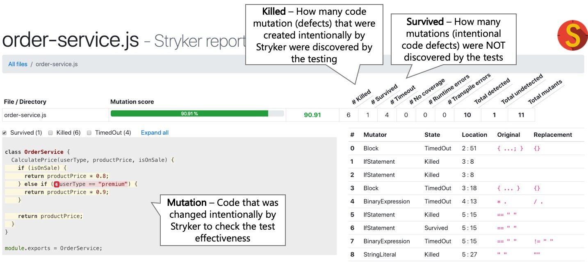

<br/>

# 👇 이 가이드가 당신의 테스트 기술을 한 단계 끌어 올리는 이유

<br/>

## 📗 철저하고 매우 포괄적인 45가지 이상의 모범 사례
JavaScript 및 Node.js에 대한 A부터 Z까지의 믿음직한 가이드입니다. 수십 가지 최고의 블로그 게시물, 서적 및 도구를 요약하고 정리합니다.

## 🚢 기초를 뛰어넘어 고급으로
운영중인 제품의 테스트, 돌연변이 테스트, 속성 기반 테스트 및 기타 여러 전략적 & 전문 도구와 같은 고급 주제로 넘어가는 여정을 경험하십시오.
이 가이드의 모든 단어를 읽으면 당신의 테스트 기술이 평균보다 높아질 수 있습니다.

## 🌐 Full-stack: 프론트, 백엔드, CI, 무엇이든
모든 응용프로그램 계층의 기초가 되는 유비쿼터스 테스트 방법을 이해하는 것으로부터 시작하십시오. 그런 다음 프론트엔드/UI, 백엔드, CI 혹은 이 모든것을 공부하세요.

<br/>

### Yoni Goldberg 작성

* JavaScript & Node.js 컨설턴트
* 👨‍🏫 [나의 테스팅 워크샵](https://www.testjavascript.com) -  유럽과 미국에서의 [제 워크샵](https://www.testjavascript.com)에 대해서 알아보십시오.
* [트위터 팔로우 하기](https://twitter.com/goldbergyoni/)
* [LA](https://js.la/), [베로나](https://2019.nodejsday.it/), [하르키우](https://kharkivjs.org/), [무료 웨비나](https://zoom.us/webinar/register/1015657064375/WN_Lzvnuv4oQJOYey2jXNqX6A)를 들으러 오십시오. 향후 이벤트는 곧 결정될 것입니다.
* [저의 JavaScript 뉴스 레터](https://testjavascript.com/newsletter/) - 인사이트와 오직 전략적인 문제에 대한 내용

<br/><br/>

## `목차`

#### [`섹션 0: 황금률`](#섹션-0️⃣-황금률)

모든 모든 사람들에게 영감을 주는 하나의 조언(하나의 특수한 항목)

#### [`섹션 1: 테스트 해부`](#섹션-1-테스트-해부-1)

기초 - 깔끔한 테스트 구성하기(12개)

#### [`섹션 2: 백엔드`](#섹션-2️⃣-백엔드-테스트)

백엔드 및 마이크로서비스 테스트 효율적으로 작성하기(8개)

#### [`섹션 3: 프론트엔드`](#섹션-3️⃣-프론트엔드-테스트)

컴포넌트 및 E2E 테스트를 포함한 웹 UI에 대한 테스트 작성하기(11개)

#### [`섹션 4: 테스트 효과 측정`](#섹션-4️⃣-테스트-효과-측정)

감시자를 감시하기 - 테스트 품질 측정(4개)


#### [`섹션 5: 지속적인 통합`](#섹션-5️⃣-지속적인-통합)

자바스크립트 세계에서 CI에 대한 지침(9개)

<br/><br/>

# 섹션 0️⃣: 황금률

<br/>

## ⚪ ️ 0. 황금률: 린 테스트를 위한 설계

:white_check_mark: **이렇게 해라:** 테스트 코드는 제품 코드와 다릅니다. 단순하고, 짧고, 추상화가 없고, 무난하고, 작업하기에 편리하고, 린하게 디자인 하십시오. 테스트를 보고 즉시 의미를 알아챌 수 있어야 합니다.

우리 머리속은 제품 코드로 가득하고 부가적인 복잡한 것들을 생각할 여유가 없습니다. 또 다른 어려운 코드를 억지로 생각해내려고 한다면, 팀의 속도를 늦추게 되어 우리가 테스트를 하는 이유가 무색해 질 것입니다. 실제로 많은 팀들이 이런 이유를 테스트를 포기합니다.

테스트는 친절하고 웃는 동료와 함께 일하는 것이 즐거울 수 있는 기회이고, 적은 투자로 큰 가치를 제공하는 것입니다. 과학은 우리에게 두 개의 뇌 시스템이 있다고 말합니다. 빈 도로에서 자동차를 운전하는 등의 간편한 활동에 사용되는 시스템 1, 그리고 수학 방정식을 푸는 것과 같이 복잡하고 의식적인 연산을 위한 시스템 2. 테스트 코드를 볼 때 수학 문제를 푸는 것 같은게 아닌, HTML 문서를 수정하는 것만 큼 쉬워야하는 시스템 1에 맞게 테스트를 설계하십시오.

선택적인 체리픽 기술, 툴 그리고 비용-효율적이고 뛰어난 ROI를 제공하는 테스트 대상 선정으로 이러한 목적을 달성할 수 있습니다. 필요한 만큼의 테스트, 융통성 있게 유지하려는 노력, 때로는 애자일함과 단순성을 위해 일부 테스트와 신뢰성을 포기하는 것도 가치가 있습니다.


 
아래 대부분의 조언은 이 원칙의 파생입니다.

### 시작할 준비 되셨나요?

<br/><br/>

# 섹션 1: 테스트 해부

<br/>

## ⚪ ️ 1.1 각 테스트 이름은 세 부분으로 구성된다.

:white_check_mark: **이렇게 해라:** 테스트는 현재 애플리케이션의 개정판이 요구 사항을 충족하는지 여부를 다음과 같은 사람들에게 알려야합니다: 배포를 할 테스터, DevOps 엔지니어, 2년 후의 미래에 코드가 익숙하지 않은 사람. 테스트가 요구 사항 수준에서 작성되어 있고 세 부분으로 구성되어 있다면, 목적을 이룰 수 있습니다:

(1) 무엇을 테스트하고 있는가? 예) 제품서비스.새제품추가 메서드

(2) 어떤 상황과 시나리오에서? 예) 메서드에 가격이 전달되지 않는다.

(3) 예상되는 결과는 무엇인가? 예) 신제품은 승인되지 않는다.

<br/>

❌ **그렇지 않으면:** 배포에 실패하였고 "제품 추가" 라는 테스트에 실패하였다. 이것이 정확히 어떤 오작동 인지를 알려주나요?

<br/>

**👇 주의:** 각 글에는 예제 코드가 있으며 때로는 이미지도 있습니다. 클릭하여 확장

<details><summary>✏ <b>예제 코드</b></summary>
  
<br/>
  
### :clap: 올바른 예: 세 부분으로 구성된 테스트 이름


```javascript
//1. 단위 테스트
describe('제품 서비스', function() {
  describe('새 제품 추가', function() {
    //2. 시나리오 3. 예상
    it('가격을 지정하지 않으면 제품 상태는 승인 대기중이다.', ()=> {
      const newProduct = new ProductService().add(...);
      expect(newProduct.status).to.equal('승인 대기');
    });
  });
});
```

<br/>

### :clap: 올바른 예: 세 부분으로 구성된 테스트 이름


</details>

<br/><br/>

## ⚪ ️ 1.2 AAA 패턴에 의한 테스트 구조

:white_check_mark: **이렇게 해라:** 3개의 잘 잘 구분된 섹션 AAA(Arrange, Act, Assert)으로 테스트를 구성하십시오. 이 구조를 따르면 테스트를 쉽게 읽을 수 있습니다:

첫번째 A - Arrange(준비): 테스트가 목표로 하는 시나리오에 필요한 시스템을 제공하기 위한 모든 설정 코드. 여기에는 테스트 생성자의 단위 인스턴스화, DB 데이터 추가, 객체에 대한 mock/stub 및 기타 준비 코드가 포함될 수 있습니다.

두번째 A - Act(행동): 단위 테스트를 실행. 일반적으로 코드 한줄

세번째 A - Assert(주장, 예상): 받은 예상값이 충족하는지 확인하십시오. 일반적으로 코드 한줄

<br/>

❌ **그렇지 않으면:** 테스트는 오늘 일의 아주 단순한 부분에 불과하지만, 메인 코드를 이해하는데 많은 시간을 낭비 할 것입니다.

<br/>

<details><summary>✏ <b>예제 코드</b></summary>

<br/>

### :clap: 올바른 예: AAA 패턴으로 구성된 테스트

 

```javascript
describe('고객 분류기', () => {
    test('고객이 500달러 이상을 소비한 경우 프리미엄으로 분류해야 합니다.', () => {
        //Arrange
        const customerToClassify = {spent:505, joined: new Date(), id:1}
        const DBStub = sinon.stub(dataAccess, "getCustomer")
            .reply({id:1, classification: 'regular'});

        //Act
        const receivedClassification = customerClassifier.classifyCustomer(customerToClassify);

        //Assert
        expect(receivedClassification).toMatch('premium');
    });
});
```

<br/>

### :thumbsdown: 올바르지 않은 예: 분리 되어있지 않고 한 벌로 작성되어 있어 해석하기 어렵다.

```javascript
test('프리미엄으로 분류해야 합니다.', () => {
    const customerToClassify = {spent:505, joined: new Date(), id:1}
    const DBStub = sinon.stub(dataAccess, "getCustomer")
        .reply({id:1, classification: 'regular'});
    const receivedClassification = customerClassifier.classifyCustomer(customerToClassify);
    expect(receivedClassification).toMatch('premium');
});
```

</details>

<br/><br/>

## ⚪ ️ 1.3 제품의 언어로 예상값을 설명: BDD 스타일의 Assertion을 사용
:white_check_mark: **이렇게 해라:** 테스트를 선언적 스타일로 작성하면 읽는 사람이 즉시 파악할 수 있습니다. 조건부 논리로 채워진 명령형 코드로 작성하면 테스트를 읽기가 쉽지 않습니다. 그런 의미에서 임의의 사용자 정의 코드를 사용하지 말고, 선언적 BDD 스타일의 expect 또는 should를 사용하여 인간과 같은 언어로 테스트를 작성하십시오. Chai & Jest에 원하는 Assertion이 포함되어 있지 않고 반복성이 높은 경우 [extending Jest matcher (Jest)](https://jestjs.io/docs/en/expect#expectextendmatchers) 혹은 [custom Chai plugin](https://www.chaijs.com/guide/plugins/) 작성을 고려하십시오.

<br/>

❌ **그렇지 않으면:** 팀은 테스트를 덜 작성하고 성가신 것들을 .skip() 으로 장식합니다.

<br/>

<details><summary>✏ <b>예제 코드</b></summary><br/>

 
  
### :thumbsdown: 올바르지 않은 예: 읽는 사람은 테스트 스토리를 이해하기 위해 짧지않은 명령형 코드를 훑어봐야 합니다.

```javascript
test("관리자 요청이 들어오면 정렬된 관리자 목록만 결과에 포함된다." , () => {
    // 여기에 두 명의 관리자 "admin1", "admin2" 및 "user1" 을 추가했다고 가정합니다.
    const allAdmins = getUsers({adminOnly:true});
    const admin1Found, adming2Found = false;
    allAdmins.forEach(aSingleUser => {
        if(aSingleUser === "user1"){
            assert.notEqual(aSingleUser, "user1", "관리자가 아닌 사용자를 찾았다.");
        }
        if(aSingleUser==="admin1"){
            admin1Found = true;
        }
        if(aSingleUser==="admin2"){
            admin2Found = true;
        }
    });
    if(!admin1Found || !admin2Found ){
        throw new Error("모든 관리자가 반환되지 않았다.");
    }
});
```

<br/>

### :clap: 올바른 예: 다음과 같은 선언적 테스트는 이해하기 쉽습니다.

```javascript
it("관리자 요청이 들어오면 정렬된 관리자 목록만 결과에 포함된다." , () => {
    // 여기에 두 명의 관리자를 추가했다고 가정합니다.
    const allAdmins = getUsers({adminOnly:true});
    expect(allAdmins).to.include.ordered.members(["admin1" , "admin2"])
                     .but.not.include.ordered.members(["user1"]);
});
```

</details>

<br/><br/>

## ⚪ ️ 1.4 블랙박스 테스트에 충실: public method만 테스트

:white_check_mark: **이렇게 해라:** 내부테스트는 거의 아무것도 하지 않는 엄청난 오버헤드를 발생시킵니다. 만약 당신의 코드 혹은 API가 올바른 결과를 반환한다면, 내부적으로 어떻게 동작했는지의 테스트에 3시간을 투자해야 합니까? 깨지기 쉬운 테스트를 유지해야 합니까? public method가 잘 동작할 때마다 private method 또한 암시적으로 테스트가 되고, 특정 문제(예. 잘못된 출력)가 있는 경우에만 테스트가 깨집니다. 이 접근법은 행동 테스트라고도 합니다. 다른 한편으로 당신은 내부 테스트를 해야합니까?(화이트박스 접근) - 컴포넌트를 설계하는 것에서 핵심 세부 사항으로 초점이 이동하거나 작은 코드의 리펙토링으로 인해 테스트가 중단 될 수 있지만, 결과는 훌륭합니다. - 이는 유지보수 부담을 크게 증가시킵니다.

<br/>

❌ **그렇지 않으면:** 당신의 테스트는 다음과 같이 동작합니다. [양치기 소년](https://en.wikipedia.org/wiki/The_Boy_Who_Cried_Wolf): 늑대가 나타났다!(예. private 변수가 변경되어 테스트에 실패하였습니다). 당연히 사람들은, 언젠가 진짜 버그가 무시될 때 까지 CI 알람을 무시하기 시작할 것입니다...

<br/>

<details><summary>✏ <b>예제 코드</b></summary>

<br/>

### :thumbsdown: 올바르지 않은 예: 테스트 케이스는 이유없이 내부를 테스트합니다.


```javascript
class ProductService{
    // 이 method 는 내부에서만 사용됩니다.
    // 이 이름을 변경하면 테스트가 실패합니다.
    calculateVAT(priceWithoutVAT){
        return {finalPrice: priceWithoutVAT * 1.2};
        // 결과 형식이나 키 이름을 변경하면 테스트가 실패합니다.
    }
    // public method
    getPrice(productId){
        const desiredProduct= DB.getProduct(productId);
        finalPrice = this.calculateVATAdd(desiredProduct.price).finalPrice;
    }
}

it("화이트박스 테스트: 내부 method가 VAT 0을 받으면 0을 반환합니다.", async () => {
    // 사용자가 VAT를 계산할 수 있게 하는 요구사항은 없으며, 최종 가격만 표시합니다.
    // 그럼에도 불구하고 여기에서 내부 테스트 수행
    expect(new ProductService().calculateVATAdd(0).finalPrice).to.equal(0);
});
```

</details>

<br/><br/>

## ⚪ ️ 1.5 올바른 테스트 더블 선택: Stub과 Spy를 위한 Mock을 피하십시오.

:white_check_mark: **이렇게 해라:**  테스트 더블은 어플리케이션 내부에 연결되어 있기때문에 필요악이지만 일부는 엄청난 가치를 제공합니다(<a href="https://martinfowler.com/articles/mocksArentStubs.html" data-href="https://martinfowler.com/articles/mocksArentStubs.html" class="markup--anchor markup--p-anchor" rel="noopener nofollow" target="_blank">[테스트 더블에 대한 알림: mocks vs stubs vs spies](https://martinfowler.com/articles/mocksArentStubs.html)</a>).

테스트 더블을 사용하기 전에 간단한 질문: 요구사항 문서에 있거나 있을 수 있는 기능을 테스트하는 데 테스트 더블을 사용합니까? 만약 아니라면 화이트박스 테스트 낌새가 보입니다.

예를 들어, 결제 서비스가 중단되었을 때 앱이 적절하게 작동하는 것을 테스트하려는 경우, 테스트중인 단위가 올바른 값을 반환하도록, 결제 서비스를 stub하고 '응답 없음' 반환을 트리거 할 수 있습니다.
이것은 특정 시나리오에서 애플리케이션의 동작/응답/결과를 확인합니다. 그리고 spy를 사용하여 해당 서비스가 중단되었을 때 메일이 보내지는지를 assert 할 수 있습니다. 이것은 다시 요구사항 문서에 있을 수 있는 행동에 대한 점검입니다(결제가 저장되지 않으면 메일은 보낸다). 반대로, 결제 서비스를 mock 하고 올바른 JavaScript 타입으로 호출 되었는지를 확인한다면 - 당신의 테스트는 애플리케이션 기능에 전혀 영향을 받지 않고 자주 변경될 수 있는 내부 구현에 초점을 둔 경우입니다.
<br/>

❌ **그렇지 않으면:** 코드를 리펙토링 할 때, 모든 mock을 찾아서 수정해야 합니다. 테스트가 도움이 아닌 부담이 됩니다.

<br/>

<details><summary>✏ <b>예제 코드</b></summary>

<br/>

### :thumbsdown: 올바르지 않은 예: 내부에 초점을 둔 mock


 
```javascript
it("유효한 제품을 삭제하려고 할 때, 올바른 제품과 올바른 구성 정보로 데이터 액세스 DAL을 한 번 호출했는지 확인한다", async () => {
    // 이미 제품을 추가했다고 가정
    const dataAccessMock = sinon.mock(DAL);
    // 좋지 않음: 내부 테스트는 side-effect를 위해서가 주요 목적을 위해서 입니다.
    dataAccessMock.expects("deleteProduct").once().withArgs(DBConfig, theProductWeJustAdded, true, false);
    new ProductService().deletePrice(theProductWeJustAdded);
    dataAccessMock.verify();
});
```

<br/>

### :clap:올바른 예: spy는 요구사항을 테스트하는데 초점을 두고있지만, 내부를 건드리는 side-effect를 피할 순 없습니다.

```javascript
it("유효한 제품을 삭제하려고 할 때, 메일을 보낸다", async () => {
    // 이미 제품을 추가했다고 가정
    const spy = sinon.spy(Emailer.prototype, "sendEmail");
    new ProductService().deletePrice(theProductWeJustAdded);
    // 좋음: 우리는 내부를 다루는가? 그렇다, 그러나 요구사항(이메일을 보낸다)에 대한 테스트의 side-effect이다.
});
```

</details>

<br/><br/>

## ⚪ ️ 1.6 의미없는 인풋 데이터를 사용하지 말고, 실제와 같은 인풋 데이터를 사용해라

:white_check_mark: **이렇게 해라:**  흔히 제품의 버그들은 매우 특수한 인풋데이터를 통해 나타납니다 - 테스트 인풋이 혈실적일 수록 버그를 조기에 발견할 가능성이 높아집니다. 실제 데이터와 다양성 및 형태가 유사한 데이터를 생성해 주는 [Faker](https://www.npmjs.com/package/faker) 같은 전용 라이브러리들을 사용하십시오. 이런 라이브러리들은 실제같은 전화번호, 사용자 이름, 신용카드, 회사명 그리고 심지어 'lorem ipsum'같은 문자등을 생성할 수도 있습니다. 당신은 가상의 데이터를 사용하여 테스트(단위 테스트 위에서)를 무작위화 하거나 심지어 실제 환경으로부터의 실제 데이터를 임포트 할수도 있습니다. 다음 단계를 얻기를 원하십니까? 그렇다면 아래로 가십시오 (property-based testing).

<br/>

❌ **그렇지 않다면:** "Foo"와 같은 인풋을 사용하면 당신의 모든 테스트가 모두 통과한것 처럼 표시되지만, 실제 환경에서는 해커가 “@3e2ddsf . ##’ 1 fdsfds . fds432 AAAA” 같은 인풋을 전달해 실패 할수도 있습니다.

<br/>

<details><summary>✏ <b>예제 코드</b></summary>

<br/>

### :thumbsdown: 올바르지 않은 예: 현실적이지 않은 데이터 때문에 통과하는 테스트


 
 
```javascript
const addProduct = (name, price) =>{
  const productNameRegexNoSpace = /^\S*$/;// 공백은 허용되지 않음

  if(!productNameRegexNoSpace.test(name))
    return false;//도달하지 않는 곳

    //some logic here
    return true;
};

test("잘못된 예제: 유효한 속성과 함께 제품을 추가한다면, 성공을 얻는다.", async () => {
    //모든 테스트에서 false 가 리턴되지 않는 "Foo" 인풋을 사용
    const addProductResult = addProduct("Foo", 5);
    expect(addProductResult).toBe(true);
    //거짓된 성공: 공백을 포함하는 문자열을 사용하지 않았기 때문에 테스트는 성공한다.
});
```

<br/>

### :clap:올바른 예: 무작위한 현실적인 인풋

```javascript
it("더 나은 것: 유효한 제품이 추가된다면, 성공을 얻는다.", async () => {
    const addProductResult = addProduct(faker.commerce.productName(), faker.random.number());
    //생성된 무작위 인풋: {'Sleek Cotton Computer',  85481}
    expect(addProductResult).to.be.true;
    //테스트는 실패한다, 무작위 인풋은 우리가 계획하지 않은 일이 일어나도록 만든다.
    //우리는 조기에 버그를 발견했다!
});
```

</details>

<br/><br/>

## ⚪ ️ 1.7  프로퍼티 기반(Property-based) 테스트를 통해 다양한 인풋 값 조합으로 테스트를 하십시오.

:white_check_mark: **이렇게 해라:** 우리는 일반적으로 적은 수의 인풋 샘플 데이터를 가지고 테스트를 합니다. 심지어 인풋 데이터 형식이 실제 데이터와 비슷할 때에도 다음과 같이 제한된 인풋 조합으로만 테스트를 커버합니다.(method(‘’, true, 1), method(“string” , false” , 0)) 하지만, 운영시에는 5개의 파라미터를 가지는 API는 수 천 개의 다른 조합의 파라미터로 호출 될 수 있고, 이 중 하나가 우리의 시스템을 다운시킬 수도 있습니다. 그렇다면 만약 1000 가지 조합의 인풋값을 자동으로 생성하고 올바른 응답을 반환하지 못하는 인풋값을 찾아내는 단위 테스트를 작성할 수 있다면 어떨까요?
프로퍼티 기반 테스트는 단위 테스트에 모든 가능한 인풋 조합을 사용하여 생각하지 못 한 버그를 찾을 확률을 높여줍니다. 예를들어, 다음의 메소드가 주어졌을 때 — addNewProduct(id, name, isDiscount) — 프로퍼티 기반 테스트 라이브러리들은  다양한 파라미터 (number, string, boolean) 조합으로  - (1, “iPhone”, false), (2, “Galaxy”, true) - 이 메소드를 호출합니다. [js-verify](https://github.com/jsverify/jsverify) 나 [testcheck](https://github.com/leebyron/testcheck-js) (much better documentation) 같은 라이브러리를 지원하는 테스트 러너들 (Mocha, Jest, etc) 중 당신이 가장 선호하는 방법을 통해 프로퍼티 기반 테스트를 할 수 있습니다. 
업데이트 : Nicolas Dubien가 코멘트를 통해 더 많은 부가적인 기능들을 제공하고 활발하게 유지보수되고 있는 라이브러리 [fast-check](https://github.com/dubzzz/fast-check#readme)를 추천해 주었습니다. 

<br/>

❌ **그렇지 않으면:** 의심할 여지 없이 당신은 오직 코드가 잘 동작하는 테스트 인풋을 사용할 것입니다. 불행하게도 이러한 방식은 버그를 찾는 도구로써의 테스트 효율성을 떨어뜨릴 것 입니다.

<br/>

<details><summary>✏ <b>예제 코드</b></summary>

<br/>

### :clap:  올바른 예: “mocha-testcheck”를 사용하여 다양한 인풋 조합으로 테스트 하십시오.


```javascript
require('mocha-testcheck').install();
const {expect} = require('chai');

describe('Product service', () => {
  describe('Adding new', () => {
    //서로 다른 무작위 값으로 100회 호출됩니다. 
    check.it('Add new product with random yet valid properties, always successful',
      gen.int, gen.string, (id, name) => {
        expect(addNewProduct(id, name).status).to.equal('approved');
      });
  })
});
```

</details>

<br/><br/>

## ⚪ ️ 1.8 필요한 경우 짧거나 인라인 스냅샷만 사용하십시오.

:white_check_mark: **이렇게 해라:** [스냅샷 테스트](https://jestjs.io/docs/en/snapshot-testing)가 필요한 경우 외부 파일이 아닌 테스트의 일부 ([인라인 스냅샷](https://jestjs.io/docs/en/snapshot-testing#inline-snapshots))에 포함 된 짧고 집중된 스냅샷(3~7 라인)만 사용하십시오. 이 지침을 따르면 따로 설명이 필요없고 잘 깨지지 않는 테스트가 됩니다.

반면에, '고전적인 스냅샷' 튜토리얼 및 도구는 외부에 큰 파일(예: 구성 요소 랜더링 마크업, API JSON 결과)를 저장하고, 테스트를 실행할 때 마다 수신된 결과를 저장된 버전과 비교하기를 권장합니다. 예를 들어, 이것은 1,000 라인(우리가 절대 읽지 않고 추론하지 않을 3,000개의 데이터 값을 가진)의 코드를 우리 테스트에 암시적으로 연결할 수 있습니다. 왜 이것이 잘못 되었을까요? 이렇게하면 테스트에 실패할 1,000 가지 이유가 생깁니다. 한줄만 변경되어도 스냅샷이 유효하지 않게 되고, 이런일이 일어날 가능성이 높습니다. 얼마나 자주? 모든 공백, 주석에서 혹은 사소한 CSS/HTML 변경에 대해서. 뿐만 아니라 테스트 이름은 1,000 라인이 변경되지 않았는지를 나타내기 때분에, 실패에 대한 단서를 제공하지 않습니다. 또한 테스트 작성자가 긴 문서(검사하고 확인할 수 없는)를 받아들이게끔 합니다. 이 모든 것은 초점이 맞지않고 너무 많은 것을 달성하려는 모호하고 간절한 테스트 증상입니다.

긴 외부 스냅샷이 허용되는 경우가 거의 없다는 점은 주목할 가치가 있습니다 - 데이터가 아닌 스키마를 assert 할 때(값 추출 및 필드에 집중) 또는 수신된 문서가 거의 변경되지 않는 경우

<br/>

❌ **그렇지 않다면:** UI 테스트가 실패합니다. 코드가 문제없어 보이고 화면이 완벽한 픽셀을 렌더링합니다. 어떻게 되었습니까? 스냅샷 테스트에서 원본 문서와 현재 수신된 문서와의 차이점을 발견했습니다. 빈칸 하나가 마크 다운에 추가되었습니다...

<br/>

<details><summary>✏ <b>예제 코드</b></summary>

<br/>

### :thumbsdown: 올바르지 않은 예: 보이지 않는 2,000 라인의 코드를 우리 테스트에 연결


 
```javascript
it('TestJavaScript.com 이 올바르게 랜더링 된다.', ()  => {

//Arrange

//Act
const receivedPage = renderer
.create(  <DisplayPage page  =  "http://www.testjavascript.com"  > Test JavaScript < /DisplayPage>)
.toJSON();

//Assert
expect(receivedPage).toMatchSnapshot();
// 이제 2,000 라인의 문서를 암묵적으로 유지합니다.
// 모든 줄바꿈 또는 주석이 테스트를 망가뜨립니다.

});
```

<br/>

### :clap: 올바른 예: expectation이 잘 보이고 집중된다.

```javascript
it('TestJavaScript.com 홈페이지를 방문하면 메뉴가 보인다.', () => {
//Arrange

//Act
receivedPage tree = renderer
.create(  <DisplayPage page  =  "http://www.testjavascript.com"  > Test JavaScript < /DisplayPage>)
.toJSON();

//Assert

const menu = receivedPage.content.menu;
expect(menu).toMatchInlineSnapshot(`
<ul>
<li>Home</li>
<li> About </li>
<li> Contact </li>
</ul>
`);
});
```

</details>

<br/><br/>

## ⚪ ️ 1.9 테스트 데이터를 글로벌로 하지말고 테스트별로 따로 추가하라.

:white_check_mark: **이렇게 해라:** 황금률에 따르면(섹션 0), 각 테스트는 커플링을 방지하고 테스트 흐름을 쉽게 추론하기 위해 자체 DB 데이터를 추가하고 실행해야 합니다. 실제로 성능 향상(테스트를 실행하기 전에 DB 데이터를 준비(['테스트 픽스쳐'라고도 합니다](https://en.wikipedia.org/wiki/Test_fixture)))을 위해 이를 위반하는 테스터들이 많습니다. 성능은 실제로 유효한 문제이지만 완화될 수 있습니다(2.2 컴포넌트 테스트 참고). 그러나 테스트 복잡성은 대부분의 다른 고려사항들을 통제해야 하는 고통을 수반합니다. 각 테스트에 필요한 DB 레코드를 명시적으로 추가하고, 해당 데이터에 대해서만 테스트를 수행하십시오. 성능이 중요한 문제가 되는 경우 - 데이터를 변경하지 않는 테스트 모음(예: 쿼리)에 대해서 데이터를 준비하는 형태로 타협할 수 있습니다.

<br/>

❌ **그렇지 않으면:** 테스트 실패, 배포 중단으로 팀원들이 귀중한 시간을 소비할 것입니다. 버그가 있습니까? 조사해보니 '없습니다' - 두 테스트에서 동일한 테스트 데이터를 변겨안 것으로 보입니다.

<br/>

<details><summary>✏ <b>예제 코드</b></summary>

<br/>

### :thumbsdown: 올바르지 않은 예: 테스트는 독립적이지 않으며 글로벌 훅에 의한 DB 데이터에 의존


 
```javascript
before(() => {
  // 사이트 및 관리자 데이터를 DB에 추가. 데이터는 어디에 있습니까? 외부에. 외부 JSON 또는 마이그레이션 프레임워크에
  await DB.AddSeedDataFromJson('seed.json');
});
it("사이트 이름을 업데이트 할 때, 성공을 확인한다.", async () => {
  // 사이트 이름 "portal"이 존재한다는 것을 알고있습니다. 시드파일에서 봤습니다.
  const siteToUpdate = await SiteService.getSiteByName("Portal");
  const updateNameResult = await SiteService.changeName(siteToUpdate, "newName");
  expect(updateNameResult).to.be(true);
});
it("사이트 이름을 쿼리할 때, 올바른 사이트 이름을 얻는다.", async () => {
  // 사이트 이름 "portal"이 존재한다는 것을 알고있습니다. 시드파일에서 봤습니다.
  const siteToCheck = await SiteService.getSiteByName("Portal");
  expect(siteToCheck.name).to.be.equal("Portal"); // 실패! 이전 테스트에서 이름이 변경되었습니다. ㅠㅠ
});
```

<br/>

### :clap: 올바른 예: 우리는 테스트 내부에만 머물 수 있으며, 각 테스트는 자체 데이터 세트에서 동작합니다.

```javascript
it("사이트 이름을 업데이트 할 때, 성공을 확인한다.", async () => {
  // 테스트는 새로운 레코드를 새로 추가하고 해당 레코드에 대해서만 동작합니다.
  const siteUnderTest = await SiteService.addSite({
    name: "siteForUpdateTest"
  });
  
  const updateNameResult = await SiteService.changeName(siteUnderTest, "newName");
  
  expect(updateNameResult).to.be(true);
});
```

</details>

<br/><br/>

## ⚪ ️ 1.10 오류를 catch 하지말고 expect 하십시오.

:white_check_mark: **이렇게 해라:** 오류를 발생시키는 입력값을 assert 할 때, try-catch-finally를 사용하고 catch 블럭에서 assert 하는게 맞아 보일수도 있습니다. 아래 예는 테스트 의도와 결과 expectation을 숨기는 어색하고 장황한 테스트 사례입니다.

보다 우아한 대안은 한줄짜리 Chai assertion을 사용하는 것 입니다: expect(method).to.throw (혹은 Jest: expect(method).toThrow()). 오류 유형을 알려주는 속성이 예외에 포함되어야 합니다. 그렇지 않고 일반적인 오류를 발생시키면 어플리케이션은 사용자에게 실망스러운 메시지를 표시하는 것 밖에 할 수 없습니다.

<br/>

❌ **그렇지 않으면:** 무엇이 잘못되었는지 테스트 보고서(예: CI 보고서)에서 추론하기 어려울 것입니다.

<br/>

<details><summary>✏ <b>예제 코드</b></summary>

<br/>

### :thumbsdown: 올바르지 않은 예: try-catch로 오류가 존재한다고 assert 하는 긴 테스트 사례


 
```javascript
it("제품명이 없으면 400 오류를 던진다.", async() => {
  let errorWeExceptFor = null;
  try {
    const result = await addNewProduct({name:'nest'});}
  catch (error) {
    expect(error.code).to.equal('InvalidInput');
    errorWeExceptFor = error;
  }
  expect(errorWeExceptFor).not.to.be.null;
  // 이 asserting이 실패하면, 테스트 결과에서 누락된 입력값에 대한 단어는 알 수 없고
  // 입력값이 null 이라는 것만 알 수 있습니다.
});
```

<br/>

### :clap: 올바른 예: QA나 PM이라도 쉽게 이해할 수 있고 읽기 쉬운 expectation

```javascript
it.only("제품명이 없으면 400 오류를 던진다.", async() => {
  expect(addNewProduct)).to.eventually.throw(AppError).with.property('code', "InvalidInput");
});
```

</details>

<br/><br/>

## ⚪ ️ 1.11 테스트에 태깅하십시오.

:white_check_mark: **이렇게 해라:** 다른 테스트는 꼭 다른 시나리오에서 실행해야 합니다: 개발자가 파일을 저장하거나 커밋을 할 때 빠르고, IO가 많이 없는 테스트를 실행해야 합니다. 전체 end-to-end 테스트는 일반적으로 새로운 Pull Request가 제출되었을 때 실행됩니다. 등.. 이러한 경우에 #cold #api #sanity와 같은 키워드로 테스트에 태깅하면 테스트를 효율적으로 grep 할 수 있고, 원하는 하위세트를 호출할 수 있습니다. 예) Mocha를 이용해서 sanity 테스트 그룹만 실행하는 방법입니다: mocha - grep 'sanity'

<br/>

❌ **그렇지 앟으면:** 개발자가 작은 변경을 할 때마다 수십 개의 DB 쿼리를 수행하는 테스트를 포함한 모든 테스트를 실행한다면, 속도가 매우 느려져 개발자가 테스트를 수행하지 않게 만들 것입니다.

<br/>

<details><summary>✏ <b>예제 코드</b></summary>

<br/>

### :clap: 올바른 예: 테스트를 '#cold-test'로 태깅하면 테스트를 수행하는 사람이 빠른 테스트만 실행할 수 있습니다(IO를 수행하지 않고 개발자가 코딩하는 중에도 자주 실행할 수 있는 테스트 cold === quick).


```javascript
// 이 테스트는 빠르고(DB 없음) 현재 사용자/CI가 자주 실행할 수 있는 태그를 지정하고 있습니다.
describe('주문 서비스', function() {
  describe('새 주문 추가 #cold-test #sanity', function() {
    test('시나리오 - 통화가 제공되지 않음. 예외 - 기본 통화 사용 #sanity', function() {
      // code logic here
    });
  });
});
```

</details>

<br/><br/>

## ⚪ ️ 1.12 일반적인 좋은 테스트 기법들

:white_check_mark: **이렇게 해라:** 이 글은 Node.js와 관련이 있거나 최소한 Node.js로 예를 들 수 있는 테스트 조언에 중점을두고 있습니다. 그러나 이번에는 Node.js가 아니지만 잘 알려진 팁들을 포함하고 있습니다.

[TDD 원칙](https://www.sm-cloud.com/book-review-test-driven-development-by-example-a-tldr/)을 배우고 연습하십시오 - 많은 사람들에게 매우 가치가 있지만, 자신의 스타일에 맞지 않을 수 있습니다. [실패-성공-리페토링 스타일](https://blog.cleancoder.com/uncle-bob/2014/12/17/TheCyclesOfTDD.html)로 코드 작성 전에 테스트를 작성하는 것을 고려하십시오. 버그를 발견하면 각 테스트에서 정확히 한 가지만 확인하도록 하십시오. 수정하기 전에 앞으로 이 버그를 발견 할 테스트를 작성하십시오. 테스트가 성공하기 전에 각 테스트가 한번 이상 실패하도록 하십시오. 테스트를 만족시키는 간단한 코드를 작성하여 빠르게 모듈을 시작하십시오 - 점신적으로 리펙토링하여 프로덕션 등급의 수준으로 가져가십시오. 환경(경로, OS 등)에 대한 종속성을 피하십시오.

<br/>

❌ **그렇지 않으면:** 수십 년 동안 수집 된 아주 소중한 조언을 놓치게 될 것입니다.

<br/><br/>

# 섹션 2️⃣: 백엔드 테스트

## ⚪ ️ 2.1 당신의 테스트 포트폴리오를 풍부하게 하십시오: 단위 테스트와 피라미드를 넘어서세요.

:white_check_mark: **이렇게 해라:** 10년이 넘은 모델인 [테스트 피라미드](https://martinfowler.com/bliki/TestPyramid.html)는 세 가지 테스트 유형을 제시하고 대다수 개발자의 테스트 전략에 영향을 주는 훌륭한 모델입니다. 동시에, 몇 가지 반짝이는 새로운 테스트 기술들이 등장하였지만 모두 테스트 피라미드의 그림자 뒤로 사라졌습니다. 우리가 최근 10년간 보아 온 극적인 기술의 변화들(Microservices, cloud, serverless)을 고려할 때, 아주 오래된 모델 하나가 *모든* 어플리케이션 유형에 적합하다는 것이 가능한가요? 테스트 세계는 새로운 기술을 받아들이는 것을 고려하지 않나요?

오해는 하지 마세요. 2019 테스트 피라미드에서 TDD와 단위 테스트는 여전히 강력한 기술이고 아마도 많은 어플리케이션에 가장 어울리는 기술입니다. 다른 모델과 마찬가지로, 테스트 미라미드는 유용하지만 [그것이 항상 맞는 것은 아닙니다](https://en.wikipedia.org/wiki/All_models_are_wrong). 예를 들어, 어떤 IOT 어플리케이션을 생각해 봅시다. 이 어플리케이션은 다수의 이벤트를 Kafka/RabbitMQ 같은 메세지 버스로 보내고 다시 데이터 웨어하우스로 흘려보냅니다. 그리고 이 데이터들은 어떤 분석 UI에서 조회됩니다. 우리는 정말 우리의 테스트 예산의 50%를 통합 중심적(intergration-centric)이고 로직이 거의 없는 어플리케이션의 단위 테스트를 작성하는데 할애해야 할까요? 어플리케이션 유형들이 다양해질 수록(bots, crypto, Alexa-skills) 테스트 피라미드가 적합하지 않은 시나리오들을 발견할 가능성이 커집니다.  

지금이 당신의 테스트 포트폴리오를 넓히고 더 많은 테스트 유형들에 익숙해질 시간입니다. (다음 항목에서 몇 가지 아이디어들을 제안합니다.) 테스트 피라미드 같은 모델들도 염두에 둘 뿐만 아니라 당신이 직면하고 있는 현실 세계의 문제들에 적합한 테스트 유형들을 찾으세요. ("우리 API 깨졌어. Consumer-driven contract 테스트 작성하자!" 처럼요.) 위험성 분석을 기반으로 포르폴리오를 구축하는 투자자처럼 당신의 테스트를 다양화하세요 - 문제가 발생할 수 있는 부분을 가늠하고 잠재적 위험성을 줄일 수 있는 예방 방법을 찾으세요. 

주의 사항 : 소프트웨어 세계에서의 TDD 논쟁은 전형적인 잘못된 이분법입니다. 어떤 사람들은 TDD를 모든 곳에 적용하라고 주장하지만, 다른 일부는 TDD를 악마라고 생각합니다. 절대적으로 한쪽만 주장하는 사람들은 모두 틀렸습니다 :]

<br/>

❌ **그렇지 않으면:** 당신은 굉장한 ROI를 주는 몇 가지 툴들을 놓칠 것입니다. Fuzz, lint, mutation 테스트들은 단 10분만에 당신에게 가치를 제공할 수 있습니다. 

<br/>

<details><summary>✏ <b>코드 예제</b></summary>

<br/>

### :clap: 올바른 예: Cindy Sridharan은 그녀의 훌륭한 글 ‘Testing Microservices — the sane way’에서 풍부한 테스트 포트폴리오를 제안합니다. 

<strong class="markup--strong markup--p-strong">예제: </strong><a href="https://www.youtube.com/watch?v=-2zP494wdUY&amp;feature=youtube" data-href="https://www.youtube.com/watch?v=-2zP494wdUY&amp;feature=youtu.be" class="markup--anchor markup--p-anchor" rel="nofollow noopener" target="_blank">[YouTube: “Beyond Unit Tests: 5 Shiny Node.JS Test Types (2018)” (Yoni Goldberg)](https://www.youtube.com/watch?v=-2zP494wdUY&feature=youtu.be)</a>

<br/>


</details>

<br/><br/>

## ⚪ ️2.2 컴포넌트 테스트가 최선의 방법일 수 있다.

:white_check_mark: **이렇게 해라:** 각각의 단위 테스트는 어플리케이션의 매우 작은 부분만을 커버하고 전체를 모두 커버하기에는 비용이 많이 듭니다. 반면에, end-to-end 테스트는 간단하게 많은 부분을 커버할 수 있지만 깊이가 얕고 더 느립니다. 그렇다면 균형 잡힌 접근법을 적용하여 단위 테스트보다는 크지만 end-to-end 테스트보다는 작은 테스트를 작성하는 것은 어떨까요? 컴포넌트 테스트는 테스트 세계에서 잘 알려지지 않은 방법입니다. - 컴포넌트 테스트는 다음의 두 가지 이점을 모두 제공합니다: 합리적인 성능과 TDD 패턴을 적용할 수 있는 가능성 + 현실적이면서 훌륭한 커버리지

컴포넌트 테스트는 마이크로 서비스 '단위'에 중점을 두고 API에 대하여 동작합니다. 마이크로서비스 그 자체에 속한 것들 (예를들면, 실제 DB 또는 해당 DB의 인-메모리 버전)은 모킹(Mock)하지 않고, 다른 마이크로서비스 호출과 같은 외부적인 것은 스텁(Stub)합니다. 그렇게 함으로써 우리는 우리가 배포하는 것을 테스트하고 어플리케이션의 바깥쪽에서 안쪽으로 접근하며, 적당한 시간 안에서 큰 자신감을 얻을 수 있습니다. 
<br/>


❌ **그렇지 않으면:** 시스템 커버리지가 20%에 불과하다는 것을 깨닫기까지 단위 테스트를 작성하는 데 오랜 시간이 걸릴 수 있습니다. 

<br/>

<details><summary>✏ <b>코드 예제</b></summary>

<br/>

### :clap: 올바른 예: Supertest를 통해 프로세스 내 Express API에 접근할 수 있습니다. (빠르고 다양한 계층을 커버함)


 allows approaching Express API in-process (fast and cover many layers)")

</details>

<br/><br/>

## ⚪ ️2.3 신규 릴리즈가 API 사용을 깨지게 하지 마십시오.

:white_check_mark: **이렇게 해라:** 당신의 마이크로서비스는 다수의 클라이언트를 가지고 있고 호환성의 이유로 여러 버전의 서비스를 운영합니다 (모든 사람을 만족시키기 위해서). 그런 상황에서 당신이 일부 필드를 변경하면 이 필드를 믿고 사용하던 일부 중요한 클라이언트는 화가 날 것입니다. 이것은 통합(integration) 세계에서 해결하기 어려운 진퇴양난에 놓인 문제입니다: 서버 사이드가 여러 클라이언트들의 모든 기댓값을 고려하는 것은 매우 어려운 일입니다. - 반면에, 서버가 릴리즈 날짜를 결정하기 때문에 클라이언트는 어떠한 테스트도 수행할 수 없습니다. 
[소비자 주도 계약 테스트(Consumer-driven contracts)와 PACT 프레임워크](https://docs.pact.io/)는 매우 파괴적인 방법으로 이러한 프로세스를 표준화하기 위해 나타났습니다. - 서버가 서버의 테스트 계획을 결정하지 않고, 클라이언트가 서버의 테스트를 결정합니다! PACT는 클라이언트의 기댓값을 기록하여 "브로커"라는 공유된 위치에 올려둘 수 있습니다. 그러면 서버는 그 기댓값을 당겨 받을 수 있고 빌드할 때마다 PACT 라이브러리를 사용하여 깨진 계약(contract - 충족되지 않은 클라이언트의 기댓값)을 감지할 수 있습니다. 이렇게 함으로써, 모든 서버-클라이언트 API 간 일치하지 않은 것들을 빌드/CI 환경에서 조기에 잡을 수 있고 당신의 큰 절망감을 줄여줄 수 있을 것입니다. 

<br/>


❌ **그렇지 않으면:** 대안은 수동 배포나 배포에 대한 두려움을 안고 가는 것 뿐입니다. 

<br/>

<details><summary>✏ <b>코드 예제</b></summary>

<br/>

### :clap: 올바른 예:


 


</details>


<br/><br/>


## ⚪ ️ 2.4 당신의 미들웨어를 독립적으로 테스트 하십시오.

:white_check_mark: **Do:** 많은 사람들은 미들웨어(Middleware) 테스트를 피합니다. 왜냐하면 미들웨어 테스트는 시스템의 작은 부분일 뿐이고 라이브 Express 서버가 필요하기 때문입니다. 하지만 두 가지 이유 모두 틀렸습니다. - 미들웨어는 작지만 모든 요청 또는 대부분의 요청에 영향을 미치고, {req,res} JS 객체를 가지는 순수한 함수로 쉽게 테스트할 수 있기 때문입니다. 미들웨어 함수를 테스트하기 위해서는 단지 함수를 불러오고 함수가 올바르게 동작하는 것을 확인하기 위해 {req, res} 객체에 대한 인터렉션을 스파이(spy)([예를들어 Sinon을 사용](https://www.npmjs.com/package/sinon))하면 됩니다. 라이브러리 [node-mock-http](https://www.npmjs.com/package/node-mocks-http)는 더 나아가서 행위에 대한 스파이와 함께 {req, res} 객체도 테스트할 수 있습니다. 예를 들어, response 객체의 http 상태가 기대했던 값과 일치하는지 여부를 확인(assert)할 수 있습니다. (아래 예제를 보세요)
<br/>


❌ **Otherwise:** Express 미들웨어에서의 버그 === 모든 요청 또는 대부분의 요청에서의 버그


<br/>

<details><summary>✏ <b>코드 예제</b></summary>

<br/>

### :clap:올바른 예: 네트워크 호출 없이 전체 Express 시스템도 깨우지 않으면서 미들웨어를 독립적으로 테스트


```javascript
//테스트하고 싶은 미들웨어
const unitUnderTest = require('./middleware')
const httpMocks = require('node-mocks-http');
//Jest 문법으로 Mocha의 describe() & it()과 동일
test('헤더에 인증정보가 없는 요청은, http status 403을 리턴해야한다.', () => {
  const request = httpMocks.createRequest({
    method: 'GET',
    url: '/user/42',
    headers: {
      authentication: ''
    }
  });
  const response = httpMocks.createResponse();
  unitUnderTest(request, response);
  expect(response.statusCode).toBe(403);
});

```

</details>


<br/><br/>

## ⚪ ️2.5 정적 분석 도구를 사용하여 측정하고 리팩토링 하십시오.
:white_check_mark: **이렇게 해라:** 정적 분석 도구를 사용하면 코드 품질을 개선하고 코드를 유지 관리할 수 있는 객관적인 방법을 제공할 수 있습니다. 정적 분석 도구를 당신의 CI 빌드에 추가하여 코드 냄새(code smell)가 발견되면 중단되도록 할 수 있습니다. 정적 분석 도구가 일반적인 린트(lint) 도구보다 더 좋은 점은 여러 파일들의 컨텍스트 안에서 품질을 검사하고(예: 중복 탐지), 고급 분석(예: 코드 복잡성)을 할 수 있으며 코드 이슈에 대한 히스토리와 프로세스를 추적할 수 있다는 것입니다. 사용할 수 있는 정적 분석 도구 두 가지는 [Sonarqube](https://www.sonarqube.org/) (2,600+ [stars](https://github.com/SonarSource/sonarqube))와 [Code Climate](https://codeclimate.com/) (1,500+ [stars](https://github.com/codeclimate/codeclimate))입니다. 

Credit:: <a href="https://github.com/TheHollidayInn" data-href="https://github.com/TheHollidayInn" class="markup--anchor markup--p-anchor" rel="noopener nofollow" target="_blank">[Keith Holliday](https://github.com/TheHollidayInn)</a>

<br/>


❌ **그렇지 않으면:** 코드 품질이 좋지 않으면 버그와 성능은 빛나는 새 라이브러리나 최신 기능으로 해결할 수 없는 문제가 될 것입니다.


<br/>

<details><summary>✏ <b>코드 예제</b></summary>

<br/>

### :clap: 올바른 예:  복잡도가 높은 함수를 찾아내는 상용 도구인 CodeClimate:


 


</details>


<br/><br/>

## ⚪ ️ 2.6 노드 혼돈(chaos)대한 준비상태를 확인하십시오.
:white_check_mark: **이렇게 해라:** 이상하게도 대부분의 소프트웨어 테스트는 오직 로직과 데이터를 대상으로 합니다. 하지만 최악의 상황(정말 해결하기 어렵기도 한 상황) 중 일부는 인프라 이슈입니다. 예를 들어, 프로세스 메모리가 과부하 되거나 서버/프로세스가 죽는 상황, 또는 API 속도가 50% 아래로 떨어질 때 모니터링 시스템이 인식하는 상황에 대해서 테스트한 적이 있나요? 이러한 문제 상황들을 테스트하고 줄이기 위해서 - [카오스 엔지니어링(Chaos engineering)](https://principlesofchaos.org/)이 넷플릭스에 의해 탄생했습니다. 카오스 엔지니어링은 혼돈(chaos) 상황에 대한 어플리케이션의 복원력을 테스트하기 위해서 상황에 대한 인식, 프레임워크, 툴들을 제공하는 것을 목표로 합니다. 예를 들어, 유명한 툴 중에 하나인 [카오스 몽키(chaos monkey)](https://github.com/Netflix/chaosmonkey)는 서버를 무작위로 종료시키고 이러한 상황에도 사용자는 서비스를 계속 사용할 수 있어 시스템이 단일 서버에 의존하지 않고 있다는 것을 테스트합니다. (쿠버네티스 버전인 [kube-monkey](https://github.com/asobti/kube-monkey)는 팟(Pod)을 종료시킴) 이러한 툴들은 모두 호스팅/플랫폼 레벨에서 동작합니다. 하지만 당신이 순수 노드 혼돈을 테스트하고 발생시키고 싶으면 어떻게 해야 할까요? 예를 들면, 노드 프로세스가 어떻게 잡히지 않은 오류, 처리되지 않은 프로미스 거부(promise rejection), 최대로 허용된 1.7GB에 대한 v8 메모리 과부하를 처리하는지. 혹은 이벤트 루프가 자주 차단될 때 UX가 만족스럽게 유지되는지 여부 같은 것들이요. 이 문제를 해결하기 위해 제가 모든 종류의 노드 관련된 카오스 행위를 제공하는 [node-chaos](https://github.com/i0natan/node-chaos-monkey) (alpha)를 만들었습니다.

<br/>


❌ **그렇지 않으면:** 탈출구는 없습니다. 머피의 법칙은 자비없이 당신의 시스템에 타격을 줄 것입니다. 

<br/>

<details><summary>✏ <b>코드 예제</b></summary>

<br/>

### :clap: 올바른 예: Node-chaos는 모든 종류의 Node.js 행위들을 발생시켜서 당신의 어플리케이션이 얼마나 혼돈 상태에 대한 복원력이 있는지 테스트 할 수 있습니다.


</details>

<br/>

## ⚪ ️2.7 글로벌한 초기 테스트 데이터 집합을 만들지 말고 각 테스트 마다 데이터를 추가하십시오. 
:white_check_mark: **이렇게 해라:** 황금률(섹션 0)에 따르면 각 테스트는 커플링을 방지하고 테스트 흐름에 대해서 쉽게 추론하기 위해 자신의 DB 데이터들을 추가하고 해당 데이터로 테스트되어야 합니다. 하지만 현실 세계에선 성능 향상을 위해 테스트를 실행하기 전에 초기 데이터를 DB에 추가하는(‘test fixture’라고 알려져 있음) 테스터들에 의해서 이 규칙은 종종 깨지곤 합니다. 성능은 실제로 중요한 문제입니다. - 이 문제는 완화될 수 있습니다 ('컴포넌트 테스트' 섹션을 보세요). 하지만 테스트 복잡성은 대부분의 다른 고려사항들을 지배해 버리는 더욱 고통스런 문제입니다. 실질적으로 각 테스트 케이스에 필요한 DB 레코드만 명시적으로 추가하고 해당 레코드를 가지고만 테스트하세요. 만약 성능이 중요한 문제라면 - 데이터를 변경하지 않는 테스트들에 대해서만 초기 데이터를 채우는 형태로 타협할 수 있습니다. (예: 쿼리)
<br/>


❌ **그렇지 않으면:** 테스트가 실패하고 배포는 중단되어 팀원들은 지금 소중한 시간을 할애해야 합니다. 버그가 있습니까? 찾아봅시다, 오 이런 - 두 개의 테스트가 동일한 테스트 데이터(seed data)를 변경한 것으로 보입니다. 

<br/>

<details><summary>✏ <b>코드 예제</b></summary>

<br/>

### :thumbsdown: 올바르지 않은 예: 테스트는 독립적이지 않고 테스트마다 글로벌 DB 데이터를 사용하도록 훅이 걸려있습니다. 


 
```javascript
before(() => {
  // DB에 사이트와 어드민 데이터를 추가합니다. 데이터는 어디에 있나요? 외부에 있습니다. 외부 json 파일이나 마이그레이션 프레임워크에 있습니다. 
  await DB.AddSeedDataFromJson('seed.json');
});
it("사이트 이름을 변경하면, 성공 결과값을 받아온다", async () => {
  //"portal"이라는 이름의 사이트가 있다는 것을 알고 있습니다. - 씨드 파일에서 봤습니다. 
  const siteToUpdate = await SiteService.getSiteByName("Portal");
  const updateNameResult = await SiteService.changeName(siteToUpdate, "newName");
  expect(updateNameResult).to.be(true);
});
it("사이트 이름으로 조회했을때, 해당 사이트를 가져온다", async () => {
  //"portal"이라는 이름의 사이트가 있다는 것을 알고 있습니다. - 씨드 파일에서 봤습니다. 
  const siteToCheck = await SiteService.getSiteByName("Portal");
  expect(siteToCheck.name).to.be.equal("Portal"); //실패! 이전 테스트에서 이름이 변경되었습니다 :[
});

```
<br/>

### :clap: 올바른 예: 테스트 안에서만 머물며 각 테스트는 자신의 데이터 세트 안에서만 동작합니다. 

```javascript
it("사이트 이름을 변경하면, 성공 결과값을 받아온다", async () => {
  //테스트는 새로운 신규 레코드를 추가하고 그 레코드를 가지고 동작합니다.
  const siteUnderTest = await SiteService.addSite({
    name: "siteForUpdateTest"
  });
  const updateNameResult = await SiteService.changeName(siteUnderTest, "newName");
  expect(updateNameResult).to.be(true);
});

```

</details>

<br/><br/>

# 섹션 3️⃣: 프론트엔드 테스트

## ⚪ ️ 3.1. 기능으로부터 화면을 분리하십시오

:white_check_mark: **이렇게 해라:** 컴포넌트 로직을 테스트할때, 화면의 세부사항들은 제외되어야할 노이즈가 됩니다. 그것을 제외함으로써 당신의 테스트들은 순수한 데이터에 집중할 수 있습니다. 실제로, 그래픽 구현에 너무 결합되지 않는 추상적인 방법을 통해 요구되어지는 데이터를 마크업으로부터 추출하십시오. 그리고 느리게 만드는 애니메이션들을 제외한 오직 순수한 데이터를 검증하십시오(vs HTML/CSS 화면 세부사항). 당신은 렌더링하는 것을 피하고 오직 화면의 뒷부분(서비스, 액션, 스토어등과 같은)만을 테스트 하려고 할 수도 있습니다. 하지만, 이것은 실제와 같지도 않으며 심지어 화면에 올바른 데이터가 도달하지 않은 경우를 나타내지도 않는 가짜 테스트에서의 결과가 될 것 입니다.


<br/>

❌ **그렇지 않으면:** 당신의 테스트의 순수하게 계산된 데이터는 10ms 내에 준비될수도 있지만, 전체 테스트는 화려하고 불필요한 애니메이션 때문에 500ms(100 테스트 = 1분) 동안 지속될 것 입니다.


<br/>

<details><summary>✏ <b>코드 예제</b></summary>

<br/>

### :clap: 올바른 예: 화면의 세부사항을 빼내는 것

 

```javascript
test('오직 VIP를 보기위해 사용자목록을 표시했을때, 오직 VIP 멤버들만 보여져야 한다', () => {
  // Arrange
  const allUsers = [
   { id: 1, name: 'Yoni Goldberg', vip: false }, 
   { id: 2, name: 'John Doe', vip: true }
  ];

  // Act
  const { getAllByTestId } = render(<UsersList users={allUsers} showOnlyVIP={true}/>);

  // Assert - 우선 화면으로부터 데이터를 추출
  const allRenderedUsers = getAllByTestId('user').map(uiElement => uiElement.textContent);
  const allRealVIPUsers = allUsers.filter((user) => user.vip).map((user) => user.name);
  expect(allRenderedUsers).toEqual(allRealVIPUsers); // 화면에 아닌 데이터를 비교
});

```

<br/>

### :thumbsdown: 잘못된 예: 화면 세부사항들과 데이터를 섞어서 검증
```javascript
test('오직 VIP를 보기위해 사용자목록을 표시했을때, 오직 VIP 멤버들만 보여져야 한다', () => {
  // Arrange
  const allUsers = [
   {id: 1, name: 'Yoni Goldberg', vip: false }, 
   {id: 2, name: 'John Doe', vip: true }
  ];

  // Act
  const { getAllByTestId } = render(<UsersList users={allUsers} showOnlyVIP={true}/>);

  // Assert - 화면과 데이터를 섞어서 검증
  expect(getAllByTestId('user')).toEqual('[<li data-testid="user">John Doe</li>]');
});

```

</details>


<br/><br/>


## ⚪ ️ 3.2 변하지 않은 요소들에 기반해서 HTML 엘리먼트들을 찾으십시오

:white_check_mark: **이렇게 해라:** CSS 검색자들과 다르게 양식 레이블들과 같이 그래픽 변경에도 살아남을 요소들을 기반으로 HTML 엘리먼트들을 찾으십시오. 만약 설계된 엘리먼트가 이와 같은 요소들을 가지고 있지 않다면, 'test-id-submit-button' 과 같이 테스트에 한정된 요소를 만드십시오. 이 방법은 당신의 기능/로직 테스트들이 룩앤필때문에 절대 망가지지 않을 것을 보장할 뿐만 아니라, 이 엘리먼트와 요소가 테스트에 의해 사용되어지고 제거되어서는 안된다는것을 팀 전체에게 명확하게 합니다.

<br/>

❌ **그렇지 않으면:** 당신은 로그인 기능을 테스트하기를 원합니다. 이 기능은 많은 컴포넌트들, 로직 그리고 서비스들에 걸쳐져 있고 모든 것은 완벽하게 준비되어 있습니다 - 스텁, 스파이, Ajax 호출은 격리되어져 있습니다. 모든것은 완벽한 것 처럼 보입니다. 그렇지만, 이 테스트는 디자이너에 의해 div 클래스 이름이 'thick-border' 에서 'thin-border'로 바뀌었기 때문에 실패합니다.

<br/>

<details><summary>✏ <b>코드 예제</b></summary>

<br/>

### :clap: 올바른 예: 테스트를 위해 한정된 요소를 사용해서 엘리먼트를 찾으십시오


 
```html
// the markup code (part of React component)
<h3>
  <Badge pill className="fixed_badge" variant="dark">
    <span data-testid="errorsLabel">{value}</span> <!-- note the attribute data-testid -->
  </Badge>
</h3>
```

```javascript
// react-testing-library를 사용한 예제
  test('metric에 데이터가 전달되지 않으면, 0을 기본값으로 보여준다', () => {
    // Arrange
    const metricValue = undefined;

    // Act
    const { getByTestId } = render(<dashboardMetric value={undefined}/>);    
    
    expect(getByTestId('errorsLabel')).text()).toBe("0");
  });

```

<br/>

### :thumbsdown: 잘못된 예: CSS 요소들에 의존
```html
<!-- the markup code (part of React component) -->
<span id="metric" className="d-flex-column">{value}</span> <!-- 만약 디자이너가 클래스를 변경한다면? -->
```

```javascript
// enzyme을 사용한 예제
test('데이터가 전달되지 않으면, 0을 보여준다', () => {
    // ...
    
    expect(wrapper.find("[className='d-flex-column']").text()).toBe("0");
  });
```


</details>


<br/>

## ⚪ ️ 3.3 가능한한, 실제와 같고 완전히 렌더링된 컴포넌트를 테스트하십시오

:white_check_mark: **이렇게 해라:** 적당한 크기가 때마다 사용자가 하는 것처럼 외부로부터 컴포넌트를 테스트하고, 화면를 완전히 렌더링하고, 그에 따라 조치를 취하고 렌더링 된 화면이 예상대로 작동하는지 확인하십시오. 모든 종류의 목킹, 부분 및 얕은 렌더링을 피하십시오. 이 접근은 세부정보의 부족으로 인해 걸리지 않는 버그가 발생할 수 있으며, 내부요소들과 함께 지저분해진 테스트들과 같이 유지보수를 하기 어렵게 만들 수도 있습니다. (see bullet 'Favour blackbox testing'). 만약 자식 컴포넌트들중 하나가 심각하게 느려지게 하거나(예: 애니메이션)) 설정을 복잡하게 하는 경우에는, 해당요소를 가상으로 처리하는 것이 좋습니다.

주의할 점: 이 기술은 자식 컴포넌트들의 크기가 적당하게 묶여있는, 소형 혹은 중형 컴포넌트들에게 적합합니다. 너무 많은 자식들과 함께 렌더링된 컴포넌트는, 테스트가 실패한 원인(근본원인 분석)을 추론하기도 어렵고 매우 느려질 수도 있습니다. 이러한 경우들에서는, 부모에 대해서는 몇가지 테스트만을 작성하고, 자식들에 대해서 더 많은 테스트를 작성하십시오.

<br/>

❌ **그렇지 않으면:** 내부 메소드를 호출하여 컴포넌트의 내부에 영향을 주고 그리고 내부의 상태를 확인한다면 - 당신이 컴포넌트의 구현을 리팩토링할때, 모든 테스트도 함께 변경해야 합니다. 당신은 유지보수를 위한 그런 여유가 있습니까?

<br/>

<details><summary>✏ <b>코드 예제</b></summary>

<br/>

### :clap: 올바른 예: 완전하게 렌더링된 컴포넌트와 함께 실제와 같은 동작

 
 
```javascript
class Calendar extends React.Component {
  static defaultProps = {showFilters: false}
  
  render() {
    return (
      <div>
        A filters panel with a button to hide/show filters
        <FiltersPanel showFilter={showFilters} title='Choose Filters'/>
      </div>
    )
  }
}

//Examples use React & Enzyme
test('실제적인 접근: 필터들을 클릭하면, 필터들이 화면에 표시된다', () => {
    // Arrange
    const wrapper = mount(<Calendar showFilters={false} />)

    // Act
    wrapper.find('button').simulate('click');

    // Assert
    expect(wrapper.text().includes('Choose Filter'));
    // 사용자가 요소에 접근하는 방법: 텍스트를 이용
})


```

### :thumbsdown: 잘못된 예: 얕은 렌더링과 함께 실제를 목킹
```javascript

test('얕은/목킹 접근: 필터들을 클릭하면, 필터들이 화면에 표시된다', () => {
    // Arrange
    const wrapper = shallow(<Calendar showFilters={false} title='Choose Filter'/>)

    // Act
    wrapper.find('filtersPanel').instance().showFilters();
    // 내부를 탭하고, 화면을 무시한채 메소드를 호출. 화이트박스 접근

    // Assert
    expect(wrapper.find('Filter').props()).toEqual({title: 'Choose Filter'});
    // name을 변경하거나, 관련된 다른 것들을 전달하지 않는다면 어떻게 될까?
})

```

</details>

<br/>


## ⚪ ️ 3.4 슬립을 사용하지 마십시오. 프레임워크에서 비동기 이벤트들을 위해 지원하는 내장 기능을 사용하십시오. 그리고 속도를 높이려 노력하십시오

:white_check_mark: **이렇게 해라:** 대부분의 경우에 테스트 완료시간은 알 수 없습니다. (예: 애니메이션은 요소의 출현을 지연시킴) - 이런 경우에는 슬립(예: setTimeout)을 피하고, 대부분의 플랫폼들이 제공하는 더 결정적인 메소드들을 사용하십시오. 몇몇 라이브러리들은 awaiting 기능을 허용합니다. (예: [Cypress cy.request('url')](https://docs.cypress.io/guides/references/best-practices.html#Unnecessary-Waiting)), 대기를 위한 다른 API [@testing-library/dom method wait(expect(element))](https://testing-library.com/docs/guide-disappearance). 때때로, 더 우아한 방법은 API같이 느린 자원을 스텁하는 것입니다. 그런 후 응답순간이 결정적이 되면, 컴포넌트를 명시적으로 다시 렌더링 할 수 있습니다. 외부 컴포넌트가 슬립상태일때는, [hurry-up the clock](https://jestjs.io/docs/en/timer-mocks)가 유용할 수 있습니다. 슬립은 당신의 테스트를 느리고 위험하게 만들기 때문에 피해야할 패턴입니다(너무 짧은 시간 기다려야할 경우). 만약 슬립과 폴링이 필연적이고 테스트 프레임워크의 지원이 없다면, [wait-for-expect](https://www.npmjs.com/package/wait-for-expect)와 같은 라이브러리들이 준결정 솔루션으로서 도움을 줄 수도 있습니다. 
<br/>

❌ **그렇지 않으면:** 오랜 시간동안 슬립하는 경우, 테스트는 더 느려질 것 입니다. 슬립할때, 테스트중인 유닛이 제 시간에 반응하지 않으면 테스트는 실패할 것 입니다. 그래서 그것은 테스트가 실패하는 약점과 나쁜 성능간의 트레이드 오프를 가지게 됩니다.


<br/>

<details><summary>✏ <b>코드 예제</b></summary>

<br/>

### :clap: 올바른 예: 비동기 실행이 완료될때 처리되는 E2E API (Cypress)

 

```javascript
// using Cypress
cy.get('#show-products').click()// navigate
cy.wait('@products')// wait for route to appear
// 라우트가 준비되면 실행 됩니다.

```

### :clap: 올바른 예: DOM 요소를 기다리는 테스트 라이브러리

```javascript
// @testing-library/dom
test('movie title appears', async () => {
    // 요소는 초기에 존재 하지 않음...

    // 출현을 대기
    await wait(() => {
        expect(getByText('the lion king')).toBeInTheDocument()
    })

    // 출현을 기다린 후 요소를 리턴
    const movie = await waitForElement(() => getByText('the lion king'))
})

```

### :thumbsdown: 잘못된 예: 사용자 정의 슬립 코드
```javascript

test('movie title appears', async () => {
    // 초기에 요소가 존재 하지 않음...

    // 사용자 정의 대기 로직 (주의: 매우 단순, 타임아웃이 아님)
    const interval = setInterval(() => {
        const found = getByText('the lion king');
        if(found){
            clearInterval(interval);
            expect(getByText('the lion king')).toBeInTheDocument();
        }
        
    }, 100);

    // 출현을 기다린 후 요소를 리턴
    const movie = await waitForElement(() => getByText('the lion king'))
})

```

</details>


<br/>

## ⚪ ️ 3.5. 화면의 내용이 네트워크를 통해 어떻게 제공될지 확인하십시오


✅ **이렇게 해라:** 네트워크를 점검하고 페이지로드 상태를 확인 할 수 있는 네트워크 액티브 모니터를 적용하십시오. [pingdom](https://www.pingdom.com/), AWS CloudWatch, [gcp StackDriver](https://cloud.google.com/monitoring/uptime-checks/) 를 사용하면 쉽게 서버의 상태와 response 내용을 모니터링 하도록 설정 할 수 있고, 화면에서의 오류는 최소화 하면서 테스트를 진행 할 수 있습니다. 이들은 프론트엔드에 최적화 된 다른 도구([lighthouse](https://developers.google.com/speed/pagespeed/insights/), [pagespeed](https://developers.google.com/speed/pagespeed/insights/)) 보다 선호되고 있고, 더 다양한 분석 기능을 제공 합니다. 테스트는 페이지 로딩시간이나, [주요 항목의 로딩](https://scotch.io/courses/10-web-performance-audit-tips-for-your-next-billion-users-in-2018/fmp-first-meaningful-paint), [화면이 인터렉티브 하게 되는 시간](https://calibreapp.com/blog/time-to-interactive/)과 같이 화면에 직접적으로 영향을 주는 항목이나 상태에 중점을 둬야 합니다. 무엇보다 contents가 압축 되었는지, 첫 byte 응답까지의 시간, image 최적화, 적절한 DOM 의 크기 파악, SSL 등의 기술적 이슈에 중점을 둬야 합니다. 이런 항목에 대한 모니터링은 개발시점이나, CI, 24x7 운영 중 수행할 것을 권장 합니다.

<br/>

❌  **그렇지 않으면:** 완벽한 UI 를 개발해 두고, 100% 기능 테스트까지 완료 했지만, 최악의 UX를 제공하게 되거나 CDN의 설정 오류 등의 이유 때문에 너무 느린 서비스를 제공하게 될 수 있습니다.

<br/>

<details><summary>✏ <b>코드 예제</b></summary>

### :clap: 올바른 예: Lighthouse 페이지 로딩 검사 보고서


</details>


<br/>

## ⚪ ️ 3.6 백엔드 API와 같이 자주 멈출 수 있거나 느린 리소스는 stub 하십시오.

:white_check_mark: **이렇게 해라:** 주요 기능에 대한 테스트 코드(E2E테스트 아님) 작성 시, backend API 처럼 그 기능의 주 역할에서 벗어나는 항목은 제외할 수 있도록 stub(예: test double) 하십시오. 실제 네트워크를 호출하지 말고, test double 라이브러리([Sinon](https://sinonjs.org/), [Test doubles](https://www.npmjs.com/package/testdouble))를 사용하십시오. 이 경우 가장 큰 장점은 예상치 못한 테스트 실패를 예방 할 수 있습니다. 코드단에서 API 정의에 따라 test를 적용하는 작업은 안정적이지 않고 당신의 component는 문제가 없지만 수시로 test가 실패 할 수 있습니다.(운영 상태의 env 설정은 testing에서는 사용하지 마세요. API 요청에 병목이 발생 할 수 있습니다.) 이런식으로 해서 API 응답 데이터가 없는 경우, 에러가 응답되는 경우 등의 다양한 API 상태에 따른 테스트를 진행 할 수 있습니다. 다시한번 강조하지만 실제 네트워크 호출은 test를 매우 느리게 만들것입니다.

<br/>

❌ **그렇지 않으면:** 평균 테스트 실행 시간이 몇 ms 인 경우, API 호출로 개당 최소 100ms 시간이 걸리게 되고 테스트는 약 20배 느려지게 됩니다.


<br/>

<details><summary>✏ <b>코드 예제</b></summary>

<br/>

### :clap: 올바른 예: Stubbing 하거나 API 응답값 변조
 
 
```javascript

// unit under test
export default function ProductsList() { 
    const [products, setProducts] = useState(false)

    const fetchProducts = async() => {
      const products = await axios.get('api/products')
      setProducts(products);
    }

    useEffect(() => {
      fetchProducts();
    }, []);

  return products ? <div>{products}</div> : <div data-testid='no-products-message'>No products</div>
}

// test
test('products가 없는 경우, 적절한 메시지 표시하기', () => {
    // Arrange
    nock("api")
            .get(`/products`)
            .reply(404);

    // Act
    const {getByTestId} = render(<ProductsList/>);

    // Assert
    expect(getByTestId('no-products-message')).toBeTruthy();
});

```

</details>

<br/>

## ⚪ ️ 3.7 전체 시스템에 걸친 엔드-투-엔드 테스트가 거의 없습니다.

:white_check_mark: **이렇게 해라:** E2E(end-to-end)는 일반적으로 실제 브라우저를 사용한 UI를 위한 테스트를 의미하지만(3.6 참고), 다른 의미로 실제 백엔드를 포함하여 전체 시스템을 확장하는 테스트를 의미합니다. 후자의 테스트 유형은 교환 스키마에 대한 잘못된 이해로 인해 발생할 수 있는 프론트엔드와 백엔드간의 통합 버그를 커버하기 때문에 상당히 유용합니다. 또한 백엔드간 통합 문제(예 : 마이크로서비스 A가 마이크로서비스 B에 잘못된 메시지를 보낸다)를 발견하고 배포 실패를 감지하는 효과적인 방법입니다. [Cypress](https://www.cypress.io)와 [Pupeteer](https://github.com/GoogleChrome/puppeteer)같은 UI 프레임워크만큼 친숙하고 성숙한 E2E 테스트 백엔드 프레임워크는 없습니다. 이러한 테스트의 단점은 구성 요소가 많은 환경을 구성하는 데 드는 높은 비용과 주로 불안정성 입니다 - 50개의 마이크로서비스가 제공되는데, 하나가 실패하더라도 전체 E2E가 실패. 따라서 이 기법을 적절히 사용해야 하며, 그 중 1~10개 정도만 사용해야 합니다. 즉, 소수의 E2E 테스트 일지라도 배포 및 통합 오류와 같은 유형의 문제를 잡을 수 있습니다. 프로덕션과 같은 스테이징 환경에서 실행하는 것이 좋습니다.

<br/>

❌ **그렇지 않으면:** UI는 백엔드에서 리턴하는 페이로드가 예상과 매우 다르다는 것을 알아차리기 위하여 기능 테스트에 많은 투자를 할 수 있습니다.

<br/>

## ⚪ ️ 3.8 로그인 자격 증명을 재사용하여 E2E 테스트 속도 향상

:white_check_mark: **이렇게 해라:** 실제 백엔드를 포함하고 API 호출이 가능한 사용자 토큰을 사용하는 E2E 테스트에서, 모든 요청에서 사용자가 생성되고 로그인이 되는 수준으로 테스트를 격리하는 것은 아닙니다. 대신 테스트가 시작되기 전에 한 번만 로그인하고(즉, before-all), 토큰을 로컬 저장소에 저장해서 여러 요청에 재사용하십시오. 이것은 핵심 테스트 원칙 중 하나를 위반하는 것 같습니다 - 리소스 커플링 없이 테스트를 자율적으로 유지하십시오. 이것은 우려할 만 하지만 E2E 테스트에서 성능은 핵심 관심사이며, 개별 테스트를 시작하기 전에 매번 1~3개의 API 요청을 보내게 되면 실행 시간이 끔직해질 수 있습니다. 자격 증명을 재사용한다고해서 테스트가 동일한 사용자 레코드에 대해 수행되어야 한다는 의미는 아닙니다. 사용자 레코드(예: 테스트 유저 결제 내역)에 의존하는 경우 해당 레코드를 테스트의 일부로 생성하고 다른 테스트와의 공유를 피하십시오. 또한 백엔드가 위조될 수 있음을 기억하십시오 - 테스트가 프론트엔드에 중점을 둔 경우, 테스트를 분리하고 백엔드 API를 스텁하는 것이 좋습니다.(3.6 참고)

<br/>

❌ **그렇지 않으면:** 200개의 테스트 케이스가 주어졌고 로그인에 100ms가 소요된다고 가정하면 매번 로그인에만 20초가 소요된다.

<br/>

<details><summary>✏ <b>예제 코드</b></summary>

<br/>

### :clap: 올바른 예: before-each가 아닌 before-all에 로그인


```javascript
let authenticationToken;

// 모든 테스트가 실행되기 전에 발생
before(() => {
  cy.request('POST', 'http://localhost:3000/login', {
    username: Cypress.env('username'),
    password: Cypress.env('password'),
  })
  .its('body')
  .then((responseFromLogin) => {
    authenticationToken = responseFromLogin.token;
  })
})

// 각 테스트 전에 발생
beforeEach(setUser => () {
  cy.visit('/home', {
    onBeforeLoad (win) {
      win.localStorage.setItem('token', JSON.stringify(authenticationToken))
    },
  })
})
```

</details>

<br/>

## ⚪ ️ 3.9 사이트 전체 페이지를 테스트 할 수 있는 E2E smoke 테스트를 만드십시오

:white_check_mark: **이렇게 해라:** 운영중인 서비스를 모니터링 하거나 개발중에도 전체 페이지를 점검할 수 있는 E2E 테스트를 실행하십시오. 이런 유형의 테스트는 간단히 작성하고 유지보수 할 수 있지만 그에 따른 효과는 거대합니다. 기능적이거나 네트워크, 개발 관련 이슈를 발견할 수 있습니다. 다른 종류의 테스트들은 E2E 만큼 신뢰할 수는 없고 완벽하지 않습니다.(일부 운영팀에서는 단순히 운영 서버로 ping을 하고있고, 개발자들이 단순 기능 테스트만을 실행하여 패키징이나 브라우져 관련 이슈는 확인 할 수 없습니다.) smoke 테스트는 기능 테스트를 대체하기 보다는 smoke 발견을 위한 도구로 볼수 있습니다.
<br/>

❌ **그렇지 않으면:** 모든 테스트도 패스하고 서비스 핼스체크도 정상이라 모든것이 완벽해 보일수 있지만, Payment component가 패키징 이슈가 있어서 페이지 이동 시 화면 랜더링이 안될 수 있습니다.

<br/>

<details><summary>✏ <b>코드 예제</b></summary>

<br/>

### :clap: 올바른 예: 모든 페이지의 smoke 탐색하기

```javascript
it('모든 페이지를 smoke 테스트 할때, 페이지들이 정상적으로 로드 되어야 한다', () => {
    // Cypress를 이용한 예제 입니다
    // 다른 E2E 도구로도 쉽게 구현이 가능합니다
    cy.visit('https://mysite.com/home');
    cy.contains('Home');
    cy.contains('https://mysite.com/Login');
    cy.contains('Login');
    cy.contains('https://mysite.com/About');
    cy.contains('About');
  })
```

</details>


<br/>

## ⚪ ️ 3.10 다같이 협업가능한 문서로 테스트 내용을 내보내기 하십시오

:white_check_mark: **이렇게 해라:** App의 신뢰도를 높일 수 있고, 테스트를 통해 또 다른 개선의 기회가 될 수 있습니다. 테스트 내용은 덜 기술적이면서 제품/UX와 관련된 표현으로 되어 있어서, 다양한 협업자들(개발자, 고객 등)간에 의사소통 수단으로 사용될 수 있습니다. 예를 들어, 어떤 프레임워크들은 비즈니스 흐름과 예상되는 결과들을 누구나(스테이크홀더, PM) 이해할 수 있는 언어로 표현하여 같이 확인하고 협업 할 수 있게 도움을 주는 필수적인 문서가 될 수 있습니다. 고객은 자신의 인수조건을 같이 정의해 나가면서 테스트를 작성하고 이것은 결국 ‘인수 테스트’ 가 됩니다. 이게 바로 [BDD (behavior-driven testing)](https://en.wikipedia.org/wiki/Behavior-driven_development) 입니다. 가장 유명한 프레임워크로는 [Cucumber(자바향)](https://github.com/cucumber/cucumber-js)가 있습니다. 아래의 예제를 참고하세요. 이와 비슷하면도 좀 다른 프레임워크로는 UI 각 컴포넌트의 다양한 상태별 실제 화면을 확인하고 어떤 경우 그런 상태가 렌더링 되는지 확인 할 수 있는 [StoryBook](https://storybook.js.org/) 이 있습니다.(예. Grid를 데이터가 있는 경우와 없는 경우, 필터된 경우로 렌더링해 볼 수 있습니다.) 이런 것들은 제품 관계자에게 매력적일 수도 있지만 보통 개발자들에게 개발 문서 처럼 사용됩니다.

❌ **그렇지 않으면:** 테스트 작성을 위해 많은 공수를 들였지만 결과적으로 위와 같은 장점을 놓치지 됩니다.

<br/>

<details><summary>✏ <b>코드 여제</b></summary>

<br/>

### :clap: 올바른 예: cucumber-js 의 humnan 언어를 사용한 테스트 코드


```javascript
// Cucumber 를 사용하여 테스트를 설명: 평문을 사용하여 누구든 이해하고 협업 할 수 있다

Feature: Twitter new tweet
 
  I want to tweet something in Twitter
  
  @focus
  Scenario: Tweeting from the home page
    Given I open Twitter home
    Given I click on "New tweet" button
    Given I type "Hello followers!" in the textbox 
    Given I click on "Submit" button
    Then I see message "Tweet saved"
    
```

### :clap: 올바른 예: Storybook을 이용한 components 상태, 입력 값별 visualizing


</details>


## ⚪ ️ 3.11 자동화된 툴을 사용하여 시각적 문제(Visual Issues)를 감지해라.


:white_check_mark: **이렇게 해라:** 컨테츠가 겹치거나 깨지는 등의 시각적 문제들이 감지될 때, UI 스크린 샷을 캡처하기 위해 자동화 도구를 셋업하세요. 이를 통해, 올바른 데이터가 준비 될 뿐만 아니라 사용자가 편리하게 변경을 확인할 수 있습니다. 이러한 기술은 현재 널리 채택되지는 않았습니다. 우리의 테스트 사고 방식은 여전히 기능 테스트에 의존하지만 사용자가 실제로 경험하는 것은 시각적 요소이며 다양한 디바이스 유형때문에 일부 UI 버그들은 간과되기 쉽습니다. 일부 무료 툴들은 육안 검사를 위한 스크린 샷을 생성하거나 저장하는 기능과 같은 기본적인 기능들을 제공합니다. 이 방법은 작은 크기의 App에는 충분하지만, 변경이 발생할 때마다 사람의 손길이 필요한 다른 수동 테스트를 수행하기에는 제약이 있습니다. 반면에, 명확한 정의가 없기 때문에 UI 문제를 자동으로 감지하는 것은 상당히 어려운 일입니다. - 이 부분이 Visual Regression 테스트 영역입니다. 이전 버전의 UI를 최근 변경과 비교하여 차이점을 감지하여 문제를 해결합니다. 일부 오픈소스/무료 툴들은 이 기능들의 일부를 제공해 주지만(예. [wraith](https://github.com/BBC-News/wraith), [PhantomCSS](https://github.com/HuddleEng/PhantomCSS)) 상당한 셋업 시간이 필요합니다. 상용 툴들은(예. [Applitools](https://applitools.com/), [Percy.io](https://percy.io/)) 설치가 간편하고 관리 UI, 알람, ‘시각적 노이즈(예. 광고, 애니메이션)’를 제거하는 스마트 캡쳐와 문제를 일으키는 DOM/css의 근본 원인을 분석하는 고급 기능들을 제공합니다.

<br/>

❌ **Otherwise:** How good is a content page that display great content (100% tests passed), loads instantly but half of the content area is hidden?


<br/>

<details><summary>✏ <b>코드 예제</b></summary>

<br/>

### :thumbsdown: Anti Pattern Example: A typical visual regression - right content that is served badly


<br/>


### :clap: Doing It Right Example: Configuring wraith to capture and compare UI snapshots


```
​# Add as many domains as necessary. Key will act as a label​

domains:
  english: "http://www.mysite.com"​

​# Type screen widths below, here are a couple of examples​

screen_widths:

  - 600​
  - 768​
  - 1024​
  - 1280​


​# Type page URL paths below, here are a couple of examples​
paths:
  about:
    path: /about
    selector: '.about'​
  subscribe:
      selector: '.subscribe'​
    path: /subscribe
```

### :clap: Doing It Right Example: Using Applitools to get snapshot comaprison and other advanced features

 

```javascript
import  *  as todoPage from  '../page-objects/todo-page';

describe('visual validation',  ()  =>  {

before(()  =>  todoPage.navigate());

beforeEach(()  =>  cy.eyesOpen({ appName:  'TAU TodoMVC'  }));

afterEach(()  =>  cy.eyesClose());

  

it('should look good',  ()  =>  {

cy.eyesCheckWindow('empty todo list');

  

todoPage.addTodo('Clean room');

  

todoPage.addTodo('Learn javascript');

  

cy.eyesCheckWindow('two todos');

  

todoPage.toggleTodo(0);

  

cy.eyesCheckWindow('mark as completed');

});

});
```


</details>


<br/><br/>

  
# Section 4️⃣: 테스트 효과 측정

<br/><br/>

## ⚪ ️ 4.1 자신감을 갖기에 충분한 커버리지를 확보하십시오. ~80%가 이상적인 것 같습니다.

:white_check_mark: **이렇게 해라:** 테스트의 목적은 빠른 변경에 대한 충분한 자신감을 갖기 위한 것입니다. 분명히 더 많은 코드가 테스트 될수록 팀은 더 자신감을 가질 수 있습니다. 커버리지는 얼마나 많은 라인(브랜치, 구문(statements) 등)이 테스트에 의해 커버되었는지에 대한 지표입니다. 그렇다면 어느 정도가 충분할까요? 10–30%는 빌드 정확성에 대해 판단하기에는 분명히 너무 낮습니다. 반면에 100%는 비용이 많이 들고 정작 당신의 관심을 중요한 부분이 아닌 테스트 코드로 옮겨버릴지도 모릅니다. 이것에 대한 답은 수치는 어플리케이션 유형과 같은 다양한 요소들에 따라 달라진다는 것입니다. - 만약 당신이 Airbus A380의 차세대 버전을 만들면 100%로 맞춰야 하지만 웹툰 사이트라면 50%면 충분합니다. 비록 테스트에 열성인 대부분의 사람들은 적절한 커버리지 임계값이 상황에 따라 달라져야 한다고 하지만, 그들 중 대부분은 대다수의 어플리케이션을 만족하기 위해서 경험상으로 80%([마틴 파울러: “in the upper 80s or 90s”](https://martinfowler.com/bliki/TestCoverage.html))가 적절하다고 얘기합니다.

구현 팁: 당신의 CI 환경에서 커버리지 임계치를 설정하여 그 기준에 미치지 못하면 빌드를 멈추도록 하고 싶을 것입니다. (컴포넌트 당 임계치를 설정하는 것도 가능합니다. 아래 예제 코드를 보세요). 이 위에, 빌드 커버리지 감소에 대한 감지도 고려해 보세요. (새로 커밋 된 코드가 커버리지에 못 미칠 때) - 이렇게 함으로써 개발자들이 커버리지를 올리거나 적어도 유지하도록 압박할 수 있습니다. 말한대로 커버리지는 오직 하나의 양적 지표일 뿐 테스트의 견고성을 나타내기에는 충분하지 않습니다. 그리고 다음 항목에 나와있는 것처럼 당신을 속일 수 있습니다.
<br/>


❌ **그렇지 않으면:**  Confidence and numbers go hand in hand, without really knowing that you tested most of the system — there will also be some fear. and fear will slow you down

<br/>

<details><summary>✏ <b>코드 예제</b></summary>

<br/>

### :clap: 예제: 일반적인 커버리지 보고서


<br/>

### :clap: 올바른 예: 컴포넌트 당 커버리지를 설정하십시오. (Jest를 사용하여)


</details>

<br/><br/>

## ⚪ ️ 4.2 커버리지 리포트를 확인하여 테스트 되지 않은 부분과 기타 이상한 점들을 감지하십시오.

:white_check_mark: **이렇게 해라:** 일부 문제들은 레이더망 아래로 숨어버려 기존의 툴들을 사용하여 찾기 매우 어렵습니다. 이것들은 실제로 버그는 아니지만 심각한 영향을 줄 수 있는 생각지 못 한 어플리케이션 동작들입니다. 예를 들어, 일부 코드 영역은 절대 또는 거의 호출되지 않습니다. - ‘PricingCalculator’라는 상품 가격을 설정하는 클래스가 있다고 생각해 보세요. DB에 100000개의 상품이 있고 판매도 많지만 이 클래스는 실제로 절대 호출되지 않는 것으로 밝혀졌습니다... 코드 커버리지 리포트를 통해 어플리케이션이 당신이 원하는 대로 동작하는지 확인할 수 있습니다. 그 외에도 리포트는 어떤 코드들이 테스트되지 않았는지를 강조해서 보여줄 수도 있습니다. - 코드의 80%가 테스트 되었다는 알림이 중요한 부분이 커버되었는지에 대한 여부를 나타내진 않습니다. 리포트를 만드는 것은 쉽습니다. - 운영 또는 테스트를 할 때 커버리지 트래킹을 하면서 어플리케이션을 실행하세요. 그러고 나서 각 코드 영역이 얼마나 자주 호출됐는지를 나타내는 형형색색의 리포트를 보세요. 잠깐 시간을 내서 이 데이터들을 보면 몇 가지 문제점들을 발견하게 될 수도 있습니다. 
<br/>

❌ **그렇지 않으면:** 어떤 코드가 테스트되지 않았는지 알 수 없으면 문제의 원인도 알 수 없습니다.  

<br/>

<details><summary>✏ <b>코드 예제</b></summary>

<br/>

### :thumbsdown: 올바르지 않은 예: 이 커버리지 리포트에는 어떤 문제가 있나요? 현실 세계 시나리오로 QA에서 어플리케이션 사용을 추적했고 흥미로운 로그인 패턴을 찾았습니다. (힌트: 로그인 실패 횟수가 비례하지 않습니다. 분명히 무언가 잘못되었습니다.) 마침내 일부 프론트엔드 버그가 백엔드 로그인 API를 계속 호출하고 있다는 것이 밝혀졌습니다. 


</details>

<br/><br/>

## ⚪ ️ 4.3 mutation 테스트를 사용하여 논리적인 범위를 측정

:white_check_mark: **이렇게 해라:** 전통적인 커버리지 측정은 거짓말쟁이: 100%의 코드 커버리지를 표시할 수 있지만, 함수 중 올바른 응답을 반환하는 기능은 없습니다. 심지어 하나도. 어찌하여? 테스트가 방문한 코드 라인을 단순하게 측정하지만, 테스트에서 실제로 테스트(올바른 응답을 assertion) 한 것이 있는지 확인하지는 않습니다. 출장을 위해 여행하고 여권 스템프를 보여주는 사람처럼 - 이것은 단지 공항과 호텔을 방문했을 뿐, 일을 했는지 어떤 것도 증명하지 못한다.

mutation 기반의 테스트는 단순한 '방문'이 아닌 실제로 테스트 '된' 코드의 양을 측정하는데 도움이 됩니다. [Stryker](https://stryker-mutator.io)는 mutation 테스트를 위한 JavaScript 라이브러리이며 구현이 정말 깔끔합니다:

(1) 의도적으로 코드를 변경하고 "버그를 심습니다". 예를 들면, newOrder.price === 0 는 newOrder.price != 0이 됩니다. 이 "버그"를 mutation이라고 합니다.

(2) 모든 테스트가 성공하면 우리는 문제가 있다 - 테스트는 버그를 발견하는 목적을 달성하지 못했고, mutation은 살아남았다. 테스트가 실패하면 엄청난 mutation이 죽었다.

모든 혹은 대부분의 mutation이 죽었다는 것을 알면 전통적인 커버리지보다 훨씬 더 높은 신뢰를 얻을 수 있으며 구성 시간은 비슷합니다.

<br/>

❌ **그렇지 않으면:** 85%의 커버리지는 테스트에서 코드의 85%에서 버그를 감지한다는 의미입니다.

<br/>

<details><summary>✏ <b>예제 코드</b></summary>

<br/>

### :thumbsdown: 올바르지 않은 예: 100% 커버리지, 0% 테스트


```javascript
function addNewOrder(newOrder) {
    logger.log(`Adding new order ${newOrder}`);
    DB.save(newOrder);
    Mailer.sendMail(newOrder.assignee, `A new order was places ${newOrder}`);

    return {approved: true};
}

it("Test addNewOrder, don't use such test names", () => {
    addNewOrder({asignee: "John@mailer.com",price: 120});
}); // 100% 커버리지가 나오지만 아무것도 확인하지 않습니다.
```

<br/>

### :clap: 올바른 예: mutation 테스트 도구인 Stryker 보고서는 테스트 되지 않은 코드의 양을 감지하고 계산합니다.



</details>

<br/><br/>

## ⚪ ️ 4.4 테스트 린터로 테스트 코드 문제 방지

:white_check_mark: **이렇게 해라:** ESLint 플러그인 세트는 테스트 코드 패턴을 검사하고 문제를 발견하기 위해 특별히 제작되었습니다. 예를 들어 [eslint-plugin-mocha](https://www.npmjs.com/package/eslint-plugin-mocha)는 테스트가 글로벌 수준에서 작성될 때(describe() 문 아래에 있지 않음) 또는 테스트를 건너 뛰고 모든 테스트가 통과되었다는 잘못된 믿음을 가질 때 경고합니다. 유사하게, [eslint-plugin-jest](https://github.com/jest-community/eslint-plugin-jest)는 예를 들어 테스트에 아무런 assertion이 없을 때 경고합니다.(아무것도 확인하지 않음)

<br/>

❌ **그렇지 않으면:** 90%의 코드 커버리지와 100%의 녹색 테스트를 보며 미소짓는 것은 많은 테스트가 아무것도 assertion하지 않고 많은 테스트 스위트가 건너 뛰어진다는 것을 알 때 까지만입니다. 이 잘못된 결과를 바탕으로 어떤 것도 배포하지 않았기를 바랍니다.

<br/>

<details><summary>✏ <b>예제 코드</b></summary>

<br/>

### :thumbsdown: 올바르지 않은 예: 오류로 가득 찬 테스트 케이스, 운 좋게도 린터가 잡았습니다.

```javascript
describe("Too short description", () => {
  const userToken = userService.getDefaultToken() // *error:no-setup-in-describe, use hooks (sparingly) instead
  it("Some description", () => {});//* error: valid-test-description. Must include the word "Should" + at least 5 words
});

it.skip("Test name", () => {// *error:no-skipped-tests, error:error:no-global-tests. Put tests only under describe or suite
  expect("somevalue"); // error:no-assert
});

it("Test name", () => {*//error:no-identical-title. Assign unique titles to tests
});
```

</details>

<br/><br/>
  
# Section 5️⃣: 지속적인 통합

<br/><br/>

## ⚪ ️ 5.1 린터를 풍성하게 구성하고 린트 문제가 있는 빌드를 중단하십시오

:white_check_mark: **이렇게 해라:**  린터는 공짜 점심이며, 5분의 설정만으로 코드를 지켜주고 입력과 동시에 중요한 문제를 포착하는 자동 조종 장치를 거저 얻을 수 있습니다. 린터가 장식(세미콜론)에 지나지 않던 시대는 지나갔습니다. 요즘의 린터는 올바르게 throw되지 않고 정보가 손실되는 오류와 같은 심각한 문제를 포착 할 수 있습니다. 기본 규칙 세트 ([ESLint standard](https://www.npmjs.com/package/eslint-plugin-standard) 혹은 [Airbnb style](https://www.npmjs.com/package/eslint-config-airbnb)) 위에, 단언문이 빠진 테스트를 발견해주는 [eslint-plugin-chai-expect](https://www.npmjs.com/package/eslint-plugin-chai-expect)와 같은 특화된 린터를 포함하는 것을 고려하십시오. [eslint-plugin-promise](https://www.npmjs.com/package/eslint-plugin-promise?activeTab=readme) 는 resolve되지 않는 Promise를 발견해줍니다 (이런 코드는 계속해서 실행되는것이 불가능합니다), [eslint-plugin-security](https://www.npmjs.com/package/eslint-plugin-security?activeTab=readme)는 DOS 공격에 사용될 수 있는 취약한 정규식을 발견해주며, [eslint-plugin-you-dont-need-lodash-underscore](https://www.npmjs.com/package/eslint-plugin-you-dont-need-lodash-underscore)는 코드가 Lodash._map(...)과 같은 V8 코어 메소드의 일부인 유틸리티 라이브러리 메소드를 사용할 때 경고해줍니다.

<br/>

❌ **그렇지 않으면:** 프로덕션이 계속 깨지는데 로그에 에러의 stack trace가 표시되지 않는 우울한 날을 상상해봅시다. 어떻게 된 걸까요? 실수로 코드가 에러가 아닌 객체를 던지고 있어서 stack trace가 손실되었다면, 벽에 머리를 들이박기 딱 좋을것입니다. 5분의 린터 설정으로 이런 오타를 감지하고 하루를 지켜낼 수 있습니다.

<br/>

<details><summary>✏ <b>코드 예제</b></summary>

<br/>

### :thumbsdown: 올바르지 않은 예: 잘못된 Error 객체가 실수로 throw되어 이 오류에 대한 stack trace가 나타나지 않습니다. 운 좋게도 ESLint는 다음과 같은 프로덕션 버그를 잡아냅니다.


</details>

<br/><br/>

## ⚪ ️ 5.2 로컬 개발자 CI로 피드백 주기 단축

:white_check_mark: **이렇게 해라:**  테스트, 린트, 취약점 확인 등과 같은 근사한 품질 검사가 포함된 CI를 사용합니까? 개발자가 이 파이프라인을 로컬에서도 실행할 수 있도록 해서 [피드백 주기](https://www.gocd.org/2016/03/15/are-you-ready-for-continuous-delivery-part-2-feedback-loops/)를 단축하십시오. 왜? 효율적인 테스트 프로세스는 많은 반복 루프를 구성합니다. (1) 시도 -> (2) 피드백 -> (3) 리팩터링. 피드백이 빠를수록 개발자가 모듈 각각을 개선하며 결과를 완벽하게 할 수 있습니다. 한편, 피드백이 늦어지면서 하루에 개선이 반복되는 빈도가 적어진다면, 팀은 이미 다른 주제 / 작업 / 모듈로 넘어갈 수 있으며 해당 모듈의 수정이 이루어지지 않을 수 있습니다.

실제로 몇몇 CI 공급 업체 (예: [CircleCI load CLI](https://circleci.com/docs/2.0/local-cli/)) 는 파이프라인의 로컬 실행을 허용합니다. [wallaby](https://wallabyjs.com/)와 같은 몇몇 상용 도구는 개발자 프로토타입으로 높은 가치의 테스트 통찰력을 제공합니다(협찬 아님). 또는 모든 품질 관련 명령어(예 : test, lint, vulnerabilities)를 실행하는 npm 스크립트를 package.json에 추가 할 수 있습니다. 병렬화를 위해 [concurrently](https://www.npmjs.com/package/concurrently)와 같은 도구를 사용하고 명령어 중 하나가 실패할 경우에는 0이 아닌 종료 코드를 사용하십시오. 이제 개발자는 하나의 명령을 호출해야 합니다. ‘npm run quality’— 즉각적인 피드백을 받습니다. githook을 사용하여 품질 검사에 실패한 경우 커밋을 중단하는 것도 고려하십시오 ([husky가 도움될 수 있음](https://github.com/typicode/husky))

<br/>

❌ **그렇지 않으면:** 코드를 작성한 다음 날에 품질 결과가 도착한다면 테스트는 개발 과정에 자연스럽게 포함될 수 없습니다

<br/>

<details><summary>✏ <b>예제 코드</b></summary>

<br/>

### :clap: 올바른 예: 코드 품질 검사를 수행하는 npm 스크립트는 요청 시 또는 개발자가 새 코드를 푸시하려고 할 때 모두 병렬로 실행됩니다.

```javascript
"scripts": {
    "inspect:sanity-testing": "mocha **/**--test.js --grep \"sanity\"",
    "inspect:lint": "eslint .",
    "inspect:vulnerabilities": "npm audit",
    "inspect:license": "license-checker --failOn GPLv2",
    "inspect:complexity": "plato .",

    "inspect:all": "concurrently -c \"bgBlue.bold,bgMagenta.bold,yellow\" \"npm:inspect:quick-testing\" \"npm:inspect:lint\" \"npm:inspect:vulnerabilities\" \"npm:inspect:license\""
  },
  "husky": {
    "hooks": {
      "precommit": "npm run inspect:all",
      "prepush": "npm run inspect:all"
    }
}

```

</details>

<br/><br/>

## ⚪ ️ 5.3 실제 프로덕션 미러를 통해 e2e 테스트 수행

:white_check_mark: **이렇게 해라:** e2e 테스트는 모든 CI 파이프라인의 주요 과제입니다. 모든 관련 클라우드 서비스가 동일한 임시 프로덕션 미러를 즉석에서 생성하는 것은 지루하고 비용이 많이 들 수 있습니다. 최고의 타협점을 찾는것이 게임입니다. [Docker-compose](https://serverless.com)를 사용하면 단일 텍스트 파일로 동일한 컨테이너로 격리된 도커 환경을 만들 수 있지만 백업 기술(예: 네트워킹, 배포 모델)은 실제 프로덕션과 다릅니다. 실제 AWS 서비스 기능과 함께 동작하게 하기 위해 이를 ['AWS Local'](https://github.com/localstack/localstack)과 결합할 수 있습니다. [Serverless](https://serverless.com)와 Serverless같은 여러 프레임워크를 사용하는 경우 [AWS SAM](https://docs.aws.amazon.com/lambda/latest/dg/serverless_app.html)을 이용해 로컬에서 FaaS 코드를 호출할 수 있습니다.

거대한 쿠버네티스 생태계는 많은 새로운 도구가 자주 나오지만, 아직 로컬 및 CI 미러링을 위한 편리한 도구의 표준을 공식화하지 않았습니다. 한가지 방법은 실제와 비슷하지만 오버헤드가 적은 [Minikube](https://kubernetes.io/docs/setup/minikube) 및 [MicroK8s](https://microk8s.io)과 같은 도구를 사용하여 '최소화된 쿠버네티스'를 실행하는 것입니다. 또 다른 방법은 원격 '실제 쿠버네티스'를 테스트하는 것입니다. 일부 CI 벤더(예: [Codefresh](https://codefresh.io)은 쿠버네티스 환경과 통합되어 있어서 실제 상황에서 CI 파이프라인을 쉽게 실행할 수 있으며, 또 원격 쿠버네티스에 대한 사용자 지정 스크립팅을 허용합니다.

<br/>

❌ **그렇지 않으면:** 프로덕션 및 테스트에 서로 다른 기술을 사용하면 두 가지 배포 모델의 관리가 필요하고 개발자와 운영 팀이 분리됩니다.

<br/>

<details><summary>✏ <b>예제 코드</b></summary>

<br/>

### :clap: 올바른 예: 쿠버네티스 클러스터를 즉시 생성하는 CI 파이프라인 ([동적 환경 쿠버네티스](https://blog.container-solutions.com/dynamic-environments-kubernetes))

<pre name="38d9" id="38d9" class="graf graf--pre graf-after--p">deploy:<br>stage: deploy<br>image: registry.gitlab.com/gitlab-examples/kubernetes-deploy<br>script:<br>- ./configureCluster.sh $KUBE_CA_PEM_FILE $KUBE_URL $KUBE_TOKEN<br>- kubectl create ns $NAMESPACE<br>- kubectl create secret -n $NAMESPACE docker-registry gitlab-registry --docker-server="$CI_REGISTRY" --docker-username="$CI_REGISTRY_USER" --docker-password="$CI_REGISTRY_PASSWORD" --docker-email="$GITLAB_USER_EMAIL"<br>- mkdir .generated<br>- echo "$CI_BUILD_REF_NAME-$CI_BUILD_REF"<br>- sed -e "s/TAG/$CI_BUILD_REF_NAME-$CI_BUILD_REF/g" templates/deals.yaml | tee ".generated/deals.yaml"<br>- kubectl apply --namespace $NAMESPACE -f .generated/deals.yaml<br>- kubectl apply --namespace $NAMESPACE -f templates/my-sock-shop.yaml<br>environment:<br>name: test-for-ci</pre>

</details>

<br/><br/>

## ⚪ ️ 5.4 테스트 실행의 병렬화

:white_check_mark: **이렇게 해라:** 제대로만 하면 테스트는 거의 즉각적인 피드백을 주는 24/7 친구입니다. 실제로 단일 스레드에서 500개의 CPU 제한 단위 테스트를 실행하는데는 시간이 오래 걸릴 수 있습니다. 운좋게도 최신 테스트 러너와 CI 플랫폼(예: [Jest](https://github.com/facebook/jest), [AVA](https://github.com/avajs/ava), [Mocha extension](https://github.com/yandex/mocha-parallel-tests))은 테스트를 여러 프로세스로 병렬화하여 피드백 시간을 크게 개선할 수 있습니다. 일부 CI 벤더는 테스트를 컨테이너 간 병렬화하여(!) 피드백 시간을 더욱 단축시킵니다. 각각 다른 프로세스에서 테스트를 실행(로컬에서 여러 프로세스로 혹은 여러 머신을 사용하는 일부 클라우드 CLI를 통해)하여 테스트를 자동화 하십시오.

❌ **그렇지 않으면:** 새 코드를 푸쉬하고 이미 다음 기능을 코딩 할 때, (한 시간 후에) 테스트 결과를 얻는 것은 테스트의 관련성을 떨어뜨리기 위한 훌륭한 방법입니다.

<br/>

<details><summary>✏ <b>예제 코드</b></summary>

<br/>

### :clap: 올바른 예: Mocha Parallel과 Jest 는 테스트 병렬화 덕분에 덕분에 기존의 Mocha를 쉽게 능가합니다. ([Credit: JavaScript Test-Runners Benchmark](https://medium.com/dailyjs/javascript-test-runners-benchmark-3a78d4117b4))

")

</details>

<br/><br/>

## ⚪ ️ 5.5 라이센스 및 표절을 검사하여 법적 문제를 피하십시오.

:white_check_mark: **이렇게 해라:** 라이센싱과 표절 문제는 당장 당신의 주요 관심사가 아닐 수 있지만, 10분 안에 이 내용을 확인하지 않으시겠습니까? 많은 npm 패키지의 [라이센스 체크](https://www.npmjs.com/package/license-checker) 및 [표절 확인](https://www.npmjs.com/package/plagiarism-checker)(상용 도구의 무료 플랜)을 CI 파이프라인에 쉽게 포함시킬 수 있습니다. 그리고 제한적인 라이센스의 종속성이나 Stack Overflow에서 복사하여 붙여넣은 일부 저작권을 위반한 것으로 보이는 코드를 점검하십시오.

❌ **그렇지 않으면:** 개발자가 의도치 않게 부적절한 라이센스가 포함된 패키지를 사용하거나 상용 코드를 복사하여 법적 문제가 발생할 수 있습니다.

<br/>

<details><summary>✏ <b>예제 코드</b></summary>

<br/>

### :clap: 올바른 예:

```javascript
//install license-checker in your CI environment or also locally
npm install -g license-checker

//ask it to scan all licenses and fail with exit code other than 0 if it found unauthorized license. The CI system should catch this failure and stop the build
license-checker --summary --failOn BSD
```

<br/>


</details>

<br/><br/>

## ⚪ ️ 5.6 취약한 종속성을 지속적으로 검사

:white_check_mark: **이렇게 해라:** Express와 같이 상당히 평판이 좋은 종속성 조차도 취약점이 있습니다. [npm audit](https://docs.npmjs.com/getting-started/running-a-security-audit)과 같은 커뮤니티 도구 또는 [snyk](https://snyk.io/)같은 상용 도구를 사용하여 쉽게 알 수 있습니다(무료 커뮤니티 버전도 제공). 둘다 당신의 CI의 모든 빌드에서 사용할 수 있습니다.

<br/>

❌ **그렇지 않으면:** 전용 도구 없이 코드를 취약점으로부터 안전하게 유지하려면 새로운 위협에 대한 최신 소식을 지속적으로 쫓아야 해서 매우 지루합니다.

<br/>

<details><summary>✏ <b>예제 코드</b></summary>

<br/>

### :clap: 올바른 예: NPM Audit 결과


</details>

<br/><br/>

## ⚪ ️ 5.7 종속성 업데이트 자동화

:white_check_mark: **이렇게 해라:** yarn과 npm이 최근 소개한 package-lock.json는 중대한 도전입니다(지옥으로 가는 길은 좋은 의도로 포장되어 있습니다). 기본적으로 이제 패키지는 더이상 업데이트되지 않습니다. 'npm install'과 'npm update'을 통해 새로운 배포를 많이 수행하는 팀도 새로운 업데이트를 받지 않습니다. 이로 인해 하위 종속 패키지 버전이 최상이거나, 최악의 경우에는 취약한 코드가 됩니다. 팀은 이제 패키지를 수동으로 업데이트하기 위해 개발자의 의지와 기억에 의존하거나 [ncu](https://www.npmjs.com/package/npm-check-updates)같은 도구를 수동으로 사용하게 됩니다. 보다 안정적인 방법은 가장 안정적인 종속성 버전을 얻는 프로세스를 자동화하는 것입니다. 묘책은 없지만 가능한 두가지 자동화 방법이 있습니다:

(1) CI는 ['npm outdated'](https://docs.npmjs.com/cli/outdated) 또는 'npm-check-updates(ncu)'같은 툴을 사용하여 오래된 종속성을 가진 빌드를 실패하게 할 수 있습니다. 그렇게하면 개발자가 종속성 업데이트를 해야합니다.

(2) 코드를 스캔하고 업데이트된 종속성으로 PR을 자동으로 보내주는 상용 도구를 사용하십시오. 남아있는 흥미로운 질문 하나는 종속성 업데이트 정책입니다. 모든 패치에서 업데이트를 하면 너무 많은 오버헤드가 발생합니다. 메이저 버전이 공개될 때 바로 업데이트 하면 불안정한 버전을 가리킬 수 있습니다.(많은 패키지가 출시된 직후 첫 날에 취약한 것으로 밝혀 짐 [esline-scope](https://nodesource.com/blog/a-high-level-post-mortem-of-the-eslint-scope-security-incident/)사건 참조)

효율적인 업데이트 정책은 일부 '투자 기간'을 허용할 수 있습니다. 로컬 사본을 버리기 전에 종속성의 시간과 버전을 @latest보다 약간 뒤쳐지게 하십시오. (예: 로컬 버전은 1.3.1 레파지토리 버전은 1.3.8)

<br/>

❌ **그렇지 않으면:** 당신의 제품은 작성자가 위험하다고 명시적으로 태그한 패키지를 실행할 것입니다.

<br/>

<details><summary>✏ <b>예제 코드</b></summary>

<br/>

### :clap: 올바른 예: 코드가 최신 버전보다 어느정도 뒤쳐지는지 감지하기 위하여 [ncu](https://www.npmjs.com/package/npm-check-updates)를 수동으로 또는 CI 파이프라인 내에서 사용할 수 있습니다.


</details>

<br/><br/>

## ⚪ ️ 5.8 기타, 노드와 관련없는 CI 팁

:white_check_mark: **이렇게 해라:** 이 글은 Node.js와 관련이 있거나 최소한 Node.js로 예를 들 수 있는 테스트 조언에 중점을 두고 있습니다. 그러나 이번에는 Node.js와 관련없지만 잘 알려진 팁 몇개를 그룹화 하였습니다.

1. 선언적 구문을 사용하십시오. 대부분의 벤더에서는 선택할 수 없지만, 이전 버전의 Jenkins에서 코드 또는 UI를 사용할 수 있습니다.
2. 고유 Docker를 지원하는 벤더를 선택하십시오.
3. 일찍 실패하고 가장 빠른 테스트를 먼저 실행하십시오. 다양한 빠른 Inspection(예: 린트, 단위테스트)를 그룹화 하고 코드 커미터에 대한 신속한 피드백을 제공할 수 있는 [스모크 테스트](https://terms.naver.com/entry.nhn?docId=864587&cid=42346&categoryId=42346) 단계/마일스톤을 만드십시오.
4. 테스트 보고서, 커버리지, 변화, 로그 등의 모든 결과물을 훑어보기 쉽게 하십시오.
5. 각 이벤트에 대해 여러 파이프라인/작업을 작성하고, 그 사이 단계를 재사용 하십시오. 예를 들면, feature 브랜치 커밋이나 마스터 PR에 대한 작업 구성. 각 재사용 로직이 공유 단계를 사용하게 하십시오.(대부분의 벤더는 코드 재사용을 위한 메커니즘을 제공합니다)
6. 작업 선언에 어떤한것도 숨겨놓지 마십시오.
7. 릴리스 빌드에서 명시적으로 버전을 충돌 시켜보거나 최소한 개발자가 그렇게했는지 확인하십시오.
8. 한번만 빌드하고 단일 빌드 결과물(예: Docker 이미지)에 대해 모든 검사를 수행하십시오.
9. 빌드간에 상태가 변하지 않는 임시 환경에서 테스트하십시오. node_modules 캐싱은 유일한 예외 일 수 있습니다.

<br/>

❌ **그렇지 않으면:** 수년간의 노하우를 놓치는 것과 같습니다.

<br/><br/>

## ⚪ ️ 5.9 빌드 매트릭스: 여러 노드 버전을 사용해서 동일한 CI 단계를 실행 하십시오.

:white_check_mark: **이렇게 해라:** 품질 검사는 [세런디피티](https://ko.wikipedia.org/wiki/%EC%84%B8%EB%9F%B0%EB%94%94%ED%94%BC%ED%8B%B0)에 관한 것으로, 문제를 조기에 발견하는데 도움이 되는 더 많은 기회를 제공합니다. 재사용 가능한 패키지를 개발하거나 다양한 구성 및 노드 버전으로 여러 고객의 제품을 실행하는 경우, CI는 모든 구성의 순열에 대해 테스트 파이프 라인을 실행해야합니다. 예를 들어, 일부 고객은 MySQL을 사용하고 다른 고객은 PostgreSQL을 사용한다고 가정합시다. 일부 CI 벤더는 '매트릭스'라는 기능을 제공하여 MySQL, PostgreSQL 및 8, 9, 10과 같은 여러 노드 버전의 모든 순열에 대해 테스트를 실행할 수 있습니다. 이 경우에는 어떠한 추가 노력없이 구성(설정)만을 사용하여 가능합니다(테스트 또는 기타 품질 검사가 있다고 가정). 매트릭스를 지원하지 않는 다른 CI는 확장이나 조정이 필요할 수 있습니다.

<br/>

❌ **그렇지 않으면:** So after doing all that hard work of writing testing are we going to let bugs sneak in only because of configuration issues?


<br/>

<details><summary>✏ <b>예제 코드</b></summary>

<br/>

### :clap: 올바른 예: Travis(CI 벤더) 빌드 정의를 사용하여 여러 노드 버전에 대한 동일한 테스트를 실행하십시오.

<pre name="f909" id="f909" class="graf graf--pre graf-after--p">language: node_js<br>node_js:<br>  - "7"<br>  - "6"<br>  - "5"<br>  - "4"<br>install:<br>  - npm install<br>script:<br>  - npm run test</pre>
</details>

<br/><br/>

# 팀

## Yoni Goldberg

<br/>


<br/>

**Role:** 저자

**About:** 저는 포춘 500대 기업 및 스타트업과 함께 JS 및 Node.js 어플리케이션을 개발하는 독립 컨설턴트입니다. 다른 어떤 주제보다 더 흥미를 끄는 테스트 기술을 습득하는 것을 목표로 합니다. 또한 [Node.js Best Practices](https://github.com/goldbergyoni/nodebestpractices)의 저자이기도 합니다.

<br/>

**Workshop:** 👨‍🏫 이러한 모든 프랙티스와 기술을 배우고 싶습니까?(유럽 & 미국) [테스트 워크샵에 등록하십시오](https://testjavascript.com)

<br/>

**Follow:**

* [🐦 Twitter](https://twitter.com/goldbergyoni/)
* [📞 Contact](https://testjavascript.com/contact-2/)
* [✉️ Newsletter](https://testjavascript.com/newsletter//)

<br/>

<hr/>

<br/>

##  [Bruno Scheufler](https://github.com/BrunoScheufler)

**Role:** 기술 검토 및 고문

모든 텍스트를 수정, 개선, lint 및 다듬었습니다.

**About:** 풀 스택 웹 엔지니어, Node.js 및 GraphQL의 열렬한 지지자

<hr/>

<br/>

## [Ido Richter](https://github.com/idori)

**Role:** 컨셉, 디자인 및 훌륭한 조언

**About:** 정통한 프론트 엔드 개발자, CSS 전문가 및 이모티콘에 관심이 많은 사람
