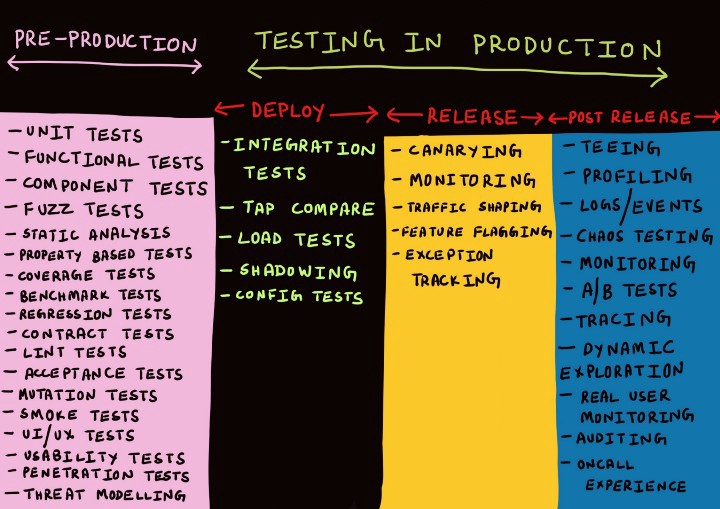
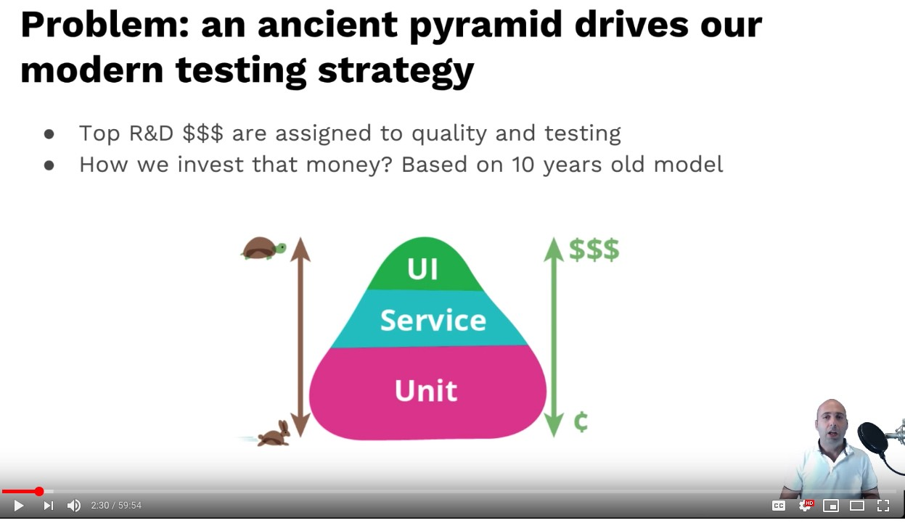
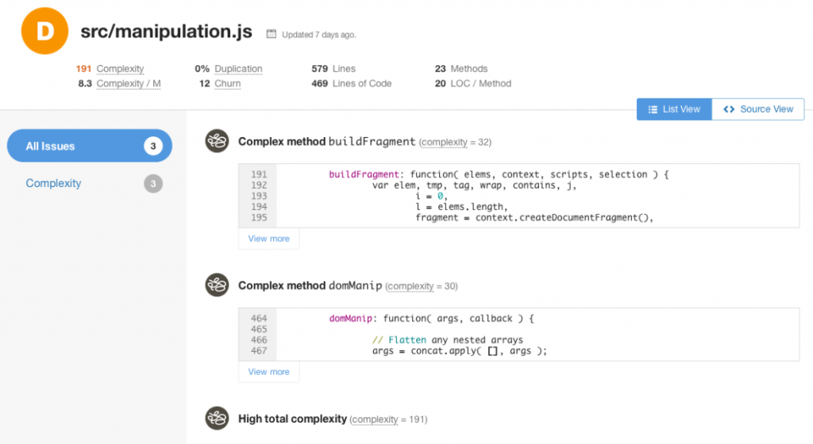
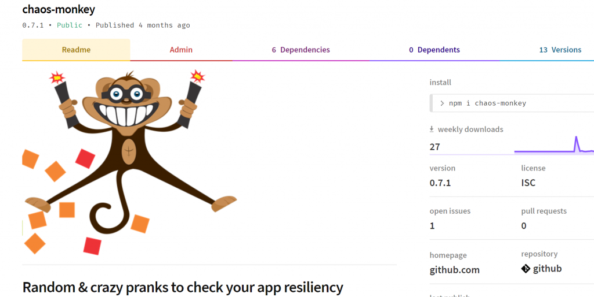
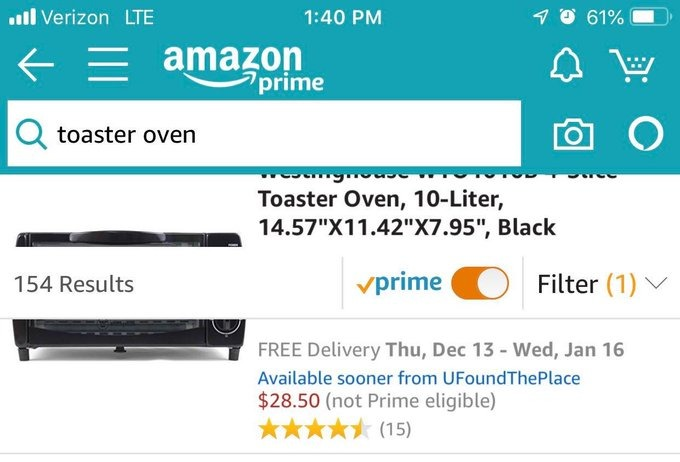
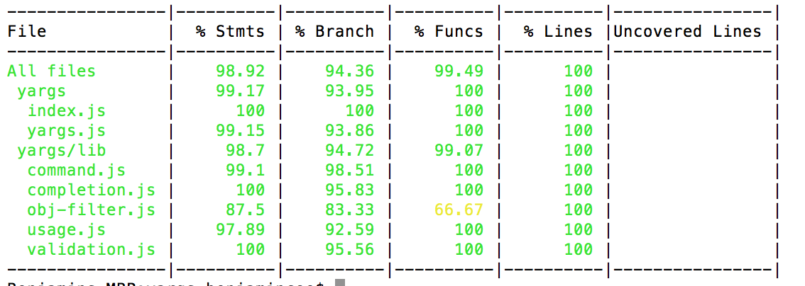
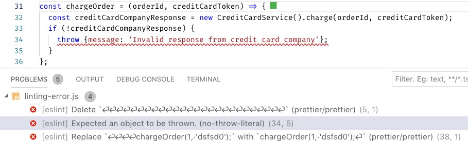
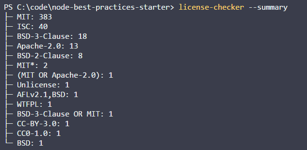
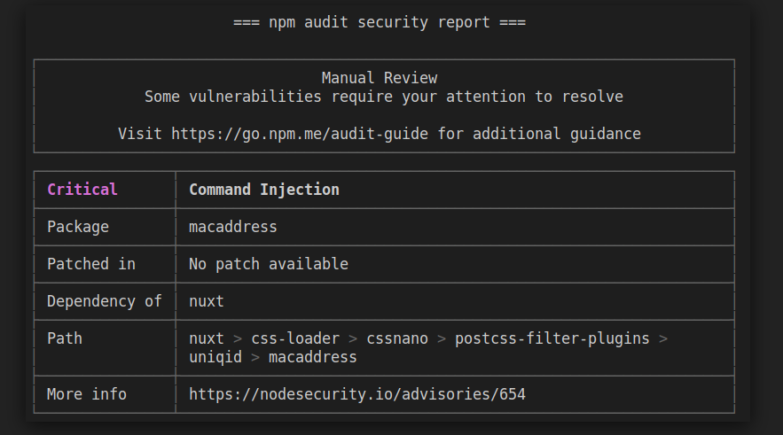
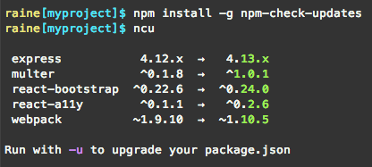

<br/>

# 👇 이 가이드가 당신의 테스트 기술을 한 단계 끌어 올리는 이유

<br/>

## 📗 철저하고 매우 포괄적인 45가지 이상의 모범 사례
JavaScript 및 Node.js에 대한 A부터 Z까지의 믿음직한 가이드입니다. 수십 가지 최고의 블로그 게시물, 서적 및 도구를 요약하고 정리합니다.

## 🚢 기초를 뛰어넘어 고급으로
운영중인 제품의 테스트, 돌연변이 테스트, 속성 기반 테스트 및 기타 여러 전략적 & 전문 도구와 같은 고급 주제로 넘어가는 여정을 경험하십시오.
이 가이드의 모든 단어를 읽으면 당신의 테스트 기술이 평균보다 높아질 수 있습니다.

## 🌐 Full-stack: 프론트, 백엔드, CI, 무엇이든
모든 응용프로그램 계층의 기초가 되는 유비쿼터스 테스트 방법을 이해하는 것으로부터 시작하십시오. 그런 다음 프론트엔드/UI, 백엔드, CI 혹은 이 모든것을 공부하세요.

<br/>

### Yoni Goldberg 작성

* JavaScript & Node.js 컨설턴트
* 👨‍🏫 [나의 테스팅 워크샵](https://www.testjavascript.com) -  유럽과 미국에서의 [제 워크샵](https://www.testjavascript.com)에 대해서 알아보십시오.
* [트위터 팔로우 하기](https://twitter.com/goldbergyoni/)
* [LA](https://js.la/), [베로나](https://2019.nodejsday.it/), [하르키우](https://kharkivjs.org/), [무료 웨비나](https://zoom.us/webinar/register/1015657064375/WN_Lzvnuv4oQJOYey2jXNqX6A)를 들으러 오십시오. 향후 이벤트는 곧 결정될 것입니다.
* [저의 JavaScript 뉴스 레터](https://testjavascript.com/newsletter/) - 인사이트와 오직 전략적인 문제에 대한 내용

<br/><br/>

## `목차`

#### [`섹션 0: 황금률`](#section-0️⃣-the-golden-rule)

모든 모든 사람들에게 영감을 주는 하나의 조언(하나의 특수한 항목)

#### [`섹션 1: 테스트 해부`](#section-1-the-test-anatomy-1)

기초 - 깔끔한 테스트 구성하기(12개)

#### [`섹션 2: 백엔드`](#section-2️⃣-backend-testing)

백엔드 및 마이크로서비스 테스트 효율적으로 작성하기(8개)

#### [`섹션 3: 프론트엔드`](#section-3️⃣-frontend-testing)

컴포넌트 및 E2E 테스트를 포함한 웹 UI에 대한 테스트 작성하기(11개)

#### [`섹션 4: 테스트 효과 측정`](#section-4️⃣-measuring-test-effectiveness)

감시자를 감시하기 - 테스트 품질 측정(4개)


#### [`섹션 5: 지속적인 통합`](#section-5️⃣-ci-and-other-quality-measures)

자바스크립트 세계에서 CI에 대한 지침(9개)

<br/><br/>

# 섹션 0️⃣: 황금률

<br/>

## ⚪ ️ 0. 황금률: 린 테스트를 위한 설계

:white_check_mark: **이렇게 해라:** 테스트 코드는 제품 코드와 다릅니다. 단순하고, 짧고, 추상화가 없고, 무난하고, 작업하기에 편리하고, 린하게 디자인 하십시오. 테스트를 보고 즉시 의미를 알아챌 수 있어야 합니다.

우리 머리속은 제품 코드로 가득하고 부가적인 복잡한 것들을 생각할 여유가 없습니다. 또 다른 어려운 코드를 억지로 생각해내려고 한다면, 팀의 속도를 늦추게 되어 우리가 테스트를 하는 이유가 무색해 질 것입니다. 실제로 많은 팀들이 이런 이유를 테스트를 포기합니다.

테스트는 친절하고 웃는 동료와 함께 일하는 것이 즐거울 수 있는 기회이고, 적은 투자로 큰 가치를 제공하는 것입니다. 과학은 우리에게 두 개의 뇌 시스템이 있다고 말합니다. 빈 도로에서 자동차를 운전하는 등의 간편한 활동에 사용되는 시스템 1, 그리고 수학 방정식을 푸는 것과 같이 복잡하고 의식적인 연산을 위한 시스템 2. 테스트 코드를 볼 때 수학 문제를 푸는 것 같은게 아닌, HTML 문서를 수정하는 것만 큼 쉬워야하는 시스템 1에 맞게 테스트를 설계하십시오.

선택적인 체리픽 기술, 툴 그리고 비용-효율적이고 뛰어난 ROI를 제공하는 테스트 대상 선정으로 이러한 목적을 달성할 수 있습니다. 필요한 만큼의 테스트, 융통성 있게 유지하려는 노력, 때로는 애자일함과 단순성을 위해 일부 테스트와 신뢰성을 포기하는 것도 가치가 있습니다.


 
아래 대부분의 조언은 이 원칙의 파생입니다.

### 시작할 준비 되셨나요?

<br/><br/>

# 섹션 1: 테스트 해부

<br/>

## ⚪ ️ 1.1 각 테스트 이름은 세 부분으로 구성된다.

:white_check_mark: **이렇게 해라:** 테스트는 현재 애플리케이션의 개정판이 요구 사항을 충족하는지 여부를 다음과 같은 사람들에게 알려야합니다: 배포를 할 테스터, DevOps 엔지니어, 2년 후의 미래에 코드가 익숙하지 않은 사람. 테스트가 요구 사항 수준에서 작성되어 있고 세 부분으로 구성되어 있다면, 목적을 이룰 수 있습니다:

(1) 무엇을 테스트하고 있는가? 예) 제품서비스.새제품추가 메서드

(2) 어떤 상황과 시나리오에서? 예) 메서드에 가격이 전달되지 않는다.

(3) 예상되는 결과는 무엇인가? 예) 신제품은 승인되지 않는다.

<br/>

❌ **그렇지 않으면:** 배포에 실패하였고 "제품 추가" 라는 테스트에 실패하였다. 이것이 정확히 어떤 오작동 인지를 알려주나요?

<br/>

**👇 주의:** 각 글에는 예제 코드가 있으며 때로는 이미지도 있습니다. 클릭하여 확장

<details><summary>✏ <b>예제 코드</b></summary>
  
<br/>
  
### :clap: 올바른 예: 세 부분으로 구성된 테스트 이름


```javascript
//1. 단위 테스트
describe('제품 서비스', function() {
  describe('새 제품 추가', function() {
    //2. 시나리오 3. 예상
    it('가격을 지정하지 않으면 제품 상태는 승인 대기중이다.', ()=> {
      const newProduct = new ProductService().add(...);
      expect(newProduct.status).to.equal('승인 대기');
    });
  });
});
```

<br/>

### :clap: 올바른 예: 세 부분으로 구성된 테스트 이름


</details>

<br/><br/>

## ⚪ ️ 1.2 AAA 패턴에 의한 테스트 구조

:white_check_mark: **이렇게 해라:** 3개의 잘 잘 구분된 섹션 AAA(Arrange, Act, Assert)으로 테스트를 구성하십시오. 이 구조를 따르면 테스트를 쉽게 읽을 수 있습니다:

첫번째 A - Arrange(준비): 테스트가 목표로 하는 시나리오에 필요한 시스템을 제공하기 위한 모든 설정 코드. 여기에는 테스트 생성자의 단위 인스턴스화, DB 데이터 추가, 객체에 대한 mock/stub 및 기타 준비 코드가 포함될 수 있습니다.

두번째 A - Act(행동): 단위 테스트를 실행. 일반적으로 코드 한줄

세번째 A - Assert(주장, 예상): 받은 예상값이 충족하는지 확인하십시오. 일반적으로 코드 한줄

<br/>

❌ **그렇지 않으면:** 테스트는 오늘 일의 아주 단순한 부분에 불과하지만, 메인 코드를 이해하는데 많은 시간을 낭비 할 것입니다.

<br/>

<details><summary>✏ <b>예제 코드</b></summary>

<br/>

### :clap: 올바른 예: AAA 패턴으로 구성된 테스트

 

```javascript
describe('고객 분류기', () => {
    test('고객이 500달러 이상을 소비한 경우 프리미엄으로 분류해야 합니다.', () => {
        //Arrange
        const customerToClassify = {spent:505, joined: new Date(), id:1}
        const DBStub = sinon.stub(dataAccess, "getCustomer")
            .reply({id:1, classification: 'regular'});

        //Act
        const receivedClassification = customerClassifier.classifyCustomer(customerToClassify);

        //Assert
        expect(receivedClassification).toMatch('premium');
    });
});
```

<br/>

### :thumbsdown: 올바르지 않은 예: 분리 되어있지 않고 한 벌로 작성되어 있어 해석하기 어렵다.

```javascript
test('프리미엄으로 분류해야 합니다.', () => {
    const customerToClassify = {spent:505, joined: new Date(), id:1}
    const DBStub = sinon.stub(dataAccess, "getCustomer")
        .reply({id:1, classification: 'regular'});
    const receivedClassification = customerClassifier.classifyCustomer(customerToClassify);
    expect(receivedClassification).toMatch('premium');
});
```

</details>

<br/><br/>

## ⚪ ️ 1.3 제품의 언어로 예상값을 설명: BDD 스타일의 Assertion을 사용
:white_check_mark: **이렇게 해라:** 테스트를 선언적 스타일로 작성하면 읽는 사람이 즉시 파악할 수 있습니다. 조건부 논리로 채워진 명령형 코드로 작성하면 테스트를 읽기가 쉽지 않습니다. 그런 의미에서 임의의 사용자 정의 코드를 사용하지 말고, 선언적 BDD 스타일의 expect 또는 should를 사용하여 인간과 같은 언어로 테스트를 작성하십시오. Chai & Jest에 원하는 Assertion이 포함되어 있지 않고 반복성이 높은 경우 [extending Jest matcher (Jest)](https://jestjs.io/docs/en/expect#expectextendmatchers) 혹은 [custom Chai plugin](https://www.chaijs.com/guide/plugins/) 작성을 고려하십시오.

<br/>

❌ **그렇지 않으면:** 팀은 테스트를 덜 작성하고 성가신 것들을 .skip() 으로 장식합니다.

<br/>

<details><summary>✏ <b>예제 코드</b></summary><br/>

 
  
### :thumbsdown: 올바르지 않은 예: 읽는 사람은 테스트 스토리를 이해하기 위해 짧지않은 명령형 코드를 훑어봐야 합니다.

```javascript
test("관리자 요청이 들어오면 정렬된 관리자 목록만 결과에 포함된다." , () => {
    // 여기에 두 명의 관리자 "admin1", "admin2" 및 "user1" 을 추가했다고 가정합니다.
    const allAdmins = getUsers({adminOnly:true});
    const admin1Found, adming2Found = false;
    allAdmins.forEach(aSingleUser => {
        if(aSingleUser === "user1"){
            assert.notEqual(aSingleUser, "user1", "관리자가 아닌 사용자를 찾았다.");
        }
        if(aSingleUser==="admin1"){
            admin1Found = true;
        }
        if(aSingleUser==="admin2"){
            admin2Found = true;
        }
    });
    if(!admin1Found || !admin2Found ){
        throw new Error("모든 관리자가 반환되지 않았다.");
    }
});
```

<br/>

### :clap: 올바른 예: 다음과 같은 선언적 테스트는 이해하기 쉽습니다.

```javascript
it("관리자 요청이 들어오면 정렬된 관리자 목록만 결과에 포함된다." , () => {
    // 여기에 두 명의 관리자를 추가했다고 가정합니다.
    const allAdmins = getUsers({adminOnly:true});
    expect(allAdmins).to.include.ordered.members(["admin1" , "admin2"])
                     .but.not.include.ordered.members(["user1"]);
});
```

</details>

<br/><br/>

## ⚪ ️ 1.4 블랙박스 테스트에 충실: public method만 테스트

:white_check_mark: **이렇게 해라:** 내부테스트는 거의 아무것도 하지 않는 엄청난 오버헤드를 발생시킵니다. 만약 당신의 코드 혹은 API가 올바른 결과를 반환한다면, 내부적으로 어떻게 동작했는지의 테스트에 3시간을 투자해야 합니까? 깨지기 쉬운 테스트를 유지해야 합니까? public method가 잘 동작할 때마다 private method 또한 암시적으로 테스트가 되고, 특정 문제(예. 잘못된 출력)가 있는 경우에만 테스트가 깨집니다. 이 접근법은 행동 테스트라고도 합니다. 다른 한편으로 당신은 내부 테스트를 해야합니까?(화이트박스 접근) - 컴포넌트를 설계하는 것에서 핵심 세부 사항으로 초점이 이동하거나 작은 코드의 리펙토링으로 인해 테스트가 중단 될 수 있지만, 결과는 훌륭합니다. - 이는 유지보수 부담을 크게 증가시킵니다.

<br/>

❌ **그렇지 않으면:** 당신의 테스트는 다음과 같이 동작합니다. [양치기 소년](https://en.wikipedia.org/wiki/The_Boy_Who_Cried_Wolf): 늑대가 나타났다!(예. private 변수가 변경되어 테스트에 실패하였습니다). 당연히 사람들은, 언젠가 진짜 버그가 무시될 때 까지 CI 알람을 무시하기 시작할 것입니다...

<br/>

<details><summary>✏ <b>예제 코드</b></summary>

<br/>

### :thumbsdown: 올바르지 않은 예: 테스트 케이스는 이유없이 내부를 테스트합니다.


```javascript
class ProductService{
    // 이 method 는 내부에서만 사용됩니다.
    // 이 이름을 변경하면 테스트가 실패합니다.
    calculateVAT(priceWithoutVAT){
        return {finalPrice: priceWithoutVAT * 1.2};
        // 결과 형식이나 키 이름을 변경하면 테스트가 실패합니다.
    }
    // public method
    getPrice(productId){
        const desiredProduct= DB.getProduct(productId);
        finalPrice = this.calculateVATAdd(desiredProduct.price).finalPrice;
    }
}

it("화이트박스 테스트: 내부 method가 VAT 0을 받으면 0을 반환합니다.", async () => {
    // 사용자가 VAT를 계산할 수 있게 하는 요구사항은 없으며, 최종 가격만 표시합니다.
    // 그럼에도 불구하고 여기에서 내부 테스트 수행
    expect(new ProductService().calculateVATAdd(0).finalPrice).to.equal(0);
});
```

</details>

<br/><br/>

## ⚪ ️ 1.5 올바른 테스트 더블 선택: Stub과 Spy를 위한 Mock을 피하십시오.

:white_check_mark: **이렇게 해라:**  테스트 더블은 어플리케이션 내부에 연결되어 있기때문에 필요악이지만 일부는 엄청난 가치를 제공합니다(<a href="https://martinfowler.com/articles/mocksArentStubs.html" data-href="https://martinfowler.com/articles/mocksArentStubs.html" class="markup--anchor markup--p-anchor" rel="noopener nofollow" target="_blank">[테스트 더블에 대한 알림: mocks vs stubs vs spies](https://martinfowler.com/articles/mocksArentStubs.html)</a>).

테스트 더블을 사용하기 전에 간단한 질문: 요구사항 문서에 있거나 있을 수 있는 기능을 테스트하는 데 테스트 더블을 사용합니까? 만약 아니라면 화이트박스 테스트 낌새가 보입니다.

예를 들어, 결제 서비스가 중단되었을 때 앱이 적절하게 작동하는 것을 테스트하려는 경우, 테스트중인 단위가 올바른 값을 반환하도록, 결제 서비스를 stub하고 '응답 없음' 반환을 트리거 할 수 있습니다.
이것은 특정 시나리오에서 애플리케이션의 동작/응답/결과를 확인합니다. 그리고 spy를 사용하여 해당 서비스가 중단되었을 때 메일이 보내지는지를 assert 할 수 있습니다. 이것은 다시 요구사항 문서에 있을 수 있는 행동에 대한 점검입니다(결제가 저장되지 않으면 메일은 보낸다). 반대로, 결제 서비스를 mock 하고 올바른 JavaScript 타입으로 호출 되었는지를 확인한다면 - 당신의 테스트는 애플리케이션 기능에 전혀 영향을 받지 않고 자주 변경될 수 있는 내부 구현에 초점을 둔 경우입니다.
<br/>

❌ **그렇지 않으면:** 코드를 리펙토링 할 때, 모든 mock을 찾아서 수정해야 합니다. 테스트가 도움이 아닌 부담이 됩니다.

<br/>

<details><summary>✏ <b>예제 코드</b></summary>

<br/>

### :thumbsdown: 올바르지 않은 예: 내부에 초점을 둔 mock


 
```javascript
it("유효한 제품을 삭제하려고 할 때, 올바른 제품과 올바른 구성 정보로 데이터 액세스 DAL을 한 번 호출했는지 확인한다", async () => {
    // 이미 제품을 추가했다고 가정
    const dataAccessMock = sinon.mock(DAL);
    // 좋지 않음: 내부 테스트는 side-effect를 위해서가 주요 목적을 위해서 입니다.
    dataAccessMock.expects("deleteProduct").once().withArgs(DBConfig, theProductWeJustAdded, true, false);
    new ProductService().deletePrice(theProductWeJustAdded);
    dataAccessMock.verify();
});
```

<br/>

### :clap:올바른 예: spy는 요구사항을 테스트하는데 초점을 두고있지만, 내부를 건드리는 side-effect를 피할 순 없습니다.

```javascript
it("유효한 제품을 삭제하려고 할 때, 메일을 보낸다", async () => {
    // 이미 제품을 추가했다고 가정
    const spy = sinon.spy(Emailer.prototype, "sendEmail");
    new ProductService().deletePrice(theProductWeJustAdded);
    // 좋음: 우리는 내부를 다루는가? 그렇다, 그러나 요구사항(이메일을 보낸다)에 대한 테스트의 side-effect이다.
});
```

</details>

<br/><br/>

## ⚪ ️ 1.6 의미없는 인풋 데이터를 사용하지 말고, 실제와 같은 인풋 데이터를 사용해라

:white_check_mark: **이렇게 해라:**  흔히 제품의 버그들은 매우 특수한 인풋데이터를 통해 나타납니다 - 테스트 인풋이 혈실적일 수록 버그를 조기에 발견할 가능성이 높아집니다. 실제 데이터와 다양성 및 형태가 유사한 데이터를 생성해 주는 [Faker](https://www.npmjs.com/package/faker) 같은 전용 라이브러리들을 사용하십시오. 이런 라이브러리들은 실제같은 전화번호, 사용자 이름, 신용카드, 회사명 그리고 심지어 'lorem ipsum'같은 문자등을 생성할 수도 있습니다. 당신은 가상의 데이터를 사용하여 테스트(단위 테스트 위에서)를 무작위화 하거나 심지어 실제 환경으로부터의 실제 데이터를 임포트 할수도 있습니다. 다음 단계를 얻기를 원하십니까? 그렇다면 아래로 가십시오 (property-based testing).

<br/>

❌ **그렇지 않다면:** "Foo"와 같은 인풋을 사용하면 당신의 모든 테스트가 모두 통과한것 처럼 표시되지만, 실제 환경에서는 해커가 “@3e2ddsf . ##’ 1 fdsfds . fds432 AAAA” 같은 인풋을 전달해 실패 할수도 있습니다.

<br/>

<details><summary>✏ <b>예제 코드</b></summary>

<br/>

### :thumbsdown: 올바르지 않은 예: 현실적이지 않은 데이터 때문에 통과하는 테스트


 
 
```javascript
const addProduct = (name, price) =>{
  const productNameRegexNoSpace = /^\S*$/;// 공백은 허용되지 않음

  if(!productNameRegexNoSpace.test(name))
    return false;//도달하지 않는 곳

    //some logic here
    return true;
};

test("잘못된 예제: 유효한 속성과 함께 제품을 추가한다면, 성공을 얻는다.", async () => {
    //모든 테스트에서 false 가 리턴되지 않는 "Foo" 인풋을 사용
    const addProductResult = addProduct("Foo", 5);
    expect(addProductResult).toBe(true);
    //거짓된 성공: 공백을 포함하는 문자열을 사용하지 않았기 때문에 테스트는 성공한다.
});
```

<br/>

### :clap:올바른 예: 무작위한 현실적인 인풋

```javascript
it("더 나은 것: 유효한 제품이 추가된다면, 성공을 얻는다.", async () => {
    const addProductResult = addProduct(faker.commerce.productName(), faker.random.number());
    //생성된 무작위 인풋: {'Sleek Cotton Computer',  85481}
    expect(addProductResult).to.be.true;
    //테스트는 실패한다, 무작위 인풋은 우리가 계획하지 않은 일이 일어나도록 만든다.
    //우리는 조기에 버그를 발견했다!
});
```

</details>

<br/><br/>

## ⚪ ️ 1.7  프로퍼티 기반(Property-based) 테스트를 통해 다양한 인풋 값 조합으로 테스트를 하십시오.

:white_check_mark: **이렇게 해라:** 우리는 일반적으로 적은 수의 인풋 샘플 데이터를 가지고 테스트를 합니다. 심지어 인풋 데이터 형식이 실제 데이터와 비슷할 때에도 다음과 같이 제한된 인풋 조합으로만 테스트를 커버합니다.(method(‘’, true, 1), method(“string” , false” , 0)) 하지만, 운영시에는 5개의 파라미터를 가지는 API는 수 천 개의 다른 조합의 파라미터로 호출 될 수 있고, 이 중 하나가 우리의 시스템을 다운시킬 수도 있습니다. 그렇다면 만약 1000 가지 조합의 인풋값을 자동으로 생성하고 올바른 응답을 반환하지 못하는 인풋값을 찾아내는 단위 테스트를 작성할 수 있다면 어떨까요?
프로퍼티 기반 테스트는 단위 테스트에 모든 가능한 인풋 조합을 사용하여 생각하지 못 한 버그를 찾을 확률을 높여줍니다. 예를들어, 다음의 메소드가 주어졌을 때 — addNewProduct(id, name, isDiscount) — 프로퍼티 기반 테스트 라이브러리들은  다양한 파라미터 (number, string, boolean) 조합으로  - (1, “iPhone”, false), (2, “Galaxy”, true) - 이 메소드를 호출합니다. [js-verify](https://github.com/jsverify/jsverify) 나 [testcheck](https://github.com/leebyron/testcheck-js) (much better documentation) 같은 라이브러리를 지원하는 테스트 러너들 (Mocha, Jest, etc) 중 당신이 가장 선호하는 방법을 통해 프로퍼티 기반 테스트를 할 수 있습니다. 
업데이트 : Nicolas Dubien가 코멘트를 통해 더 많은 부가적인 기능들을 제공하고 활발하게 유지보수되고 있는 라이브러리 [fast-check](https://github.com/dubzzz/fast-check#readme)를 추천해 주었습니다. 

<br/>

❌ **그렇지 않으면:** 의심할 여지 없이 당신은 오직 코드가 잘 동작하는 테스트 인풋을 사용할 것입니다. 불행하게도 이러한 방식은 버그를 찾는 도구로써의 테스트 효율성을 떨어뜨릴 것 입니다.

<br/>

<details><summary>✏ <b>예제 코드</b></summary>

<br/>

### :clap:  올바른 예: “mocha-testcheck”를 사용하여 다양한 인풋 조합으로 테스트 하십시오.


```javascript
require('mocha-testcheck').install();
const {expect} = require('chai');

describe('Product service', () => {
  describe('Adding new', () => {
    //서로 다른 무작위 값으로 100회 호출됩니다. 
    check.it('Add new product with random yet valid properties, always successful',
      gen.int, gen.string, (id, name) => {
        expect(addNewProduct(id, name).status).to.equal('approved');
      });
  })
});
```

</details>

<br/><br/>

## ⚪ ️ 1.8 필요한 경우 짧거나 인라인 스냅샷만 사용하십시오.

:white_check_mark: **이렇게 해라:** [스냅샷 테스트](https://jestjs.io/docs/en/snapshot-testing)가 필요한 경우 외부 파일이 아닌 테스트의 일부 ([인라인 스냅샷](https://jestjs.io/docs/en/snapshot-testing#inline-snapshots))에 포함 된 짧고 집중된 스냅샷(3~7 라인)만 사용하십시오. 이 지침을 따르면 따로 설명이 필요없고 잘 깨지지 않는 테스트가 됩니다.

반면에, '고전적인 스냅샷' 튜토리얼 및 도구는 외부에 큰 파일(예: 구성 요소 랜더링 마크업, API JSON 결과)를 저장하고, 테스트를 실행할 때 마다 수신된 결과를 저장된 버전과 비교하기를 권장합니다. 예를 들어, 이것은 1,000 라인(우리가 절대 읽지 않고 추론하지 않을 3,000개의 데이터 값을 가진)의 코드를 우리 테스트에 암시적으로 연결할 수 있습니다. 왜 이것이 잘못 되었을까요? 이렇게하면 테스트에 실패할 1,000 가지 이유가 생깁니다. 한줄만 변경되어도 스냅샷이 유효하지 않게 되고, 이런일이 일어날 가능성이 높습니다. 얼마나 자주? 모든 공백, 주석에서 혹은 사소한 CSS/HTML 변경에 대해서. 뿐만 아니라 테스트 이름은 1,000 라인이 변경되지 않았는지를 나타내기 때분에, 실패에 대한 단서를 제공하지 않습니다. 또한 테스트 작성자가 긴 문서(검사하고 확인할 수 없는)를 받아들이게끔 합니다. 이 모든 것은 초점이 맞지않고 너무 많은 것을 달성하려는 모호하고 간절한 테스트 증상입니다.

긴 외부 스냅샷이 허용되는 경우가 거의 없다는 점은 주목할 가치가 있습니다 - 데이터가 아닌 스키마를 assert 할 때(값 추출 및 필드에 집중) 또는 수신된 문서가 거의 변경되지 않는 경우

<br/>

❌ **그렇지 않다면:** UI 테스트가 실패합니다. 코드가 문제없어 보이고 화면이 완벽한 픽셀을 렌더링합니다. 어떻게 되었습니까? 스냅샷 테스트에서 원본 문서와 현재 수신된 문서와의 차이점을 발견했습니다. 빈칸 하나가 마크 다운에 추가되었습니다...

<br/>

<details><summary>✏ <b>예제 코드</b></summary>

<br/>

### :thumbsdown: 올바르지 않은 예: 보이지 않는 2,000 라인의 코드를 우리 테스트에 연결


 
```javascript
it('TestJavaScript.com 이 올바르게 랜더링 된다.', ()  => {

//Arrange

//Act
const receivedPage = renderer
.create(  <DisplayPage page  =  "http://www.testjavascript.com"  > Test JavaScript < /DisplayPage>)
.toJSON();

//Assert
expect(receivedPage).toMatchSnapshot();
// 이제 2,000 라인의 문서를 암묵적으로 유지합니다.
// 모든 줄바꿈 또는 주석이 테스트를 망가뜨립니다.

});
```

<br/>

### :clap: 올바른 예: expectation이 잘 보이고 집중된다.

```javascript
it('TestJavaScript.com 홈페이지를 방문하면 메뉴가 보인다.', () => {
//Arrange

//Act
receivedPage tree = renderer
.create(  <DisplayPage page  =  "http://www.testjavascript.com"  > Test JavaScript < /DisplayPage>)
.toJSON();

//Assert

const menu = receivedPage.content.menu;
expect(menu).toMatchInlineSnapshot(`
<ul>
<li>Home</li>
<li> About </li>
<li> Contact </li>
</ul>
`);
});
```

</details>

<br/><br/>

## ⚪ ️ 1.9 테스트 데이터를 글로벌로 하지말고 테스트별로 따로 추가하라.

:white_check_mark: **이렇게 해라:** 황금률에 따르면(섹션 0), 각 테스트는 커플링을 방지하고 테스트 흐름을 쉽게 추론하기 위해 자체 DB 데이터를 추가하고 실행해야 합니다. 실제로 성능 향상(테스트를 실행하기 전에 DB 데이터를 준비(['테스트 픽스쳐'라고도 합니다](https://en.wikipedia.org/wiki/Test_fixture)))을 위해 이를 위반하는 테스터들이 많습니다. 성능은 실제로 유효한 문제이지만 완화될 수 있습니다(2.2 컴포넌트 테스트 참고). 그러나 테스트 복잡성은 대부분의 다른 고려사항들을 통제해야 하는 고통을 수반합니다. 각 테스트에 필요한 DB 레코드를 명시적으로 추가하고, 해당 데이터에 대해서만 테스트를 수행하십시오. 성능이 중요한 문제가 되는 경우 - 데이터를 변경하지 않는 테스트 모음(예: 쿼리)에 대해서 데이터를 준비하는 형태로 타협할 수 있습니다.

<br/>

❌ **그렇지 않으면:** 테스트 실패, 배포 중단으로 팀원들이 귀중한 시간을 소비할 것입니다. 버그가 있습니까? 조사해보니 '없습니다' - 두 테스트에서 동일한 테스트 데이터를 변겨안 것으로 보입니다.

<br/>

<details><summary>✏ <b>예제 코드</b></summary>

<br/>

### :thumbsdown: 올바르지 않은 예: 테스트는 독립적이지 않으며 글로벌 훅에 의한 DB 데이터에 의존


 
```javascript
before(() => {
  // 사이트 및 관리자 데이터를 DB에 추가. 데이터는 어디에 있습니까? 외부에. 외부 JSON 또는 마이그레이션 프레임워크에
  await DB.AddSeedDataFromJson('seed.json');
});
it("사이트 이름을 업데이트 할 때, 성공을 확인한다.", async () => {
  // 사이트 이름 "portal"이 존재한다는 것을 알고있습니다. 시드파일에서 봤습니다.
  const siteToUpdate = await SiteService.getSiteByName("Portal");
  const updateNameResult = await SiteService.changeName(siteToUpdate, "newName");
  expect(updateNameResult).to.be(true);
});
it("사이트 이름을 쿼리할 때, 올바른 사이트 이름을 얻는다.", async () => {
  // 사이트 이름 "portal"이 존재한다는 것을 알고있습니다. 시드파일에서 봤습니다.
  const siteToCheck = await SiteService.getSiteByName("Portal");
  expect(siteToCheck.name).to.be.equal("Portal"); // 실패! 이전 테스트에서 이름이 변경되었습니다. ㅠㅠ
});
```

<br/>

### :clap: 올바른 예: 우리는 테스트 내부에만 머물 수 있으며, 각 테스트는 자체 데이터 세트에서 동작합니다.

```javascript
it("사이트 이름을 업데이트 할 때, 성공을 확인한다.", async () => {
  // 테스트는 새로운 레코드를 새로 추가하고 해당 레코드에 대해서만 동작합니다.
  const siteUnderTest = await SiteService.addSite({
    name: "siteForUpdateTest"
  });
  
  const updateNameResult = await SiteService.changeName(siteUnderTest, "newName");
  
  expect(updateNameResult).to.be(true);
});
```

</details>

<br/><br/>

## ⚪ ️ 1.10 오류를 catch 하지말고 expect 하십시오.

:white_check_mark: **이렇게 해라:** 오류를 발생시키는 입력값을 assert 할 때, try-catch-finally를 사용하고 catch 블럭에서 assert 하는게 맞아 보일수도 있습니다. 아래 예는 테스트 의도와 결과 expectation을 숨기는 어색하고 장황한 테스트 사례입니다.

보다 우아한 대안은 한줄짜리 Chai assertion을 사용하는 것 입니다: expect(method).to.throw (혹은 Jest: expect(method).toThrow()). 오류 유형을 알려주는 속성이 예외에 포함되어야 합니다. 그렇지 않고 일반적인 오류를 발생시키면 어플리케이션은 사용자에게 실망스러운 메시지를 표시하는 것 밖에 할 수 없습니다.

<br/>

❌ **그렇지 않으면:** 무엇이 잘못되었는지 테스트 보고서(예: CI 보고서)에서 추론하기 어려울 것입니다.

<br/>

<details><summary>✏ <b>예제 코드</b></summary>

<br/>

### :thumbsdown: 올바르지 않은 예: try-catch로 오류가 존재한다고 assert 하는 긴 테스트 사례


 
```javascript
it("제품명이 없으면 400 오류를 던진다.", async() => {
  let errorWeExceptFor = null;
  try {
    const result = await addNewProduct({name:'nest'});}
  catch (error) {
    expect(error.code).to.equal('InvalidInput');
    errorWeExceptFor = error;
  }
  expect(errorWeExceptFor).not.to.be.null;
  // 이 asserting이 실패하면, 테스트 결과에서 누락된 입력값에 대한 단어는 알 수 없고
  // 입력값이 null 이라는 것만 알 수 있습니다.
});
```

<br/>

### :clap: 올바른 예: QA나 PM이라도 쉽게 이해할 수 있고 읽기 쉬운 expectation

```javascript
it.only("제품명이 없으면 400 오류를 던진다.", async() => {
  expect(addNewProduct)).to.eventually.throw(AppError).with.property('code', "InvalidInput");
});
```

</details>

<br/><br/>

## ⚪ ️ 1.11 테스트에 태깅하십시오.

:white_check_mark: **이렇게 해라:** 다른 테스트는 꼭 다른 시나리오에서 실행해야 합니다: 개발자가 파일을 저장하거나 커밋을 할 때 빠르고, IO가 많이 없는 테스트를 실행해야 합니다. 전체 end-to-end 테스트는 일반적으로 새로운 Pull Request가 제출되었을 때 실행됩니다. 등.. 이러한 경우에 #cold #api #sanity와 같은 키워드로 테스트에 태깅하면 테스트를 효율적으로 grep 할 수 있고, 원하는 하위세트를 호출할 수 있습니다. 예) Mocha를 이용해서 sanity 테스트 그룹만 실행하는 방법입니다: mocha - grep 'sanity'

<br/>

❌ **그렇지 앟으면:** 개발자가 작은 변경을 할 때마다 수십 개의 DB 쿼리를 수행하는 테스트를 포함한 모든 테스트를 실행한다면, 속도가 매우 느려져 개발자가 테스트를 수행하지 않게 만들 것입니다.

<br/>

<details><summary>✏ <b>예제 코드</b></summary>

<br/>

### :clap: 올바른 예: 테스트를 '#cold-test'로 태깅하면 테스트를 수행하는 사람이 빠른 테스트만 실행할 수 있습니다(IO를 수행하지 않고 개발자가 코딩하는 중에도 자주 실행할 수 있는 테스트 cold === quick).


```javascript
// 이 테스트는 빠르고(DB 없음) 현재 사용자/CI가 자주 실행할 수 있는 태그를 지정하고 있습니다.
describe('주문 서비스', function() {
  describe('새 주문 추가 #cold-test #sanity', function() {
    test('시나리오 - 통화가 제공되지 않음. 예외 - 기본 통화 사용 #sanity', function() {
      // code logic here
    });
  });
});
```

</details>

<br/><br/>

## ⚪ ️1.12 Other generic good testing hygiene
:white_check_mark: **Do:**  This post is focused on testing advice that is related to, or at least can be exemplified with Node JS. This bullet, however, groups few non-Node related tips that are well-known

Learn and practice [TDD principles](https://www.sm-cloud.com/book-review-test-driven-development-by-example-a-tldr/) — they are extremely valuable for many but don’t get intimidated if they don’t fit your style, you’re not the only one. Consider writing the tests before the code in a [red-green-refactor style](https://blog.cleancoder.com/uncle-bob/2014/12/17/TheCyclesOfTDD.html), ensure each test checks exactly one thing, when you find a bug — before fixing write a test that will detect this bug in the future, let each test fail at least once before turning green, start a module by writing a quick and simplistic code that satsifies the test - then refactor gradually and take it to a production grade level, avoid any dependency on the environment (paths, OS, etc)
<br/>


❌ **Otherwise:** You‘ll miss pearls of wisdom that were collected for decades

<br/><br/>


# Section 2️⃣: Backend Testing

## ⚪ ️2.1 당신의 테스트 포트폴리오를 풍부하게 하십시오: 단위 테스트와 피라미드를 넘어서세요.

:white_check_mark: **이렇게 해라:** 10년이 넘은 모델인 [테스트 피라미드](https://martinfowler.com/bliki/TestPyramid.html)는 세 가지 테스트 유형을 제시하고 대다수 개발자의 테스트 전략에 영향을 주는 훌륭한 모델입니다. 동시에, 몇 가지 반짝이는 새로운 테스트 기술들이 등장하였지만 모두 테스트 피라미드의 그림자 뒤로 사라졌습니다. 우리가 최근 10년간 보아 온 극적인 기술의 변화들(Microservices, cloud, serverless)을 고려할 때, 아주 오래된 모델 하나가 *모든* 어플리케이션 유형에 적합하다는 것이 가능한가요? 테스트 세계는 새로운 기술을 받아들이는 것을 고려하지 않나요?

오해는 하지 마세요. 2019 테스트 피라미드에서 TDD와 단위 테스트는 여전히 강력한 기술이고 아마도 많은 어플리케이션에 가장 어울리는 기술입니다. 다른 모델과 마찬가지로, 테스트 미라미드는 유용하지만 [그것이 항상 맞는 것은 아닙니다](https://en.wikipedia.org/wiki/All_models_are_wrong). 예를 들어, 어떤 IOT 어플리케이션을 생각해 봅시다. 이 어플리케이션은 다수의 이벤트를 Kafka/RabbitMQ 같은 메세지 버스로 보내고 다시 데이터 웨어하우스로 흘려보냅니다. 그리고 이 데이터들은 어떤 분석 UI에서 조회됩니다. 우리는 정말 우리의 테스트 예산의 50%를 통합 중심적(intergration-centric)이고 로직이 거의 없는 어플리케이션의 단위 테스트를 작성하는데 할애해야 할까요? 어플리케이션 유형들이 다양해질 수록(bots, crypto, Alexa-skills) 테스트 피라미드가 적합하지 않은 시나리오들을 발견할 가능성이 커집니다.  

지금이 당신의 테스트 포트폴리오를 넓히고 더 많은 테스트 유형들에 익숙해질 시간입니다. (다음 총알에서 몇 가지 아이디어들을 제안합니다.) 테스트 피라미드 같은 모델들도 염두에 둘 뿐만 아니라 당신이 직면하고 있는 현실 세계의 문제들에 적합한 테스트 유형들을 찾으세요. ("우리 API 깨졌어. Consumer-driven contract 테스트 작성하자!" 처럼요.) 위험성 분석을 기반으로 포르폴리오를 구축하는 투자자처럼 당신의 테스트를 다양화하세요 - 문제가 발생할 수 있는 부분을 가늠하고 잠재적 위험성을 줄일 수 있는 예방 방법을 찾으세요. 

주의 사항 : 소프트웨어 세계에서의 TDD 논쟁은 전형적인 잘못된 이분법입니다. 어떤 사람들은 TDD를 모든 곳에 적용하라고 주장하지만, 다른 일부는 TDD를 악마라고 생각합니다. 절대적으로 한쪽만 주장하는 사람들은 모두 틀렸습니다 :]

<br/>


❌ **그렇지 않으면:** 당신은 굉장한 RIO를 주는 몇 가지 툴들을 놓칠 것입니다. Fuzz, lint, mutation 테스트들은 단 10분만에 당신에게 가치를 제공할 수 있습니다. 

<br/>

<details><summary>✏ <b>코드 예제</b></summary>

<br/>

### :clap: 올바른 예: Cindy Sridharan은 그녀의 훌륭한 글 ‘Testing Microservices — the sane way’에서 풍부한 테스트 포트폴리오를 제안합니다. 

<strong class="markup--strong markup--p-strong">예제: </strong><a href="https://www.youtube.com/watch?v=-2zP494wdUY&amp;feature=youtube" data-href="https://www.youtube.com/watch?v=-2zP494wdUY&amp;feature=youtu.be" class="markup--anchor markup--p-anchor" rel="nofollow noopener" target="_blank">[YouTube: “Beyond Unit Tests: 5 Shiny Node.JS Test Types (2018)” (Yoni Goldberg)](https://www.youtube.com/watch?v=-2zP494wdUY&feature=youtu.be)</a>

<br/>




</details>


<br/><br/>

## ⚪ ️2.2 Component testing might be your best affair

:white_check_mark: **Do:** Each unit test covers a tiny portion of the application and it’s expensive to cover the whole, whereas end-to-end testing easily covers a lot of ground but is flaky and slower, why not apply a balanced approach and write tests that are bigger than unit tests but smaller than end-to-end testing? Component testing is the unsung song of the testing world — they provide the best from both worlds: reasonable performance and a possibility to apply TDD patterns + realistic and great coverage.

Component tests focus on the Microservice ‘unit’, they work against the API, don’t mock anything which belongs to the Microservice itself (e.g. real DB, or at least the in-memory version of that DB) but stub anything that is external like calls to other Microservices. By doing so, we test what we deploy, approach the app from outwards to inwards and gain great confidence in a reasonable amount of time.
<br/>


❌ **Otherwise:** You may spend long days on writing unit tests to find out that you got only 20% system coverage


<br/>

<details><summary>✏ <b>Code Examples</b></summary>

<br/>

### :clap: Doing It Right Example: Supertest allows approaching Express API in-process (fast and cover many layers)


 allows approaching Express API in-process (fast and cover many layers)")

</details>

<br/><br/>

## ⚪ ️2.3 Ensure new releases don’t break the API using

:white_check_mark: **Do:**  So your Microservice has multiple clients, and you run multiple versions of the service for compatibility reasons (keeping everyone happy). Then you change some field and ‘boom!’, some important client who relies on this field is angry. This is the Catch-22 of the integration world: It’s very challenging for the server side to consider all the multiple client expectations — On the other hand, the clients can’t perform any testing because the server controls the release dates. [Consumer-driven contracts and the framework PACT](https://docs.pact.io/) were born to formalize this process with a very disruptive approach — not the server defines the test plan of itself rather the client defines the tests of the… server! PACT can record the client expectation and put in a shared location, “broker”, so the server can pull the expectations and run on every build using PACT library to detect broken contracts — a client expectation that is not met. By doing so, all the server-client API mismatches are caught early during build/CI and might save you a great deal of frustration
<br/>


❌ **Otherwise:** The alternatives are exhausting manual testing or deployment fear


<br/>

<details><summary>✏ <b>Code Examples</b></summary>

<br/>

### :clap: Doing It Right Example:


 


</details>


<br/><br/>


## ⚪ ️ 2.4 Test your middlewares in isolation

:white_check_mark: **Do:** Many avoid Middleware testing because they represent a small portion of the system and require a live Express server. Both reasons are wrong — Middlewares are small but affect all or most of the requests and can be tested easily as pure functions that get {req,res} JS objects. To test a middleware function one should just invoke it and spy ([using Sinon for example](https://www.npmjs.com/package/sinon)) on the interaction with the {req,res} objects to ensure the function performed the right action. The library [node-mock-http](https://www.npmjs.com/package/node-mocks-http) takes it even further and factors the {req,res} objects along with spying on their behavior. For example, it can assert whether the http status that was set on the res object matches the expectation (See example below)
<br/>


❌ **Otherwise:** A bug in Express middleware === a bug in all or most requests


<br/>

<details><summary>✏ <b>Code Examples</b></summary>

<br/>

### :clap:Doing It Right Example: Testing middleware in isolation without issuing network calls and waking-up the entire Express machine


```javascript
//the middleware we want to test
const unitUnderTest = require('./middleware')
const httpMocks = require('node-mocks-http');
//Jest syntax, equivelant to describe() & it() in Mocha
test('A request without authentication header, should return http status 403', () => {
  const request = httpMocks.createRequest({
    method: 'GET',
    url: '/user/42',
    headers: {
      authentication: ''
    }
  });
  const response = httpMocks.createResponse();
  unitUnderTest(request, response);
  expect(response.statusCode).toBe(403);
});

```

</details>


<br/><br/>

## ⚪ ️2.5 Measure and refactor using static analysis tools
:white_check_mark: **Do:** Using static analysis tools helps by giving objective ways to improve code quality and keep your code maintainable. You can add static analysis tools to your CI build to abort when it finds code smells. Its main selling points over plain linting are the ability to inspect quality in the context of multiple files (e.g. detect duplications), perform advanced analysis (e.g. code complexity) and follow the history and progress of code issues. Two examples of tools you can use are [Sonarqube](https://www.sonarqube.org/) (2,600+ [stars](https://github.com/SonarSource/sonarqube)) and [Code Climate](https://codeclimate.com/) (1,500+ [stars](https://github.com/codeclimate/codeclimate))

Credit:: <a href="https://github.com/TheHollidayInn" data-href="https://github.com/TheHollidayInn" class="markup--anchor markup--p-anchor" rel="noopener nofollow" target="_blank">[Keith Holliday](https://github.com/TheHollidayInn)</a>

<br/>


❌ **Otherwise:** With poor code quality, bugs and performance will always be an issue that no shiny new library or state of the art features can fix


<br/>

<details><summary>✏ <b>Code Examples</b></summary>

<br/>

### :clap: Doing It Right Example:  CodeClimate, a commercial tool that can identify complex methods:


 


</details>


<br/><br/>

## ⚪ ️ 2.6 Check your readiness for Node-related chaos
:white_check_mark: **Do:** Weirdly, most software testings are about logic & data only, but some of the worst things that happen (and are really hard to mitigate ) are infrastructural issues. For example, did you ever test what happens when your process memory is overloaded, or when the server/process dies, or does your monitoring system realizes when the API becomes 50% slower?. To test and mitigate these type of bad things — [Chaos engineering](https://principlesofchaos.org/) was born by Netflix. It aims to provide awareness, frameworks and tools for testing our app resiliency for chaotic issues. For example, one of its famous tools, [the chaos monkey](https://github.com/Netflix/chaosmonkey), randomly kills servers to ensure that our service can still serve users and not relying on a single server (there is also a Kubernetes version, [kube-monkey](https://github.com/asobti/kube-monkey), that kills pods). All these tools work on the hosting/platform level, but what if you wish to test and generate pure Node chaos like check how your Node process copes with uncaught errors, unhandled promise rejection, v8 memory overloaded with the max allowed of 1.7GB or whether your UX stays satisfactory when the event loop gets blocked often? to address this I’ve written, [node-chaos](https://github.com/i0natan/node-chaos-monkey) (alpha) which provides all sort of Node-related chaotic acts
<br/>


❌ **Otherwise:**  No escape here, Murphy’s law will hit your production without mercy


<br/>

<details><summary>✏ <b>Code Examples</b></summary>

<br/>

### :clap: Doing It Right Example: : Node-chaos can generate all sort of Node.js pranks so you can test how resilience is your app to chaos


</details>

<br/>

## ⚪ ️2.7 Avoid global test fixtures and seeds, add data per-test

:white_check_mark: **Do:** Going by the golden rule (bullet 0), each test should add and act on its own set of DB rows to prevent coupling and easily reason about the test flow. In reality, this is often violated by testers who seed the DB with data before running the tests (also known as ‘test fixture’) for the sake of performance improvement. While performance is indeed a valid concern — it can be mitigated (see “Component testing” bullet), however, test complexity is a much painful sorrow that should govern other considerations most of the time. Practically, make each test case explicitly add the DB records it needs and act only on those records. If performance becomes a critical concern — a balanced compromise might come in the form of seeding the only suite of tests that are not mutating data (e.g. queries)
<br/>


❌ **Otherwise:** Few tests fail, a deployment is aborted, our team is going to spend precious time now, do we have a bug? let’s investigate, oh no — it seems that two tests were mutating the same seed data


<br/>

<details><summary>✏ <b>Code Examples</b></summary>

<br/>

### :thumbsdown: Anti Pattern Example: tests are not independent and rely on some global hook to feed global DB data


 
```javascript
before(() => {
  //adding sites and admins data to our DB. Where is the data? outside. At some external json or migration framework
  await DB.AddSeedDataFromJson('seed.json');
});
it("When updating site name, get successful confirmation", async () => {
  //I know that site name "portal" exists - I saw it in the seed files
  const siteToUpdate = await SiteService.getSiteByName("Portal");
  const updateNameResult = await SiteService.changeName(siteToUpdate, "newName");
  expect(updateNameResult).to.be(true);
});
it("When querying by site name, get the right site", async () => {
  //I know that site name "portal" exists - I saw it in the seed files
  const siteToCheck = await SiteService.getSiteByName("Portal");
  expect(siteToCheck.name).to.be.equal("Portal"); //Failure! The previous test change the name :[
});

```
<br/>

### :clap: Doing It Right Example: We can stay within the test, each test acts on its own set of data

```javascript
it("When updating site name, get successful confirmation", async () => {
  //test is adding a fresh new records and acting on the records only
  const siteUnderTest = await SiteService.addSite({
    name: "siteForUpdateTest"
  });
  const updateNameResult = await SiteService.changeName(siteUnderTest, "newName");
  expect(updateNameResult).to.be(true);
});

```

</details>

<br/><br/>

# Section 3️⃣: Frontend Testing

## ⚪ ️ 3.1. Separate UI from functionality

:white_check_mark: **Do:** When focusing on testing component logic, UI details become a noise that should be extracted, so your tests can focus on pure data. Practically, extract the desired data from the markup in an abstract way that is not too coupled to the graphic implementation, assert only on pure data (vs HTML/CSS graphic details) and disable animations that slow down. You might get tempted to avoid rendering and test only the back part of the UI (e.g. services, actions, store) but this will result in fictional tests that don't resemble the reality and won't reveal cases where the right data doesn't even arrive in the UI


<br/>

❌ **Otherwise:** The pure calculated data of your test might be ready in 10ms, but then the whole test will last 500ms (100 tests = 1 min) due to some fancy and irrelevant animation


<br/>

<details><summary>✏ <b>Code Examples</b></summary>

<br/>

### :clap: Doing It Right Example: Separating out the UI details

 

```javascript
test('When users-list is flagged to show only VIP, should display only VIP members', () => {
  // Arrange
  const allUsers = [
   { id: 1, name: 'Yoni Goldberg', vip: false }, 
   { id: 2, name: 'John Doe', vip: true }
  ];

  // Act
  const { getAllByTestId } = render(<UsersList users={allUsers} showOnlyVIP={true}/>);

  // Assert - Extract the data from the UI first
  const allRenderedUsers = getAllByTestId('user').map(uiElement => uiElement.textContent);
  const allRealVIPUsers = allUsers.filter((user) => user.vip).map((user) => user.name);
  expect(allRenderedUsers).toEqual(allRealVIPUsers); //compare data with data, no UI here
});

```

<br/>

### :thumbsdown: Anti Pattern Example: Assertion mix UI details and data
```javascript
test('When flagging to show only VIP, should display only VIP members', () => {
  // Arrange
  const allUsers = [
   {id: 1, name: 'Yoni Goldberg', vip: false }, 
   {id: 2, name: 'John Doe', vip: true }
  ];

  // Act
  const { getAllByTestId } = render(<UsersList users={allUsers} showOnlyVIP={true}/>);

  // Assert - Mix UI & data in assertion
  expect(getAllByTestId('user')).toEqual('[<li data-testid="user">John Doe</li>]');
});

```

</details>


<br/><br/>


## ⚪ ️ 3.2 Query HTML elements based on attributes that are unlikely to change

:white_check_mark: **Do:** Query HTML elements based on attributes that are likely to survive graphic changes unlike CSS selectors and like form labels. If the designated element doesn't have such attributes, create a dedicated test attribute like 'test-id-submit-button'. Going this route not only ensures that your functional/logic tests never break because of look & feel changes but also it becomes clear to the entire team that this element and attribute are utilized by tests and shouldn't get removed

<br/>

❌ **Otherwise:** You want to test the login functionality that spans many components, logic and services, everything is set up perfectly - stubs, spies, Ajax calls are isolated. All seems perfect. Then the test fails because the designer changed the div CSS class from 'thick-border' to 'thin-border'

<br/>

<details><summary>✏ <b>Code Examples</b></summary>

<br/>

### :clap: Doing It Right Example: Querying an element using a dedicated attrbiute for testing


 
```html
// the markup code (part of React component)
<h3>
  <Badge pill className="fixed_badge" variant="dark">
    <span data-testid="errorsLabel">{value}</span> <!-- note the attribute data-testid -->
  </Badge>
</h3>
```

```javascript
// this example is using react-testing-library
  test('Whenever no data is passed to metric, show 0 as default', () => {
    // Arrange
    const metricValue = undefined;

    // Act
    const { getByTestId } = render(<dashboardMetric value={undefined}/>);    
    
    expect(getByTestId('errorsLabel')).text()).toBe("0");
  });

```

<br/>

### :thumbsdown: Anti-Pattern Example: Relying on CSS attributes
```html
<!-- the markup code (part of React component) -->
<span id="metric" className="d-flex-column">{value}</span> <!-- what if the designer changes the classs? -->
```

```javascript
// this exammple is using enzyme
test('Whenever no data is passed, error metric shows zero', () => {
    // ...
    
    expect(wrapper.find("[className='d-flex-column']").text()).toBe("0");
  });
```


</details>


<br/>

## ⚪ ️ 3.3 Whenever possible, test with a realistic and fully rendered component

:white_check_mark: **Do:** Whenever reasonably sized, test your component from outside like your users do, fully render the UI, act on it and assert that the rendered UI behaves as expected. Avoid all sort of mocking, partial and shallow rendering - this approach might result in untrapped bugs due to lack of details and harden the maintenance as the tests mess with the internals (see bullet 'Favour blackbox testing'). If one of the child components is significantly slowing down (e.g. animation) or complicating the setup - consider explicitly replacing it with a fake

With all that said, a word of caution is in order: this technique works for small/medium components that pack a reasonable size of child components. Fully rendering a component with too many children will make it hard to reason about test failures (root cause analysis) and might get too slow. In such cases, write only a few tests against that fat parent component and more tests against its children

<br/>

❌ **Otherwise:** When poking into a component's internal by invoking its private methods, and checking the inner state - you would have to refactor all tests when refactoring the components implementation. Do you really have a capacity for this level of maintenance?


<br/>

<details><summary>✏ <b>Code Examples</b></summary>

<br/>

### :clap: Doing It Right Example: Working realstically with a fully rendered component

 
 
```javascript
class Calendar extends React.Component {
  static defaultProps = {showFilters: false}
  
  render() {
    return (
      <div>
        A filters panel with a button to hide/show filters
        <FiltersPanel showFilter={showFilters} title='Choose Filters'/>
      </div>
    )
  }
}

//Examples use React & Enzyme
test('Realistic approach: When clicked to show filters, filters are displayed', () => {
    // Arrange
    const wrapper = mount(<Calendar showFilters={false} />)

    // Act
    wrapper.find('button').simulate('click');

    // Assert
    expect(wrapper.text().includes('Choose Filter'));
    // This is how the user will approach this element: by text
})


```

### :thumbsdown: Anti-Pattern Example: Mocking the reality with shallow rendering
```javascript

test('Shallow/mocked approach: When clicked to show filters, filters are displayed', () => {
    // Arrange
    const wrapper = shallow(<Calendar showFilters={false} title='Choose Filter'/>)

    // Act
    wrapper.find('filtersPanel').instance().showFilters();
    // Tap into the internals, bypass the UI and invoke a method. White-box approach

    // Assert
    expect(wrapper.find('Filter').props()).toEqual({title: 'Choose Filter'});
    // what if we change the prop name or don't pass anything relevant?
})

```

</details>

<br/>


## ⚪ ️ 3.4 Don't sleep, use frameworks built-in support for async events. Also try to speed things up

:white_check_mark: **Do:** In many cases, the unit under test completion time is just unknown (e.g. animation suspends element appearance) - in that case, avoid sleeping (e.g. setTimeOut) and prefer more deterministic methods that most platforms provide. Some libraries allows awaiting on operations (e.g. [Cypress cy.request('url')](https://docs.cypress.io/guides/references/best-practices.html#Unnecessary-Waiting)), other provide API for waiting like [@testing-library/dom method wait(expect(element))](https://testing-library.com/docs/guide-disappearance). Sometimes a more elegant way is to stub the slow resource, like API for example, and then once the response moment becomes deterministic the component can be explicitly re-rendered. When depending upon some external component that sleeps, it might turn useful to [hurry-up the clock](https://jestjs.io/docs/en/timer-mocks). Sleeping is a pattern to avoid because it forces your test to be slow or risky (when waiting for a too short period). Whenever sleeping and polling is inevitable and there's no support from the testing framework, some npm libraries like [wait-for-expect](https://www.npmjs.com/package/wait-for-expect) can help with a semi-deterministic solution 
<br/>

❌ **Otherwise:** When sleeping for a long time, tests will be an order of magnitude slower. When trying to sleep for small numbers, test will fail when the unit under test didn't respond in a timely fashion. So it boils down to a trade-off between flakiness and bad performance


<br/>

<details><summary>✏ <b>Code Examples</b></summary>

<br/>

### :clap: Doing It Right Example: E2E API that resolves only when the async operations is done (Cypress)

 

```javascript
// using Cypress
cy.get('#show-products').click()// navigate
cy.wait('@products')// wait for route to appear
// this line will get executed only when the route is ready

```

### :clap: Doing It Right Example: Testing library that waits for DOM elements

```javascript
// @testing-library/dom
test('movie title appears', async () => {
    // element is initially not present...

    // wait for appearance
    await wait(() => {
        expect(getByText('the lion king')).toBeInTheDocument()
    })

    // wait for appearance and return the element
    const movie = await waitForElement(() => getByText('the lion king'))
})

```

### :thumbsdown: Anti-Pattern Example: custom sleep code
```javascript

test('movie title appears', async () => {
    // element is initially not present...

    // custom wait logic (caution: simplistic, no timeout)
    const interval = setInterval(() => {
        const found = getByText('the lion king');
        if(found){
            clearInterval(interval);
            expect(getByText('the lion king')).toBeInTheDocument();
        }
        
    }, 100);

    // wait for appearance and return the element
    const movie = await waitForElement(() => getByText('the lion king'))
})

```

</details>


<br/>

## ⚪ ️ 3.5. Watch how the content is served over the network


✅ **Do:** Apply some active monitor that ensures the page load under real network is optimized - this includes any UX concern like slow page load or un-minified bundle. The inspection tools market is no short: basic tools like [pingdom](https://www.pingdom.com/), AWS CloudWatch, [gcp StackDriver](https://cloud.google.com/monitoring/uptime-checks/) can be easily configured to watch whether the server is alive and response under a reasonable SLA. This only scratches the surface of what might get wrong, hence it's preferable to opt for tools that specialize in frontend (e.g. [lighthouse](https://developers.google.com/web/tools/lighthouse/), [pagespeed](https://developers.google.com/speed/pagespeed/insights/)) and perform richer analysis. The focus should be on symptoms, metrics that directly affect the UX, like page load time, [meaningful paint](https://scotch.io/courses/10-web-performance-audit-tips-for-your-next-billion-users-in-2018/fmp-first-meaningful-paint), [time until the page gets interactive (TTI)](https://calibreapp.com/blog/time-to-interactive/). On top of that, one may also watch for technical causes like ensuring the content is compressed, time to the first byte, optimize images, ensuring reasonable DOM size, SSL and many others. It's advisable to have these rich monitors both during development, as part of the CI and most important - 24x7 over the production's servers/CDN

<br/>

❌ **Otherwise:** It must be disappointing to realize that after such great care for crafting a UI, 100% functional tests passing and sophisticated bundling - the UX is horrible and slow due to CDN misconfiguration

<br/>

<details><summary>✏ <b>Code Examples</b></summary>

### :clap: Doing It Right Example: Lighthouse page load inspection report


</details>


<br/>

## ⚪ ️ 3.6 Stub flakky and slow resources like backend APIs

:white_check_mark: **Do:** When coding your mainstream tests (not E2E tests), avoid involving any resource that is beyond your responsibility and control like backend API and use stubs instead (i.e. test double). Practically, instead of real network calls to APIs, use some test double library (like [Sinon](https://sinonjs.org/), [Test doubles](https://www.npmjs.com/package/testdouble), etc) for stubbing the API response. The main benefit is preventing flakiness - testing or staging APIs by definition are not highly stable and from time to time will fail your tests although YOUR component behaves just fine (production env was not meant for testing and it usually throttles requests). Doing this will allow simulating various API behavior that should drive your component behavior as when no data was found or the case when API throws an error. Last but not least, network calls will greatly slow down the tests

<br/>

❌ **Otherwise:** The average test runs no longer than few ms, a typical API call last 100ms>, this makes each test ~20x slower


<br/>

<details><summary>✏ <b>Code Examples</b></summary>

<br/>

### :clap: Doing It Right Example: Stubbing or intercepting API calls
 
 
```javascript

// unit under test
export default function ProductsList() { 
    const [products, setProducts] = useState(false)

    const fetchProducts = async() => {
      const products = await axios.get('api/products')
      setProducts(products);
    }

    useEffect(() => {
      fetchProducts();
    }, []);

  return products ? <div>{products}</div> : <div data-testid='no-products-message'>No products</div>
}

// test
test('When no products exist, show the appropriate message', () => {
    // Arrange
    nock("api")
            .get(`/products`)
            .reply(404);

    // Act
    const {getByTestId} = render(<ProductsList/>);

    // Assert
    expect(getByTestId('no-products-message')).toBeTruthy();
});

```

</details>

<br/>

## ⚪ ️ 3.7 Have very few end-to-end tests that spans the whole system

:white_check_mark: **Do:** Although E2E (end-to-end) usually means UI-only testing with a real browser (See bullet 3.6), for other they mean tests that stretch the entire system including the real backend. The latter type of tests is highly valuable as they cover integration bugs between frontend and backend that might happen due to a wrong understanding of the exchange schema. They are also an efficient method to discover backend-to-backend integration issues (e.g. Microservice A sends the wrong message to Microservice B) and even to detect deployment failures - there are no backend frameworks for E2E testing that are as friendly and mature as UI frameworks like [Cypress](https://www.cypress.io/) and [Pupeteer](https://github.com/GoogleChrome/puppeteer). The downside of such tests is the high cost of configuring an environment with so many components, and mostly their brittleness - given 50 microservices, even if one fails then the entire E2E just failed. For that reason, we should use this technique sparingly and probably have 1-10 of those and no more. That said, even a small number of E2E tests are likely to catch the type of issues they are targeted for - deployment & integration faults. It's advisable to run those over a production-like staging environment

<br/>

❌ **Otherwise:** UI might invest much in testing its functionality only to realizes very late that the backend returned payload (the data schema the UI has to work with) is very differnt than expected

<br/>

## ⚪ ️ 3.8 Speed-up E2E tests by reusing login credentials

:white_check_mark: **Do:** In E2E tests that involve a real backend and rely on a valid user token for API calls, it doesn't payoff to isolate the test to a level where a user is created and logged-in in every request. Instead, login only once before the tests execution start (i.e. before-all hook), save the token in some local storage and reuse it across requests. This seem to violate one of the core testing principle - keep the test autonomous without resources coupling. While this is a valid worry, in E2E tests performance is a key concern and creating 1-3 API requests before starting each individial tests might lead to horrible execution time. Reusing credentials doesn't mean the tests have to act on the same user records - if relying on user records (e.g. test user payments history) than make sure to generate those records as part of the test and avoid sharing their existence with other tests. Also remember that the backend can be faked - if your tests are focused on the frontend it might be better to isolate it and stub the backend API (see bullet 3.6). 

<br/>

❌ **Otherwise:** Given 200 test cases and assuming login=100ms = 20 seconds only for logging-in again and again

<br/>

<details><summary>✏ <b>Code Examples</b></summary>

<br/>

### :clap: Doing It Right Example: Logging-in before-all and not before-each


```javascript
let authenticationToken;

// happens before ALL tests run
before(() => {
  cy.request('POST', 'http://localhost:3000/login', {
    username: Cypress.env('username'),
    password: Cypress.env('password'),
  })
  .its('body')
  .then((responseFromLogin) => {
    authenticationToken = responseFromLogin.token;
  })
})

// happens before EACH test
beforeEach(setUser => () {
  cy.visit('/home', {
    onBeforeLoad (win) {
      win.localStorage.setItem('token', JSON.stringify(authenticationToken))
    },
  })
})

```

</details>


<br/>

## ⚪ ️ 3.9 Have one E2E smoke test that just travels across the site map

:white_check_mark: **Do:** For production monitoring and development-time sanity check, run a single E2E test that visits all/most of the site pages and ensures no one breaks. This type of test brings a great return on investment as it's very easy to write and maintain, but it can detect any kind of failure including functional, network and deployment issues. Other styles of smoke and sanity checking are not as reliable and exhaustive - some ops teams just ping the home page (production) or developers who run many integration tests which don't discover packaging and browser issues. Goes without saying that the smoke test doesn't replace functional tests rather just aim to serve as a quick smoke detector

<br/>

❌ **Otherwise:** Everything might seem perfect, all tests pass, production health-check is also positive but the Payment component had some packaging issue and only the /Payment route is not rendering


<br/>

<details><summary>✏ <b>Code Examples</b></summary>

<br/>

### :clap: Doing It Right Example: Smoke travelling across all pages

```javascript
it('When doing smoke testing over all page, should load them all successfully', () => {
    // exemplified using Cypress but can be implemented easily
    // using any E2E suite
    cy.visit('https://mysite.com/home');
    cy.contains('Home');
    cy.contains('https://mysite.com/Login');
    cy.contains('Login');
    cy.contains('https://mysite.com/About');
    cy.contains('About');
  })
```

</details>


<br/>

## ⚪ ️ 3.10 Expose the tests as a live collaborative document

:white_check_mark: **Do:** Besides increasing app reliability, tests bring another attractive opportunity to the table - serve as live app documentation. Since tests inherently speak at a less-technical and product/UX language, using the right tools they can serve as a communication artifact that greatly aligns all the peers - developers and their customers. For example, some frameworks allow expressing the flow and expectations (i.e. tests plan) using a human-readable language so any stakeholder, including product managers, can read, approve and collaborate on the tests which just became the live requirements document. This technique is also being referred to as 'acceptance test' as it allows the customer to define his acceptance criteria in plain language. This is [BDD (behavior-driven testing)](https://en.wikipedia.org/wiki/Behavior-driven_development) at its purest form. One of the popular frameworks that enable this is [Cucumber which has a JavaScript flavor](https://github.com/cucumber/cucumber-js), see example below. Another similar yet different opportunity, [StoryBook](https://storybook.js.org/), allows exposing UI components as a graphic catalog where one can walk through the various states of each component (e.g. render a grid w/o filters, render that grid with multiple rows or with none, etc), see how it looks like, and how to trigger that state - this can appeal also to product folks but mostly serves as live doc for developers who consume those components.

❌ **Otherwise:** After investing top resources on testing, it's just a pity not to leverage this investment and win great value


<br/>

<details><summary>✏ <b>Code Examples</b></summary>

<br/>

### :clap: Doing It Right Example: Describing tests in human-language using cucumber-js


```javascript
// this is how one can describe tests using cucumber: plain language that allows anyone to understand and collaborate

Feature: Twitter new tweet
 
  I want to tweet something in Twitter
  
  @focus
  Scenario: Tweeting from the home page
    Given I open Twitter home
    Given I click on "New tweet" button
    Given I type "Hello followers!" in the textbox 
    Given I click on "Submit" button
    Then I see message "Tweet saved"
    
```

### :clap: Doing It Right Example: Visualizing our components, their various states and inputs using Storybook


</details>


## ⚪ ️ 3.11 Detect visual issues with automated tools


:white_check_mark: **Do:** Setup automated tools to capture UI screenshots when changes are presented and detect visual issues like content overlapping or breaking. This ensures that not only the right data is prepared but also the user can conveniently see it. This technique is not widely adopted, our testing mindset leans toward functional tests but it's the visuals what the user experience and with so many device types it's very easy to overlook some nasty UI bug. Some free tools can provide the basics - generate and save screenshots for the inspection of human eyes. While this approach might be sufficient for small apps, it's flawed as any other manual testing that demands human labor anytime something changes. On the other hand, it's quite challenging to detect UI issues automatically due to the lack of clear definition - this is where the field of 'Visual Regression' chime in and solve this puzzle by comparing old UI with the latest changes and detect differences. Some OSS/free tools can provide some of this functionality (e.g. [wraith](https://github.com/BBC-News/wraith), [PhantomCSS]([https://github.com/HuddleEng/PhantomCSS](https://github.com/HuddleEng/PhantomCSS)) but might charge signficant setup time. The commercial line of tools (e.g. [Applitools](https://applitools.com/), [Percy.io](https://percy.io/)) takes is a step further by smoothing the installation and packing advanced features like management UI, alerting, smart capturing by elemeinating  'visual noise' (e.g. ads, animations) and even root cause analysis of the DOM/css changes that led to the issue

<br/>

❌ **Otherwise:** How good is a content page that display great content (100% tests passed), loads instantly but half of the content area is hidden?


<br/>

<details><summary>✏ <b>Code Examples</b></summary>

<br/>

### :thumbsdown: Anti Pattern Example: A typical visual regression - right content that is served badly



<br/>


### :clap: Doing It Right Example: Configuring wraith to capture and compare UI snapshots


```
​# Add as many domains as necessary. Key will act as a label​

domains:
  english: "http://www.mysite.com"​

​# Type screen widths below, here are a couple of examples​

screen_widths:

  - 600​
  - 768​
  - 1024​
  - 1280​


​# Type page URL paths below, here are a couple of examples​
paths:
  about:
    path: /about
    selector: '.about'​
  subscribe:
      selector: '.subscribe'​
    path: /subscribe
```

### :clap: Doing It Right Example: Using Applitools to get snapshot comaprison and other advanced features

 

```javascript
import  *  as todoPage from  '../page-objects/todo-page';

describe('visual validation',  ()  =>  {

before(()  =>  todoPage.navigate());

beforeEach(()  =>  cy.eyesOpen({ appName:  'TAU TodoMVC'  }));

afterEach(()  =>  cy.eyesClose());

  

it('should look good',  ()  =>  {

cy.eyesCheckWindow('empty todo list');

  

todoPage.addTodo('Clean room');

  

todoPage.addTodo('Learn javascript');

  

cy.eyesCheckWindow('two todos');

  

todoPage.toggleTodo(0);

  

cy.eyesCheckWindow('mark as completed');

});

});
```


</details>


<br/><br/>

  
# Section 4️⃣: Measuring Test Effectiveness

<br/><br/>

## ⚪ ️ 4.1 Get enough coverage for being confident, ~80% seems to be the lucky number

:white_check_mark: **Do:** The purpose of testing is to get enough confidence for moving fast, obviously the more code is tested the more confident the team can be. Coverage is a measure of how many code lines (and branches, statements, etc) are being reached by the tests. So how much is enough? 10–30% is obviously too low to get any sense about the build correctness, on the other side 100% is very expensive and might shift your focus from the critical paths to the exotic corners of the code. The long answer is that it depends on many factors like the type of application — if you’re building the next generation of Airbus A380 than 100% is a must, for a cartoon pictures website 50% might be too much. Although most of the testing enthusiasts claim that the right coverage threshold is contextual, most of them also mention the number 80% as a thumb of a rule ([Fowler: “in the upper 80s or 90s”](https://martinfowler.com/bliki/TestCoverage.html)) that presumably should satisfy most of the applications.

Implementation tips: You may want to configure your continuous integration (CI) to have a coverage threshold ([Jest link](https://jestjs.io/docs/en/configuration.html#collectcoverage-boolean)) and stop a build that doesn’t stand to this standard (it’s also possible to configure threshold per component, see code example below). On top of this, consider detecting build coverage decrease (when a newly committed code has less coverage) — this will push developers raising or at least preserving the amount of tested code. All that said, coverage is only one measure, a quantitative based one, that is not enough to tell the robustness of your testing. And it can also be fooled as illustrated in the next bullets

<br/>


❌ **Otherwise:**  Confidence and numbers go hand in hand, without really knowing that you tested most of the system — there will also be some fear. and fear will slow you down


<br/>

<details><summary>✏ <b>Code Examples</b></summary>

<br/>

### :clap: Example: A typical coverage report


<br/>

### :clap: Doing It Right Example: Setting up coverage per component (using Jest)


</details>


<br/><br/>

## ⚪ ️ 4.2 Inspect coverage reports to detect untested areas and other oddities

:white_check_mark: **Do:** Some issues sneak just under the radar and are really hard to find using traditional tools. These are not really bugs but more of surprising application behavior that might have a severe impact. For example, often some code areas are never or rarely being invoked — you thought that the ‘PricingCalculator’ class is always setting the product price but it turns out it is actually never invoked although we have 10000 products in DB and many sales… Code coverage reports help you realize whether the application behaves the way you believe it does. Other than that, it can also highlight which types of code is not tested — being informed that 80% of the code is tested doesn’t tell whether the critical parts are covered. Generating reports is easy — just run your app in production or during testing with coverage tracking and then see colorful reports that highlight how frequent each code area is invoked. If you take your time to glimpse into this data — you might find some gotchas
<br/>


❌ **Otherwise:** If you don’t know which parts of your code are left un-tested, you don’t know where the issues might come from


<br/>

<details><summary>✏ <b>Code Examples</b></summary>

<br/>

### :thumbsdown: Anti-Pattern Example: What’s wrong with this coverage report? based on a real-world scenario where we tracked our application usage in QA and find out interesting login patterns (Hint: the amount of login failures is non-proportional, something is clearly wrong. Finally it turned out that some frontend bug keeps hitting the backend login API)


</details>


<br/><br/>

## ⚪ ️ 4.3 Measure logical coverage using mutation testing

:white_check_mark: **Do:**  The Traditional Coverage metric often lies: It may show you 100% code coverage, but none of your functions, even not one, return the right response. How come? it simply measures over which lines of code the test visited, but it doesn’t check if the tests actually tested anything — asserted for the right response. Like someone who’s traveling for business and showing his passport stamps — this doesn’t prove any work done, only that he visited few airports and hotels.

Mutation-based testing is here to help by measuring the amount of code that was actually TESTED not just VISITED. [Stryker](https://stryker-mutator.io/) is a JavaScript library for mutation testing and the implementation is really neat:

(1) it intentionally changes the code and “plants bugs”. For example the code newOrder.price===0 becomes newOrder.price!=0. This “bugs” are called mutations

(2) it runs the tests, if all succeed then we have a problem — the tests didn’t serve their purpose of discovering bugs, the mutations are so-called survived. If the tests failed, then great, the mutations were killed.

Knowing that all or most of the mutations were killed gives much higher confidence than traditional coverage and the setup time is similar
<br/>


❌ **Otherwise:** You’ll be fooled to believe that 85% coverage means your test will detect bugs in 85% of your code

<br/>

<details><summary>✏ <b>Code Examples</b></summary>

<br/>

### :thumbsdown: Anti Pattern Example: 100% coverage, 0% testing


```javascript
function addNewOrder(newOrder) {
    logger.log(`Adding new order ${newOrder}`);
    DB.save(newOrder);
    Mailer.sendMail(newOrder.assignee, `A new order was places ${newOrder}`);

    return {approved: true};
}

it("Test addNewOrder, don't use such test names", () => {
    addNewOrder({asignee: "John@mailer.com",price: 120});
});//Triggers 100% code coverage, but it doesn't check anything

```
<br/>

### :clap: Doing It Right Example: Stryker reports, a tool for mutation testing, detects and counts the amount of code that is not tested (Mutations)

")

</details>


<br/><br/>

## ⚪ ️4.4 Preventing test code issues with Test linters

:white_check_mark: **Do:**  A set of ESLint plugins were built specifically for inspecting the tests code patterns and discover issues. For example, [eslint-plugin-mocha](https://www.npmjs.com/package/eslint-plugin-mocha) will warn when a test is written at the global level (not a son of a describe() statement) or when tests are [skipped](https://mochajs.org/#inclusive-tests) which might lead to a false belief that all tests are passing. Similarly, [eslint-plugin-jest](https://github.com/jest-community/eslint-plugin-jest) can, for example, warn when a test has no assertions at all (not checking anything)

<br/>


❌ **Otherwise:** Seeing 90% code coverage and 100% green tests will make your face wear a big smile only until you realize that many tests aren’t asserting for anything and many test suites were just skipped. Hopefully, you didn’t deploy anything based on this false observation


<br/>
<details><summary>✏ <b>Code Examples</b></summary>

<br/>

### :thumbsdown: Anti Pattern Example: A test case full of errors, luckily all are caught by Linters

```javascript
describe("Too short description", () => {
  const userToken = userService.getDefaultToken() // *error:no-setup-in-describe, use hooks (sparingly) instead
  it("Some description", () => {});//* error: valid-test-description. Must include the word "Should" + at least 5 words
});

it.skip("Test name", () => {// *error:no-skipped-tests, error:error:no-global-tests. Put tests only under describe or suite
  expect("somevalue"); // error:no-assert
});

it("Test name", () => {*//error:no-identical-title. Assign unique titles to tests
});
```

</details>

<br/><br/>

  
# Section 5️⃣: CI and Other Quality Measures

<br/><br/>

## ⚪ ️ 5.1 Enrich your linters and abort builds that have linting issues

:white_check_mark: **Do:**  Linters are a free lunch, with 5 min setup you get for free an auto-pilot guarding your code and catching significant issue as you type. Gone are the days where linting was about cosmetics (no semi-colons!). Nowadays, Linters can catch severe issues like errors that are not thrown correctly and losing information. On top of your basic set of rules (like [ESLint standard](https://www.npmjs.com/package/eslint-plugin-standard) or [Airbnb style](https://www.npmjs.com/package/eslint-config-airbnb)), consider including some specializing Linters like [eslint-plugin-chai-expect](https://www.npmjs.com/package/eslint-plugin-chai-expect) that can discover tests without assertions, [eslint-plugin-promise](https://www.npmjs.com/package/eslint-plugin-promise?activeTab=readme) can discover promises with no resolve (your code will never continue), [eslint-plugin-security](https://www.npmjs.com/package/eslint-plugin-security?activeTab=readme) which can discover eager regex expressions that might get used for DOS attacks, and [eslint-plugin-you-dont-need-lodash-underscore](https://www.npmjs.com/package/eslint-plugin-you-dont-need-lodash-underscore) is capable of alarming when the code uses utility library methods that are part of the V8 core methods like Lodash._map(…)
<br/>


❌ **Otherwise:** Consider a rainy day where your production keeps crashing but the logs don’t display the error stack trace. What happened? Your code mistakenly threw a non-error object and the stack trace was lost, a good reason for banging your head against a brick wall. A 5min linter setup could detect this TYPO and save your day


<br/>

<details><summary>✏ <b>Code Examples</b></summary>

<br/>

### :thumbsdown: Anti Pattern Example: The wrong Error object is thrown mistakenly, no stack-trace will appear for this error. Luckily, ESLint catches the next production bug


</details>


<br/><br/>

# ⚪ ️ 5.2 Shorten the feedback loop with local developer-CI

:white_check_mark: **Do:**   Using a CI with shiny quality inspections like testing, linting, vulnerabilities check, etc? Help developers run this pipeline also locally to solicit instant feedback and shorten the [feedback loop](https://www.gocd.org/2016/03/15/are-you-ready-for-continuous-delivery-part-2-feedback-loops/). Why? an efficient testing process constitutes many and iterative loops: (1) try-outs -> (2) feedback -> (3) refactor. The faster the feedback is, the more improvement iterations a developer can perform per-module and perfect the results. On the flip, when the feedback is late to come fewer improvement iterations could be packed into a single day, the team might already move forward to another topic/task/module and might not be up for refining that module.

Practically, some CI vendors (Example: [CircleCI load CLI](https://circleci.com/docs/2.0/local-cli/)) allow running the pipeline locally. Some commercial tools like [wallaby provide highly-valuable & testing insights](https://wallabyjs.com/) as a developer prototype (no affiliation). Alternatively, you may just add npm script to package.json that runs all the quality commands (e.g. test, lint, vulnerabilities) — use tools like [concurrently](https://www.npmjs.com/package/concurrently) for parallelization and non-zero exit code if one of the tools failed. Now the developer should just invoke one command — e.g. ‘npm run quality’ — to get instant feedback. Consider also aborting a commit if the quality check failed using a githook ([husky can help](https://github.com/typicode/husky))
<br/>


❌ **Otherwise:** When the quality results arrive the day after the code, testing doesn’t become a fluent part of development rather an after the fact formal artifact


<br/>

<details><summary>✏ <b>Code Examples</b></summary>

<br/>

### :clap:  Doing It Right Example: npm scripts that perform code quality inspection, all are run in parallel on demand or when a developer is trying to push new code
```javascript
"scripts": {
    "inspect:sanity-testing": "mocha **/**--test.js --grep \"sanity\"",
    "inspect:lint": "eslint .",
    "inspect:vulnerabilities": "npm audit",
    "inspect:license": "license-checker --failOn GPLv2",
    "inspect:complexity": "plato .",

    "inspect:all": "concurrently -c \"bgBlue.bold,bgMagenta.bold,yellow\" \"npm:inspect:quick-testing\" \"npm:inspect:lint\" \"npm:inspect:vulnerabilities\" \"npm:inspect:license\""
  },
  "husky": {
    "hooks": {
      "precommit": "npm run inspect:all",
      "prepush": "npm run inspect:all"
    }
}

```

</details>


<br/><br/>

# ⚪ ️5.3 Perform e2e testing over a true production-mirror

:white_check_mark: **Do:**   End to end (e2e) testing are the main challenge of every CI pipeline — creating an identical ephemeral production mirror on the fly with all the related cloud services can be tedious and expensive. Finding the best compromise is your game: [Docker-compose](https://serverless.com/) allows crafting isolated dockerized environment with identical containers using a single plain text file but the backing technology (e.g. networking, deployment model) is different from real-world productions. You may combine it with [‘AWS Local’](https://github.com/localstack/localstack) to work with a stub of the real AWS services. If you went [serverless](https://serverless.com/) multiple frameworks like serverless and [AWS SAM](https://docs.aws.amazon.com/lambda/latest/dg/serverless_app.html) allows the local invocation of Faas code.

The huge Kubernetes eco-system is yet to formalize a standard convenient tool for local and CI-mirroring though many new tools are launched frequently. One approach is running a ‘minimized-Kubernetes’ using tools like [Minikube](https://kubernetes.io/docs/setup/minikube/) and [MicroK8s](https://microk8s.io/) which resemble the real thing only come with less overhead. Another approach is testing over a remote ‘real-Kubernetes’, some CI providers (e.g. [Codefresh](https://codefresh.io/)) has native integration with Kubernetes environment and make it easy to run the CI pipeline over the real thing, others allow custom scripting against a remote Kubernetes.
<br/>


❌ **Otherwise:** Using different technologies for production and testing demands maintaining two deployment models and keeps the developers and the ops team separated


<br/>

<details><summary>✏ <b>Code Examples</b></summary>

<br/>

### :clap:  Example: a CI pipeline that generates Kubernetes cluster on the fly <a href="https://container-solutions.com/dynamic-environments-kubernetes/" data-href="https://container-solutions.com/dynamic-environments-kubernetes/" class="markup--anchor markup--p-anchor" rel="noopener nofollow" target="_blank">([Credit: Dynamic-environments Kubernetes](https://container-solutions.com/dynamic-environments-kubernetes/))</a>

<pre name="38d9" id="38d9" class="graf graf--pre graf-after--p">deploy:<br>stage: deploy<br>image: registry.gitlab.com/gitlab-examples/kubernetes-deploy<br>script:<br>- ./configureCluster.sh $KUBE_CA_PEM_FILE $KUBE_URL $KUBE_TOKEN<br>- kubectl create ns $NAMESPACE<br>- kubectl create secret -n $NAMESPACE docker-registry gitlab-registry --docker-server="$CI_REGISTRY" --docker-username="$CI_REGISTRY_USER" --docker-password="$CI_REGISTRY_PASSWORD" --docker-email="$GITLAB_USER_EMAIL"<br>- mkdir .generated<br>- echo "$CI_BUILD_REF_NAME-$CI_BUILD_REF"<br>- sed -e "s/TAG/$CI_BUILD_REF_NAME-$CI_BUILD_REF/g" templates/deals.yaml | tee ".generated/deals.yaml"<br>- kubectl apply --namespace $NAMESPACE -f .generated/deals.yaml<br>- kubectl apply --namespace $NAMESPACE -f templates/my-sock-shop.yaml<br>environment:<br>name: test-for-ci</pre>

</details>


<br/><br/>

## ⚪ ️5.4 Parallelize test execution
:white_check_mark: **Do:**    When done right, testing is your 24/7 friend providing almost instant feedback. In practice, executing 500 CPU-bounded unit test on a single thread can take too long. Luckily, modern test runners and CI platforms (like [Jest](https://github.com/facebook/jest), [AVA](https://github.com/avajs/ava) and [Mocha extensions](https://github.com/yandex/mocha-parallel-tests)) can parallelize the test into multiple processes and achieve significant improvement in feedback time. Some CI vendors do also parallelize tests across containers (!) which shortens the feedback loop even further. Whether locally over multiple processes, or over some cloud CLI using multiple machines — parallelizing demand keeping the tests autonomous as each might run on different processes


❌ **Otherwise:** Getting test results 1 hour long after pushing new code, as you already code the next features, is a great recipe for making testing less relevant


<br/>

<details><summary>✏ <b>Code Examples</b></summary>

<br/>

### :clap: Doing It Right Example: Mocha parallel & Jest easily outrun the traditional Mocha thanks to testing parallelization ([Credit: JavaScript Test-Runners Benchmark](https://medium.com/dailyjs/javascript-test-runners-benchmark-3a78d4117b4))
")

</details>


<br/><br/>

## ⚪ ️5.5 Stay away from legal issues using license and plagiarism check
:white_check_mark: **Do:**    Licensing and plagiarism issues are probably not your main concern right now, but why not tick this box as well in 10 minutes? A bunch of npm packages like [license check](https://www.npmjs.com/package/license-checker) and [plagiarism check](https://www.npmjs.com/package/plagiarism-checker) (commercial with free plan) can be easily baked into your CI pipeline and inspect for sorrows like dependencies with restrictive licenses or code that was copy-pasted from Stackoverflow and apparently violates some copyrights

❌ **Otherwise:** Unintentionally, developers might use packages with inappropriate licenses or copy paste commercial code and run into legal issues


<br/>

<details><summary>✏ <b>Code Examples</b></summary>

<br/>

### :clap: Doing It Right Example:
```javascript
//install license-checker in your CI environment or also locally
npm install -g license-checker

//ask it to scan all licenses and fail with exit code other than 0 if it found unauthorized license. The CI system should catch this failure and stop the build
license-checker --summary --failOn BSD

```

<br/>




</details>


<br/><br/>

## ⚪ ️5.6 Constantly inspect for vulnerable dependencies
:white_check_mark: **Do:**    Licensing and plagiarism issues are probably not your main concern right now, but why not tick this box as well in 10 minutes? A bunch of npm packages like license check and plagiarism check (commercial with free plan) can be easily baked into your CI pipeline and inspect for sorrows like dependencies with restrictive licenses or code that was copy-pasted from Stackoverflow and apparently violates some copyrights
<br/>


❌ **Otherwise:** Even the most reputable dependencies such as Express have known vulnerabilities. This can get easily tamed using community tools such as [npm audit](https://docs.npmjs.com/getting-started/running-a-security-audit), or commercial tools like [snyk](https://snyk.io/) (offer also a free community version). Both can be invoked from your CI on every build


<br/>

<details><summary>✏ <b>Code Examples</b></summary>

<br/>

### :clap: Example: NPM Audit result


</details>


<br/><br/>

## ⚪ ️5.7 Automate dependency updates
:white_check_mark: **Do:**   Yarn and npm latest introduction of package-lock.json introduced a serious challenge (the road to hell is paved with good intentions) — by default now, packages are no longer getting updates. Even a team running many fresh deployments with ‘npm install’ & ‘npm update’ won’t get any new updates. This leads to subpar dependent packages versions at best or to vulnerable code at worst. Teams now rely on developers goodwill and memory to manually update the package.json or use tools [like ncu](https://www.npmjs.com/package/npm-check-updates) manually. A more reliable way could be to automate the process of getting the most reliable dependency versions, though there are no silver bullet solutions yet there are two possible automation roads:

(1) CI can fail builds that have obsolete dependencies — using tools like [‘npm outdated’](https://docs.npmjs.com/cli/outdated) or ‘npm-check-updates (ncu)’ . Doing so will enforce developers to update dependencies.

(2) Use commercial tools that scan the code and automatically send pull requests with updated dependencies. One interesting question remaining is what should be the dependency update policy — updating on every patch generates too many overhead, updating right when a major is released might point to an unstable version (many packages found vulnerable on the very first days after being released, [see the](https://nodesource.com/blog/a-high-level-post-mortem-of-the-eslint-scope-security-incident/) eslint-scope incident).

An efficient update policy may allow some ‘vesting period’ — let the code lag behind the @latest for some time and versions before considering the local copy as obsolete (e.g. local version is 1.3.1 and repository version is 1.3.8)
<br/>


❌ **Otherwise:** Your production will run packages that have been explicitly tagged by their author as risky


<br/>

<details><summary>✏ <b>Code Examples</b></summary>

<br/>

### :clap:  Example: [ncu](https://www.npmjs.com/package/npm-check-updates) can be used manually or within a CI pipeline to detect to which extent the code lag behind the latest versions



</details>


<br/><br/>

## ⚪ ️ 5.8 Other, non-Node related, CI tips
:white_check_mark: **Do:**    This post is focused on testing advice that is related to, or at least can be exemplified with Node JS. This bullet, however, groups few non-Node related tips that are well-known

 <ol class="postList"><li name="e3e4" id="e3e4" class="graf graf--li graf-after--p">Use a declarative syntax. This is the only option for most vendors but older versions of Jenkins allows using code or UI</li><li name="1fdc" id="1fdc" class="graf graf--li graf-after--li">Opt for a vendor that has native Docker support</li><li name="edcd" id="edcd" class="graf graf--li graf-after--li">Fail early, run your fastest tests first. Create a ‘Smoke testing’ step/milestone that groups multiple fast inspections (e.g. linting, unit tests) and provide snappy feedback to the code committer</li><li name="0375" id="0375" class="graf graf--li graf-after--li">Make it easy to skim-through all build artifacts including test reports, coverage reports, mutation reports, logs, etc</li><li name="df82" id="df82" class="graf graf--li graf-after--li">Create multiple pipelines/jobs for each event, reuse steps between them. For example, configure a job for feature branch commits and a different one for master PR. Let each reuse logic using shared steps (most vendors provide some mechanism for code reuse</li><li name="19b0" id="19b0" class="graf graf--li graf-after--li">Never embed secrets in a job declaration, grab them from a secret store or from the job’s configuration</li><li name="b70d" id="b70d" class="graf graf--li graf-after--li">Explicitly bump version in a release build or at least ensure the developer did so</li><li name="957c" id="957c" class="graf graf--li graf-after--li">Build only once and perform all the inspections over the single build artifact (e.g. Docker image)</li><li name="339b" id="339b" class="graf graf--li graf-after--li">Test in an ephemeral environment that doesn’t drift state between builds. Caching node_modules might be the only exception</li></ol>
<br/>


❌ **Otherwise:** You‘ll miss years of wisdom

<br/><br/>

## ⚪ ️ 5.9 Build matrix: Run the same CI steps using multiple Node versions
:white_check_mark: **Do:** Quality checking is about serendipity, the more ground you cover the luckier you get in detecting issues early. When developing reusable packages or running a multi-customer production with various configuration and Node versions, the CI must run the pipeline of tests over all the permutations of configurations. For example, assuming we use MySQL for some customers and Postgres for others — some CI vendors support a feature called ‘Matrix’ which allow running the suit of testing against all permutations of MySQL, Postgres and multiple Node version like 8, 9 and 10. This is done using configuration only without any additional effort (assuming you have testing or any other quality checks). Other CIs who doesn’t support Matrix might have extensions or tweaks to allow that
<br/>


❌ **Otherwise:** So after doing all that hard work of writing testing are we going to let bugs sneak in only because of configuration issues?


<br/>

<details><summary>✏ <b>Code Examples</b></summary>

<br/>

### :clap:   Example: Using Travis (CI vendor) build definition to run the same test over multiple Node versions
<pre name="f909" id="f909" class="graf graf--pre graf-after--p">language: node_js<br>node_js:<br>  - "7"<br>  - "6"<br>  - "5"<br>  - "4"<br>install:<br>  - npm install<br>script:<br>  - npm run test</pre>
</details>

<br/><br/>

# Team


## Yoni Goldberg

<br/>

<br/>

**Role:** Writer

**About:** I'm an independent consultant who works with 500 fortune corporates and garage startups on polishing their JS & Node.js applications. More than any other topic I'm fascinated by and aims to master the art of testing. I'm also the author of [Node.js Best Practices](https://github.com/goldbergyoni/nodebestpractices)

<br/>

**Workshop:** 👨‍🏫 Want to learn all these practices and techniques at your offices (Europe & USA)? [Register here for my testing workshop](https://testjavascript.com/)
<br/>

**Follow:**

* [🐦 Twitter](https://twitter.com/goldbergyoni/)
* [📞 Contact](https://testjavascript.com/contact-2/)
* [✉️ Newsletter](https://testjavascript.com/newsletter//)

<br/>
<hr/>
<br/>


##  [Bruno Scheufler](https://github.com/BrunoScheufler)

**Role:** Tech reviewer and advisor

Took care to revise, improve, lint and polish all the texts 

**About:** full-stack web engineer, Node.js & GraphQL enthusiast
<hr/>
<br/>

## [Ido Richter](https://github.com/idori)

**Role:** Concept, design and great advice

**About:** A savvy frontend developer, CSS expert and emojis freak
